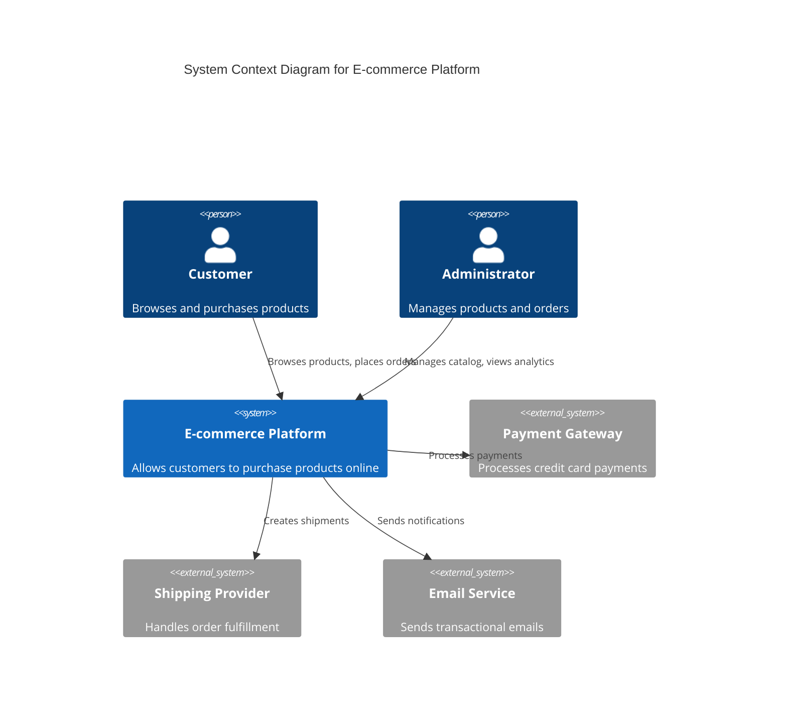
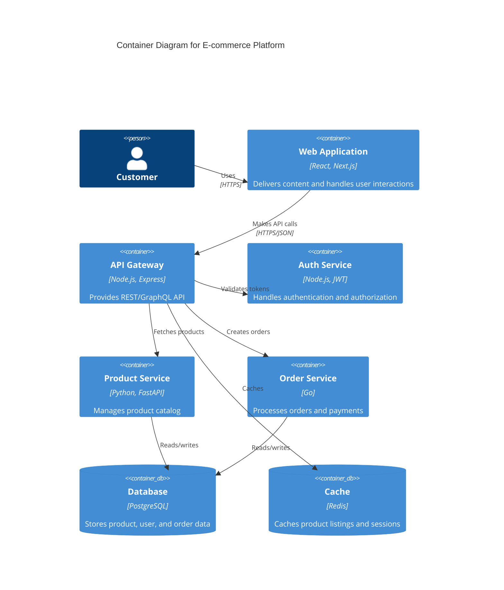
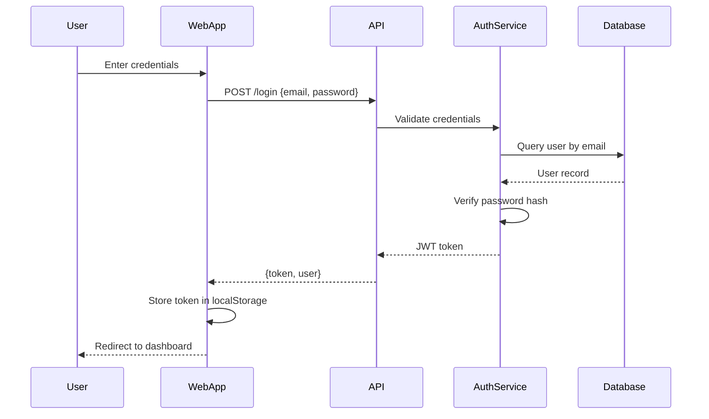
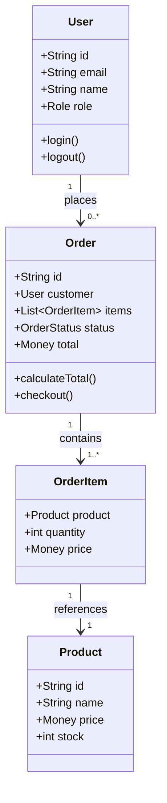
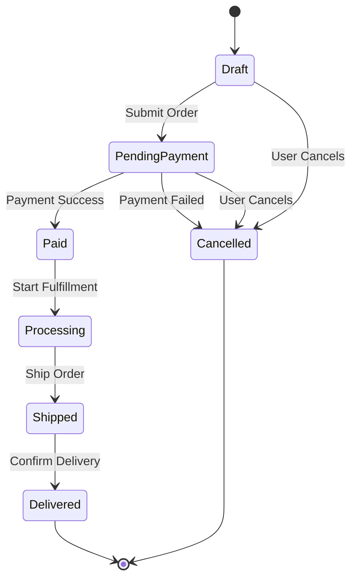
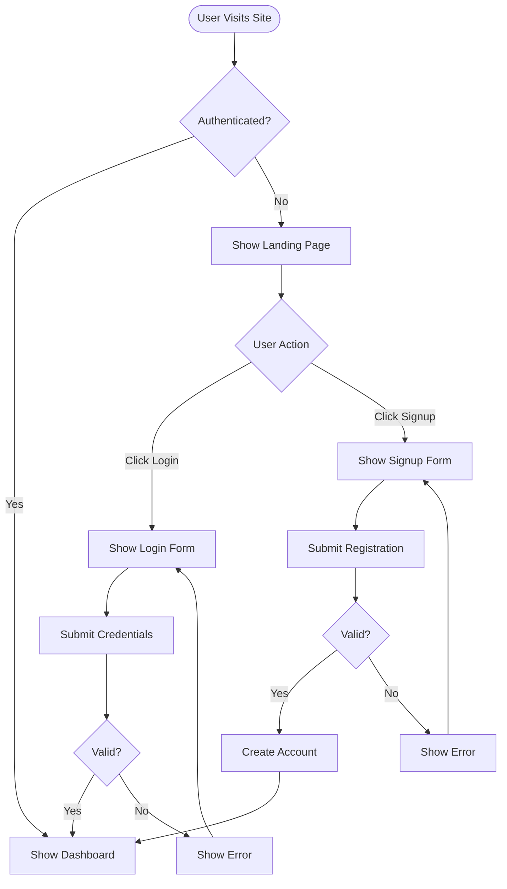
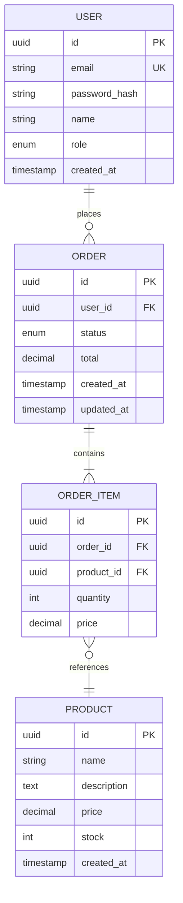
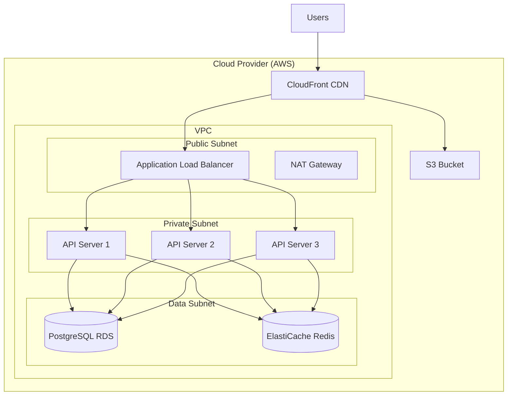

# Architecture Diagram Command

## What This Command Does

This command helps you create professional architecture diagrams by:

- Generating C4 model diagrams (Context, Container, Component, Code)
- Creating UML diagrams (class, sequence, deployment, state)
- Building flowcharts and process diagrams
- Designing database ERD (Entity-Relationship Diagrams)
- Exporting in multiple formats (Mermaid, PlantUML, Draw.io)
- Following industry best practices for diagram clarity

Diagrams are generated as code (diagram-as-code) for version control, easy updates, and collaboration.

## Usage Examples

### Interactive Diagram Creation

```bash
/architecture:diagram
```

Interactive mode will ask about system components and generate appropriate diagram.

### Create C4 Context Diagram

```bash
/architecture:diagram --type c4 --level context
```

Generate a high-level C4 Context diagram showing system and external actors.

### Create Sequence Diagram

```bash
/architecture:diagram --type sequence --format mermaid
```

Generate a sequence diagram showing interactions between components.

### Create Database ERD

```bash
/architecture:diagram --type erd --format mermaid
```

Generate an entity-relationship diagram for database schema.

### Create Component Diagram

```bash
/architecture:diagram --type c4 --level component --format plantuml
```

Generate a detailed C4 Component diagram in PlantUML format.

## Diagram Types Supported

### 1. C4 Model Diagrams (Recommended)

The C4 model provides a hierarchical approach to visualizing software architecture at different levels of abstraction.

#### Level 1: Context Diagram

**Purpose**: Show how your system fits in the world
**Audience**: Everyone (technical and non-technical)
**Shows**: System, users, external systems



#### Level 2: Container Diagram

**Purpose**: Show high-level technology choices
**Audience**: Technical stakeholders
**Shows**: Applications, databases, services



#### Level 3: Component Diagram

**Purpose**: Show internal structure of a container
**Audience**: Developers, architects
**Shows**: Components, classes, modules within a container

#### Level 4: Code Diagram

**Purpose**: Show implementation details
**Audience**: Developers
**Shows**: Classes, interfaces, relationships (UML class diagrams)

### 2. UML Diagrams

#### Sequence Diagram

**Purpose**: Show object interactions over time
**Use Cases**: API flows, authentication, request processing



#### Class Diagram

**Purpose**: Show object-oriented structure
**Use Cases**: Domain models, design patterns



#### State Diagram

**Purpose**: Show object state transitions
**Use Cases**: Order states, workflow states



### 3. Flowcharts

**Purpose**: Show processes, algorithms, decision trees
**Use Cases**: Business logic, user flows, deployment processes



### 4. Entity-Relationship Diagrams (ERD)

**Purpose**: Show database schema and relationships
**Use Cases**: Database design, data modeling



### 5. Deployment Diagrams

**Purpose**: Show infrastructure and deployment topology
**Use Cases**: Cloud architecture, server infrastructure



## Output Formats

### Mermaid (Recommended)

- **Pros**: Renders in GitHub/GitLab, easy syntax, great for docs
- **Cons**: Limited customization compared to PlantUML
- **Best For**: Most use cases, especially when embedded in markdown

### PlantUML

- **Pros**: Most powerful, extensive customization, supports all UML types
- **Cons**: Requires Java runtime to render, steeper learning curve
- **Best For**: Complex diagrams, PDF exports, detailed UML

### Draw.io (Diagrams.net)

- **Pros**: Visual editing, no code required, export to PNG/SVG/PDF
- **Cons**: Not version-control friendly, manual updates
- **Best For**: Presentations, one-off diagrams, pixel-perfect designs

## Diagram Best Practices

### General Principles

1. **Start Simple**: Begin with high-level views, add detail as needed
2. **One Purpose**: Each diagram should answer one specific question
3. **Consistent Notation**: Use same shapes/colors for same concepts
4. **Limit Scope**: 5-9 elements per diagram (cognitive limit)
5. **Clear Labels**: Every box, arrow, and relationship should be labeled
6. **Version Control**: Store diagrams as code alongside codebase

### C4 Model Best Practices

- **Level 1 (Context)**: Max 10 external systems, focus on "what" not "how"
- **Level 2 (Container)**: Group by deployment unit (service, database, app)
- **Level 3 (Component)**: Only diagram complex containers, skip trivial ones
- **Level 4 (Code)**: Only create when onboarding or solving complex design

### Color Coding

- **Blue**: Internal systems/containers you own
- **Gray**: External systems you integrate with
- **Green**: Databases and data stores
- **Yellow**: Message queues and async communication
- **Red**: Security boundaries or deprecated systems

### Naming Conventions

- **Systems**: Noun phrases (e.g., "E-commerce Platform")
- **Containers**: Technology + purpose (e.g., "API Gateway (Node.js)")
- **Components**: Specific modules (e.g., "UserAuthenticationController")
- **Relationships**: Verb phrases (e.g., "sends email", "queries database")

## Business Value & ROI

### Improved Communication

- **Problem**: Miscommunication between teams leads to integration issues
- **Solution**: Diagrams provide shared visual understanding
- **ROI**: 30% reduction in integration bugs, 50% faster alignment meetings

### Faster Onboarding

- **Problem**: New developers take 2-3 months to understand architecture
- **Solution**: C4 diagrams provide progressive learning path
- **ROI**: Reduce onboarding from 12 weeks to 6 weeks = $15K-$30K saved per hire

### Better Decision Making

- **Problem**: Cannot visualize impact of architectural changes
- **Solution**: Diagrams show dependencies and blast radius
- **ROI**: Avoid 1-2 costly architectural mistakes per year ($100K-$500K each)

### Documentation That Stays Current

- **Problem**: Architecture diagrams in PPT/Visio become outdated immediately
- **Solution**: Diagram-as-code stored with codebase, updated in PRs
- **ROI**: 80% reduction in documentation drift, always accurate diagrams

### Stakeholder Buy-In

- **Problem**: Non-technical stakeholders can't understand technical architecture
- **Solution**: C4 Context diagrams provide accessible high-level view
- **ROI**: Faster approvals, better alignment, fewer scope changes

## Success Metrics

### Diagram Quality Checklist

- [ ] Clear title describing purpose and scope
- [ ] Legend explaining colors, shapes, notation
- [ ] Appropriate level of abstraction for audience
- [ ] All elements clearly labeled
- [ ] Relationships/arrows show direction and purpose
- [ ] No more than 9 main elements (cognitive limit)
- [ ] Consistent notation and color scheme
- [ ] Renders correctly in target format (GitHub, docs, PDF)

### C4 Model Completeness

- [ ] Level 1 (Context) exists for overall system
- [ ] Level 2 (Container) exists for main architecture
- [ ] Level 3 (Component) exists for complex containers
- [ ] All diagrams link to relevant ADRs
- [ ] Diagrams stored in version control
- [ ] Diagrams referenced in README and onboarding docs

### Process Metrics

- [ ] Diagrams created before major implementation
- [ ] Diagrams reviewed in architecture reviews
- [ ] Diagrams updated when architecture changes
- [ ] New team members use diagrams for learning
- [ ] Diagrams referenced in ADRs and design docs

### Adoption Metrics

- **Coverage**: % of systems with C4 diagrams (Target: 100% of major systems)
- **Currency**: % of diagrams updated in last 6 months (Target: 80%+)
- **Usage**: Diagram views/references per month (Track in wiki/docs)
- **Onboarding**: New hire comprehension score with diagrams (Target: 8+/10)

## Execution Protocol

### Creating Architecture Diagrams

1. **Define Purpose** (5 minutes)
   - What question should this diagram answer?
   - Who is the audience (technical level)?
   - What level of detail is needed?

2. **Choose Diagram Type** (5 minutes)
   - C4 Context: System in the world
   - C4 Container: Technology choices
   - C4 Component: Internal structure
   - Sequence: Interactions over time
   - Flowchart: Process or algorithm
   - ERD: Database schema

3. **Gather Information** (10-20 minutes)
   - Review codebase structure
   - Identify components and their relationships
   - Document technologies used
   - Map data flows and interactions

4. **Create Diagram** (20-30 minutes)
   - Start with main elements
   - Add relationships and flows
   - Label everything clearly
   - Add legend and title
   - Apply consistent color scheme

5. **Review & Refine** (10-15 minutes)
   - Check for clarity and accuracy
   - Verify all labels are clear
   - Ensure consistent notation
   - Test rendering in target format
   - Get feedback from team

6. **Document & Publish** (5-10 minutes)
   - Save diagram source code to `/docs/architecture/diagrams/`
   - Export rendered version (PNG/SVG) if needed
   - Link diagram in README and architecture docs
   - Reference in relevant ADRs
   - Commit to version control

**Total Time**: 55-85 minutes per diagram

## Integration with Other Commands

- **Architecture Design**: Use `/architecture:design` to create architecture, then `/architecture:diagram` to visualize
- **ADR Creation**: Use `/architecture:adr` to document decisions, reference diagrams
- **Code Review**: Use `/architecture:review` to verify implementation matches diagrams
- **Onboarding**: Reference diagrams in onboarding documentation

## File Organization

### Recommended Structure

```text
docs/
  architecture/
    diagrams/
      c4/
        01-context.mmd
        02-container.mmd
        03-api-component.mmd
        04-database-component.mmd
      sequence/
        01-authentication-flow.mmd
        02-order-checkout-flow.mmd
      erd/
        01-database-schema.mmd
      flowchart/
        01-deployment-process.mmd
      rendered/
        context.png
        container.png
        auth-flow.png
      README.md (Index of all diagrams)
```

### Naming Convention

Format: `[number]-[descriptive-name].[extension]`

Examples:

- `01-system-context.mmd`
- `02-container-architecture.puml`
- `03-authentication-sequence.mmd`
- `04-database-erd.mmd`

## Tools for Rendering

### Mermaid

```bash
# Install mermaid-cli
npm install -g @mermaid-js/mermaid-cli

# Render diagram
mmdc -i diagram.mmd -o diagram.png
mmdc -i diagram.mmd -o diagram.svg
mmdc -i diagram.mmd -o diagram.pdf
```

### PlantUML

```bash
# Install PlantUML (requires Java)
brew install plantuml

# Render diagram
plantuml diagram.puml
plantuml -tsvg diagram.puml
plantuml -tpdf diagram.puml
```

### Online Editors

- **Mermaid Live**: <https://mermaid.live>
- **PlantUML Online**: <https://www.plantuml.com/plantuml>
- **Draw.io**: <https://app.diagrams.net>

---

**Next Steps**:

1. Create C4 Context diagram for system overview
2. Create C4 Container diagram for technology architecture
3. Create sequence diagrams for key user flows
4. Create ERD for database schema
5. Store all diagrams in version control
6. Reference diagrams in ADRs and README
