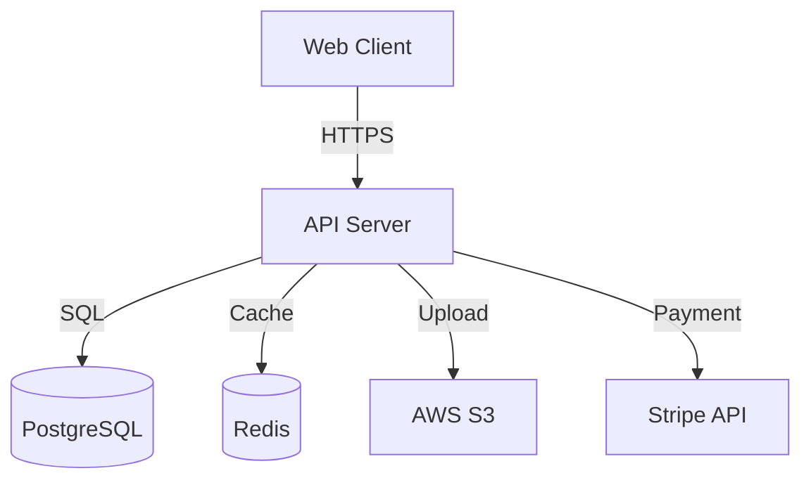

# /spec-kit:plan - Generate Implementation Plan

Generate a comprehensive technical implementation plan from specification, including architecture decisions, technology stack selection, database schema, and API contract design.

## Overview

The `plan` command transforms detailed specifications into actionable technical plans:

- **Architecture Design**: System architecture and component breakdown
- **Technology Stack**: Framework, library, and tool selection
- **Database Schema**: Table design, relationships, indexes
- **API Contract Design**: Endpoint design and data flow
- **Integration Points**: Third-party services and APIs
- **Deployment Strategy**: Infrastructure and CI/CD approach

## Prerequisites

**Required:** Specification must be generated first

- Run `/spec-kit:specify <design-id>` before planning
- Workflow must be in 'plan' phase or later

## Execution Steps

### Step 1: Verify Specification Exists

Check workflow status:

```bash
curl -X GET http://localhost:3000/api/specifications/designs/{design_id}/workflow
```

Verify current phase:

- ✅ If phase = 'plan' → Proceed
- ⚠️ If phase = 'specify' → Must complete specify first
- ✅ If phase = 'tasks' or 'complete' → Can regenerate plan

If specification doesn't exist:

```text
❌ No specification found for design {design_id}

You must generate a specification first:
  /spec-kit:specify {design_id}

Or check workflow status:
  /spec-kit:specify {design_id} --status
```

### Step 2: Architecture Decision Points

**Ask user for architecture preferences:**

**2.1 Deployment Model**
Ask: "What is your deployment model?"

- Monolithic (single deployable unit)
- Microservices (separate services)
- Serverless (cloud functions)
- Hybrid (mix of approaches)

**2.2 Frontend-Backend Separation**
Ask: "How is the frontend separated?"

- Monolithic (server-rendered)
- SPA (Single Page Application)
- SSR (Server-Side Rendering with framework like Next.js)
- Mobile native + API backend

**2.3 Database Strategy**
Ask: "What database approach?"

- Single database (shared schema)
- Database per service (microservices)
- Polyglot persistence (mix of DB types)

**2.4 API Style**
Ask: "What API style?" (if not already specified)

- REST (RESTful HTTP APIs)
- GraphQL (single graph endpoint)
- gRPC (Protocol Buffers)
- Mixed (REST + GraphQL or REST + gRPC)

### Step 3: Technology Stack Selection

**3.1 Programming Languages**
Based on constitution preferences or ask:

- Backend: TypeScript, Python, Go, Java, C#
- Frontend: TypeScript, JavaScript
- Mobile: Swift (iOS), Kotlin (Android), React Native, Flutter

**3.2 Frameworks**
Based on language selection:

- TypeScript: Express, Fastify, Next.js, NestJS
- Python: FastAPI, Django, Flask
- Go: Gin, Echo, Chi
- Frontend: React, Vue, Angular, Svelte

**3.3 Databases**
Based on data model and requirements:

- Relational: PostgreSQL, MySQL, SQL Server
- Document: MongoDB, CouchDB
- Key-Value: Redis, DynamoDB
- Graph: Neo4j
- Time-Series: InfluxDB, TimescaleDB

**3.4 Infrastructure**

- Cloud: AWS, GCP, Azure, DigitalOcean
- Containers: Docker, Kubernetes
- Orchestration: Docker Compose, K8s, ECS
- CI/CD: GitHub Actions, GitLab CI, CircleCI

### Step 4: Generate Plan via API

Call the plan generation endpoint:

```bash
curl -X POST http://localhost:3000/api/specifications/designs/{design_id}/plan \
  -H "Content-Type: application/json"
```

The API will:

1. Load specification artifact
2. Call spec-kit CLI to generate plan
3. Store plan data in workflow
4. Advance workflow to 'tasks' phase (80% complete)
5. Return plan with execution metadata

### Step 5: Display Implementation Plan

Show comprehensive plan structure:

```text
✅ Implementation Plan Generated!

Design ID: {design_id}
Workflow Progress: 80% (Plan → Tasks)
Generation Time: {execution_time_ms}ms

🏗️ ARCHITECTURE OVERVIEW

System Architecture: {architecture_type}
Deployment Model: {deployment_model}
Frontend-Backend: {separation_model}

Component Breakdown:
1. Frontend Application ({frontend_framework})
   - User interface components
   - State management
   - API client

2. Backend API Server ({backend_framework})
   - RESTful endpoints
   - Business logic layer
   - Data access layer

3. Database ({database_type})
   - Schema design
   - Migrations
   - Indexes and constraints

4. Authentication Service
   - OAuth 2.0 / JWT
   - User management
   - Session handling

5. External Integrations
   - Payment gateway (Stripe)
   - Email service (SendGrid)
   - Cloud storage (S3)

📚 TECHNOLOGY STACK

Backend:
• Language: TypeScript 5.0+
• Runtime: Node.js 20 LTS
• Framework: Fastify 4.x
• ORM: Prisma 5.x
• Testing: Jest, Supertest
• Validation: Zod

Frontend:
• Framework: React 18
• Meta-framework: Next.js 14 (App Router)
• State: Zustand
• Styling: Tailwind CSS
• UI Library: shadcn/ui
• Testing: Vitest, React Testing Library

Database:
• Primary: PostgreSQL 16
• Cache: Redis 7
• Search: Elasticsearch 8 (optional)
• Migrations: Prisma Migrate

Infrastructure:
• Cloud: AWS
• Compute: ECS Fargate
• Database: RDS PostgreSQL
• Cache: ElastiCache Redis
• Storage: S3
• CDN: CloudFront
• CI/CD: GitHub Actions

🗄️ DATABASE SCHEMA

Tables (8):

1. users
   - id (UUID, PRIMARY KEY)
   - email (VARCHAR(255), UNIQUE, NOT NULL)
   - password_hash (VARCHAR(255), NOT NULL)
   - name (VARCHAR(100))
   - created_at (TIMESTAMP, DEFAULT NOW())
   - updated_at (TIMESTAMP)
   Indexes: idx_users_email

2. products
   - id (UUID, PRIMARY KEY)
   - name (VARCHAR(200), NOT NULL)
   - description (TEXT)
   - price (DECIMAL(10,2), NOT NULL)
   - stock_quantity (INTEGER, DEFAULT 0)
   - category_id (UUID, FOREIGN KEY → categories.id)
   - created_at (TIMESTAMP)
   - updated_at (TIMESTAMP)
   Indexes: idx_products_category, idx_products_price

3. orders
   - id (UUID, PRIMARY KEY)
   - user_id (UUID, FOREIGN KEY → users.id, NOT NULL)
   - status (ENUM: pending, confirmed, shipped, delivered, cancelled)
   - total_amount (DECIMAL(10,2), NOT NULL)
   - shipping_address (JSONB)
   - created_at (TIMESTAMP)
   - updated_at (TIMESTAMP)
   Indexes: idx_orders_user, idx_orders_status, idx_orders_created

[... additional tables ...]

Relationships:
• users → orders (1:many)
• orders → order_items (1:many)
• products → order_items (1:many)
• categories → products (1:many)

🔌 API CONTRACT DESIGN

Endpoint Groups (5):

1. Authentication
   POST   /auth/register     - Create new user account
   POST   /auth/login        - Authenticate and get JWT
   POST   /auth/refresh      - Refresh access token
   POST   /auth/logout       - Invalidate session

2. Products
   GET    /products          - List products (paginated, filterable)
   GET    /products/:id      - Get product details
   POST   /products          - Create product (admin)
   PATCH  /products/:id      - Update product (admin)
   DELETE /products/:id      - Delete product (admin)

3. Cart
   GET    /cart              - Get user's cart
   POST   /cart/items        - Add item to cart
   PATCH  /cart/items/:id    - Update cart item quantity
   DELETE /cart/items/:id    - Remove item from cart

4. Orders
   GET    /orders            - List user's orders
   GET    /orders/:id        - Get order details
   POST   /orders            - Create order from cart
   PATCH  /orders/:id/cancel - Cancel order

5. Users
   GET    /users/me          - Get current user profile
   PATCH  /users/me          - Update user profile
   GET    /users/me/addresses - List user addresses
   POST   /users/me/addresses - Add new address

Authentication: Bearer JWT tokens
Rate Limiting: 1000 req/hour per user
Pagination: Limit/offset (max 100 per page)

🔗 INTEGRATION POINTS

Third-Party Services (3):

1. Stripe (Payment Processing)
   - Create payment intents
   - Handle webhooks for payment confirmation
   - Manage customer payment methods
   Integration: stripe npm package
   Configuration: STRIPE_SECRET_KEY, STRIPE_WEBHOOK_SECRET

2. SendGrid (Email Service)
   - Order confirmations
   - Password reset emails
   - Marketing emails
   Integration: @sendgrid/mail
   Configuration: SENDGRID_API_KEY

3. AWS S3 (File Storage)
   - Product images
   - User avatars
   - Order receipts (PDF)
   Integration: @aws-sdk/client-s3
   Configuration: AWS_ACCESS_KEY_ID, AWS_SECRET_ACCESS_KEY, AWS_S3_BUCKET

🚀 DEPLOYMENT STRATEGY

Environments (3):
1. Development - Local Docker Compose
2. Staging - AWS ECS (single instance)
3. Production - AWS ECS (multi-AZ, auto-scaling)

CI/CD Pipeline:
1. Code push → GitHub
2. GitHub Actions triggered
3. Run tests (unit + integration)
4. Build Docker images
5. Push to ECR
6. Deploy to ECS
7. Run smoke tests
8. Notify team (Slack)

Infrastructure as Code:
• Terraform for AWS resources
• Docker Compose for local development
• GitHub Actions for CI/CD

Monitoring & Observability:
• Logs: CloudWatch Logs
• Metrics: Prometheus + Grafana
• Tracing: Jaeger
• Errors: Sentry
• Uptime: UptimeRobot

📁 PROJECT STRUCTURE

```

project/
├── backend/
│   ├── src/
│   │   ├── routes/           # API endpoints
│   │   ├── services/         # Business logic
│   │   ├── models/           # Prisma models
│   │   ├── middleware/       # Auth, validation
│   │   └── integrations/     # Third-party APIs
│   ├── tests/
│   ├── prisma/              # Database schema
│   ├── Dockerfile
│   └── package.json
├── frontend/
│   ├── app/                 # Next.js App Router
│   ├── components/          # React components
│   ├── lib/                 # Utilities
│   ├── public/              # Static assets
│   ├── Dockerfile
│   └── package.json
├── infrastructure/
│   ├── terraform/           # AWS resources
│   └── docker-compose.yml   # Local development
└── .github/
    └── workflows/           # CI/CD pipelines

```text

📊 TECHNICAL SPECIFICATIONS

Performance Targets:
• API response time: <500ms (p95)
• Database queries: <100ms (p95)
• Frontend load time: <2s (p95)
• Throughput: 1000 req/sec

Scalability:
• Horizontal scaling with ECS auto-scaling
• Database read replicas for read-heavy operations
• Redis caching for frequently accessed data
• CDN for static assets

Security:
• HTTPS everywhere (TLS 1.3)
• JWT tokens with 15min expiration
• Refresh tokens with 7-day expiration
• CORS configured for known origins only
• Input validation on all endpoints (Zod schemas)
• SQL injection protection (Prisma ORM)
• Rate limiting per user/IP
• Security headers (helmet.js)

📁 Next Steps:
• Generate task breakdown: /spec-kit:tasks {design_id}
• Export plan to file: /spec-kit:plan {design_id} --export ./plans/
• Validate technical decisions: /spec-kit:validate {design_id}
• Start implementation: Ready to code!
```

### Step 6: Optional Actions

Ask if the user wants to:

- **Generate task breakdown** - Break plan into actionable tasks
- **Export plan to file** - Save as markdown
- **Validate architecture** - Check against constitution and best practices
- **Update technology stack** - Modify selections

## Advanced Features

### Export Plan to File

```bash
/spec-kit:plan <design-id> --export <path>
```

Exports plan as structured markdown file.

### Regenerate Plan

```bash
/spec-kit:plan <design-id> --regenerate
```

Generates new plan with updated decisions.

### View Architecture Diagram

```bash
/spec-kit:plan <design-id> --diagram
```

Generates and displays Mermaid architecture diagram.

Example output:



### Constitution Compliance Check

If design has linked constitution, automatically validate plan:

```text
🔒 Constitution Compliance

Constitution: SaaS Best Practices
Plan Compliance: 92/100

✓ Technology Stack Matches:
  ✓ PostgreSQL (preferred database)
  ✓ TypeScript (preferred language)
  ✓ Docker + Kubernetes (preferred deployment)

✓ Architecture Decisions:
  ✓ Microservices architecture
  ✓ Horizontal scalability
  ✓ Multi-AZ deployment

⚠ Recommendations:
  - Add automated backups (best practice)
  - Implement circuit breakers for external APIs
  - Add distributed tracing
```

## Error Handling

**If specification not found:**

```text
❌ Cannot generate plan: No specification found

Workflow Phase: {current_phase}
Expected Phase: plan

Run specification first:
  /spec-kit:specify {design_id}
```

**If plan generation fails:**

```text
❌ Plan generation failed: {error_message}

Possible causes:
1. Specification file missing from workspace
2. spec-kit CLI not available
3. Invalid specification format

Try:
1. Regenerate specification: /spec-kit:specify {design_id}
2. Check spec-kit health: curl http://localhost:3000/api/spec-kit/health
3. View specification: /spec-kit:specify {design_id} --status
```

## Example Usage

### Example 1: E-commerce Platform

```yaml
User: /spec-kit:plan design-abc-123
Assistant: Generating implementation plan...
  Architecture: Microservices
  Backend: TypeScript + Fastify
  Frontend: Next.js 14
  Database: PostgreSQL + Redis
  Deployment: AWS ECS
Assistant: ✅ Plan generated!
  Components: 5 services
  API endpoints: 23 designed
  Database tables: 8 defined
```

### Example 2: Mobile Backend

```yaml
User: /spec-kit:plan design-def-456
Assistant: What deployment model? (serverless/containers)
User: serverless
Assistant: Generating serverless plan...
  Backend: AWS Lambda + API Gateway
  Database: DynamoDB
  Auth: Cognito
Assistant: ✅ Serverless plan generated!
  Lambda functions: 12
  API Gateway routes: 18
  DynamoDB tables: 5
```

## Success Criteria

✅ Plan generated with complete architecture design
✅ Technology stack selected and justified
✅ Database schema defined with relationships
✅ API contract designed with all endpoints
✅ Deployment strategy outlined
✅ Workflow advanced to tasks phase (80%)
✅ User ready to generate task breakdown

## Notes

- Plan can be regenerated with different architecture decisions
- Constitution compliance is checked automatically if linked
- Export plan before starting implementation
- Use plan as reference during coding
- Plan is versioned and stored in database
