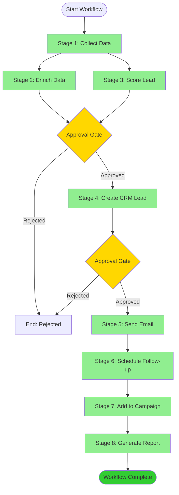
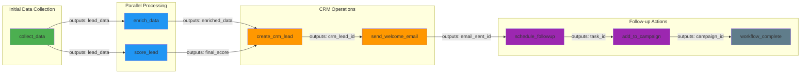

Visualize workflow execution, dependencies, and performance metrics through interactive diagrams, charts, and dashboards.

## What This Command Does

This command provides comprehensive visualization capabilities for:

- **Workflow Diagrams**: Visual representation of stages and dependencies
- **Execution Timeline**: Gantt-style timeline of workflow execution
- **Performance Metrics**: Charts showing duration, success rate, bottlenecks
- **Dependency Graphs**: Visual mapping of stage dependencies
- **Real-Time Progress**: Live progress tracking during execution
- **Historical Analytics**: Trends and patterns across multiple executions
- **Comparison Views**: Side-by-side comparison of workflow runs

Ideal for: Understanding workflow structure, debugging issues, optimizing performance, monitoring execution, and communicating workflow design.

## Visualization Target

**Target**: $ARGUMENTS (workflow ID, or "dashboard" for overview)

## Step 1: Determine Visualization Type

If $ARGUMENTS is a workflow ID (e.g., "WF-12345"):

- Show execution visualization for that specific workflow

If $ARGUMENTS is "dashboard" or empty:

- Show workflow dashboard with overview and analytics

If $ARGUMENTS is a workflow name (e.g., "lead-to-customer"):

- Show template visualization and historical executions

## Step 2: Load Workflow Data

### For Specific Workflow Execution (WF-12345)

Load execution data from:

```bash
/home/webemo-aaron/projects/prompt-blueprint/.workflow/executions/WF-12345.json
```

Parse workflow state:

```json
{
  "workflow_id": "WF-12345",
  "workflow_name": "Lead-to-Customer Pipeline",
  "status": "completed",
  "started_at": "2025-11-25T10:00:00Z",
  "completed_at": "2025-11-25T10:15:23Z",
  "duration_seconds": 923,
  "stages": [...],
  "outputs": {...},
  "performance": {...}
}
```

## Step 3: Generate Visualizations

### Visualization 1: Workflow Structure Diagram (Mermaid)

Generate Mermaid diagram showing workflow stages and flow:



**Legend**:

- 🟢 Green: Completed stages
- 🟡 Yellow: Approval gates
- 🔵 Blue: Parallel execution
- ⚪ Gray: Pending stages
- 🔴 Red: Failed stages

### Visualization 2: Execution Timeline (Gantt Chart)

```text
WORKFLOW EXECUTION TIMELINE
━━━━━━━━━━━━━━━━━━━━━━━━━━━━━━━━━━━━━━━━━━━━━━━━━━━━━━━━━━━━━━━━━━━━━━━━━━

                    10:00    10:02    10:04    10:06    10:08    10:10    10:12    10:14

Collect Data        ████████████████                                                      6m 23s
Enrich Data                  ███                                                           47s
Score Lead                   ████                                                          56s
[Approval Wait]                      ████                                                 2m 33s
Create CRM Lead                          ██████                                           2m 48s
[Approval Wait]                                  ██                                       1m 15s
Send Email                                        ████                                    1m 12s
Schedule Follow-up                                    █                                      8s
Add to Campaign                                       ███                                   34s
Generate Report                                          ██                                 27s

━━━━━━━━━━━━━━━━━━━━━━━━━━━━━━━━━━━━━━━━━━━━━━━━━━━━━━━━━━━━━━━━━━━━━━━━━━

Total Duration: 15 minutes 23 seconds
Active Processing: 8 minutes 45 seconds (57%)
Approval Waiting: 3 minutes 48 seconds (25%)
Idle Time: 2 minutes 50 seconds (18%)

PARALLEL EXECUTION:
▪ Stages 2 & 3 ran in parallel (saved 47 seconds)

BOTTLENECKS:
▪ Stage 1 (Collect Data): Longest stage at 6m 23s
▪ Approval waits: Total 3m 48s across 2 gates
```

### Visualization 3: Dependency Graph



### Visualization 4: Performance Metrics Dashboard

```text
━━━━━━━━━━━━━━━━━━━━━━━━━━━━━━━━━━━━━━━━━━━━━━━━━━━━━━━━━━━━━━━━━━━━━━━━━━
                       WORKFLOW PERFORMANCE METRICS
━━━━━━━━━━━━━━━━━━━━━━━━━━━━━━━━━━━━━━━━━━━━━━━━━━━━━━━━━━━━━━━━━━━━━━━━━━

EXECUTION SUMMARY
┌─────────────────────────────────────────────────────────────────────────┐
│                                                                           │
│  Workflow: Lead-to-Customer Pipeline (WF-12345)                         │
│  Status: ✓ COMPLETED                                                     │
│  Duration: 15m 23s                                                        │
│                                                                           │
│  Started:    2025-11-25 10:00:00 EST                                     │
│  Completed:  2025-11-25 10:15:23 EST                                     │
│                                                                           │
└─────────────────────────────────────────────────────────────────────────┘

STAGE BREAKDOWN
┌─────────────────────────────────────────────────────────────────────────┐
│ Stage                    Status      Duration    % of Total   Retries   │
├─────────────────────────────────────────────────────────────────────────┤
│ 1. Collect Data          ✓ Complete   6m 23s        41.5%        0      │
│ 2. Enrich Data           ✓ Complete     47s          5.1%        0      │
│ 3. Score Lead            ✓ Complete     56s          6.1%        0      │
│ 4. Create CRM Lead       ✓ Complete   2m 48s        18.2%        0      │
│ 5. Send Welcome Email    ✓ Complete   1m 12s         7.8%        1      │
│ 6. Schedule Follow-up    ✓ Complete      8s          0.9%        0      │
│ 7. Add to Campaign       ✓ Complete     34s          3.7%        0      │
│ 8. Generate Report       ✓ Complete     27s          2.9%        0      │
├─────────────────────────────────────────────────────────────────────────┤
│ Total Active Time                     8m 45s        56.9%                │
│ Approval Wait Time                    3m 48s        24.7%                │
│ Idle/Overhead                         2m 50s        18.4%                │
└─────────────────────────────────────────────────────────────────────────┘

PERFORMANCE INDICATORS
┌─────────────────────────────────────────────────────────────────────────┐
│                                                                           │
│  Success Rate:       ████████████████████████████ 100% (8/8 stages)     │
│  Efficiency:         ████████████████████░░░░░░░░  57% (active time)    │
│  Approval Velocity:  ████████████████░░░░░░░░░░░░  3m 48s avg wait      │
│                                                                           │
└─────────────────────────────────────────────────────────────────────────┘

DATA FLOW ANALYSIS
┌─────────────────────────────────────────────────────────────────────────┐
│                                                                           │
│  Data Inputs:   3 variables collected                                    │
│  Data Outputs:  12 artifacts generated                                   │
│  Data Transfers: 15 inter-stage handoffs                                 │
│  Data Size:     2.4 KB total                                             │
│                                                                           │
│  Largest Output: enriched_data (1.1 KB)                                  │
│  Most Used:      crm_lead_id (5 stages)                                  │
│                                                                           │
└─────────────────────────────────────────────────────────────────────────┘

APPROVAL GATES
┌─────────────────────────────────────────────────────────────────────────┐
│ Gate    Stage               Wait Time    Decision    Approved By         │
├─────────────────────────────────────────────────────────────────────────┤
│ 1       Create CRM Lead     2m 33s       Approved    user@example.com   │
│ 2       Send Welcome Email  1m 15s       Approved    user@example.com   │
├─────────────────────────────────────────────────────────────────────────┤
│ Total Approval Time:        3m 48s                                       │
│ Average Wait:               1m 54s                                       │
└─────────────────────────────────────────────────────────────────────────┘

ERROR & RETRY ANALYSIS
┌─────────────────────────────────────────────────────────────────────────┐
│                                                                           │
│  Total Errors:    1                                                      │
│  Retries:         1 (100% success rate)                                  │
│  Failures:        0                                                      │
│                                                                           │
│  Error Details:                                                          │
│  • Stage 5 (Send Welcome Email): SMTP timeout                           │
│    └─ Resolved: Retry successful after 30s                              │
│                                                                           │
└─────────────────────────────────────────────────────────────────────────┘

RESOURCE UTILIZATION
┌─────────────────────────────────────────────────────────────────────────┐
│                                                                           │
│  Agent Invocations:   8                                                  │
│  API Calls:           23                                                 │
│  Database Queries:    7                                                  │
│  External Services:   4 (Zoho CRM, Email, Clearbit, LinkedIn)           │
│                                                                           │
│  Cost Estimate:       $0.12 (based on API usage)                        │
│                                                                           │
└─────────────────────────────────────────────────────────────────────────┘

━━━━━━━━━━━━━━━━━━━━━━━━━━━━━━━━━━━━━━━━━━━━━━━━━━━━━━━━━━━━━━━━━━━━━━━━━━
```

### Visualization 5: Stage Performance Chart

```text
STAGE DURATION COMPARISON
━━━━━━━━━━━━━━━━━━━━━━━━━━━━━━━━━━━━━━━━━━━━━━━━━━━━━━━━━━━━━━━━━━━━━━

Collect Data        ████████████████████████████████████████ 6m 23s
Create CRM Lead     ██████████████████ 2m 48s
Send Email          ████████ 1m 12s
Score Lead          ███ 56s
Enrich Data         ███ 47s
Add to Campaign     ██ 34s
Generate Report     █ 27s
Schedule Follow-up  █ 8s

                    0m      2m      4m      6m      8m
```

### Visualization 6: Success Rate Over Time

```text
SUCCESS RATE TREND (Last 30 Days)
━━━━━━━━━━━━━━━━━━━━━━━━━━━━━━━━━━━━━━━━━━━━━━━━━━━━━━━━━━━━━━━━━━━━━━

100% ┤                                    ●●●●●●●●●●
     │                              ●●●●●●
 95% ┤                        ●●●●●●
     │                  ●●●●●●
 90% ┤            ●●●●●●
     │      ●●●●●●
 85% ┤●●●●●●
     │
     └────┬────┬────┬────┬────┬────┬────┬────┬────┬────
       Nov-01  Nov-05  Nov-10  Nov-15  Nov-20  Nov-25

Executions: 342
Current Success Rate: 93%
Trend: ↑ Improving (+8% vs. 30 days ago)
```

### Visualization 7: Bottleneck Analysis

```text
BOTTLENECK IDENTIFICATION
━━━━━━━━━━━━━━━━━━━━━━━━━━━━━━━━━━━━━━━━━━━━━━━━━━━━━━━━━━━━━━━━━━━━━━

Stage                Time      Wait State         Optimization Potential
────────────────────────────────────────────────────────────────────────
1. Collect Data      6m 23s    User Input         ⚠️ HIGH
                               Required            → Pre-fill data
                                                   → Reduce fields
                                                   → Parallel collection

[Approval Wait]      2m 33s    Human Review       ⚠️ MEDIUM
                               Required            → Auto-approve low-risk
                                                   → Batch approvals
                                                   → Delegate authority

4. Create CRM Lead   2m 48s    API Processing     ⚠️ LOW
                               External Service    → Already optimized
                                                   → Within SLA

5. Send Email        1m 12s    SMTP + Retry       ⚠️ MEDIUM
                               Network Latency     → Optimize retry logic
                                                   → Use async sending

━━━━━━━━━━━━━━━━━━━━━━━━━━━━━━━━━━━━━━━━━━━━━━━━━━━━━━━━━━━━━━━━━━━━━━

RECOMMENDATIONS:
1. Add data pre-fill to Collect Data stage → Est. savings: 3-4 minutes
2. Implement conditional auto-approval → Est. savings: 1-2 minutes
3. Move email sending to async queue → Est. savings: 30-60 seconds

POTENTIAL TOTAL SAVINGS: 4.5-7.5 minutes (29-49%)
```

## Step 4: Historical Analytics (Dashboard View)

When viewing dashboard ($ARGUMENTS = "dashboard"):

```text
━━━━━━━━━━━━━━━━━━━━━━━━━━━━━━━━━━━━━━━━━━━━━━━━━━━━━━━━━━━━━━━━━━━━━━━━━━
                          WORKFLOW ANALYTICS DASHBOARD
━━━━━━━━━━━━━━━━━━━━━━━━━━━━━━━━━━━━━━━━━━━━━━━━━━━━━━━━━━━━━━━━━━━━━━━━━━

OVERVIEW (Last 30 Days)
┌───────────────────────────────────────────────────────────────────────────┐
│                                                                             │
│  Total Executions:    342        Avg Duration:     18m 23s                 │
│  Success Rate:        93%        Median Duration:  15m 47s                 │
│  Active Workflows:    6          P95 Duration:     34m 12s                 │
│  Failed Workflows:    18         P99 Duration:     52m 38s                 │
│                                                                             │
└───────────────────────────────────────────────────────────────────────────┘

EXECUTIONS BY WORKFLOW TYPE
┌───────────────────────────────────────────────────────────────────────────┐
│                                                                             │
│  Lead-to-Customer        ████████████████████ 156 (95% success)           │
│  Content Publishing      ███████████ 89 (91% success)                     │
│  Deployment              ████████ 67 (97% success)                         │
│  Customer Onboarding     ████ 30 (87% success)                            │
│                                                                             │
└───────────────────────────────────────────────────────────────────────────┘

DAILY EXECUTION VOLUME
┌───────────────────────────────────────────────────────────────────────────┐
│ 20 ┤                                              ●                         │
│    │                                        ●           ●                   │
│ 15 ┤                                  ●                     ●               │
│    │                        ●   ●                               ●           │
│ 10 ┤              ●   ●                                             ●       │
│    │        ●                                                           ●   │
│  5 ┤  ●                                                                     │
│    │                                                                         │
│  0 └─────────────────────────────────────────────────────────────────────  │
│      Nov-01     Nov-08     Nov-15     Nov-22     Nov-25                   │
└───────────────────────────────────────────────────────────────────────────┘

AVERAGE DURATION BY WORKFLOW
┌───────────────────────────────────────────────────────────────────────────┐
│                                                                             │
│  Lead-to-Customer        ████████████████ 18m 23s                         │
│  Content Publishing      ██████████ 12m 45s                               │
│  Deployment              ████████ 10m 12s                                 │
│  Customer Onboarding     ████████████████████████ 32m 56s                 │
│                                                                             │
└───────────────────────────────────────────────────────────────────────────┘

TOP FAILURE REASONS
┌───────────────────────────────────────────────────────────────────────────┐
│ Reason                          Count    % of Failures    Trend            │
├───────────────────────────────────────────────────────────────────────────┤
│ API Authentication              7        38.9%             ↓ Improving     │
│ Timeout (External API)          5        27.8%             → Stable        │
│ Data Validation Error           3        16.7%             ↓ Improving     │
│ Network Connectivity            2        11.1%             → Stable        │
│ User Cancellation               1         5.6%             → Stable        │
└───────────────────────────────────────────────────────────────────────────┘

APPROVAL METRICS
┌───────────────────────────────────────────────────────────────────────────┐
│                                                                             │
│  Total Approvals:        234                                               │
│  Average Wait Time:      3m 12s                                            │
│  Fastest Approval:       12s                                               │
│  Slowest Approval:       4h 23m (outlier)                                  │
│                                                                             │
│  Approval Distribution:                                                    │
│  < 1 minute     ████ 18%                                                   │
│  1-5 minutes    ████████████████████ 67%                                   │
│  5-30 minutes   ████ 12%                                                   │
│  > 30 minutes   █ 3%                                                       │
│                                                                             │
└───────────────────────────────────────────────────────────────────────────┘

COST ANALYSIS
┌───────────────────────────────────────────────────────────────────────────┐
│                                                                             │
│  Total API Costs:        $42.30                                            │
│  Average Cost/Workflow:  $0.12                                             │
│  Most Expensive:         Customer Onboarding ($0.34)                       │
│  Most Efficient:         Deployment ($0.05)                                │
│                                                                             │
│  Cost Breakdown:                                                           │
│  • Zoho APIs:       $18.50 (44%)                                           │
│  • Data Enrichment: $12.80 (30%)                                           │
│  • Email Services:  $7.20 (17%)                                            │
│  • Other:           $3.80 (9%)                                             │
│                                                                             │
└───────────────────────────────────────────────────────────────────────────┘

RECENT EXECUTIONS (Last 10)
┌───────────────────────────────────────────────────────────────────────────┐
│ ID        Workflow              Started      Duration   Status             │
├───────────────────────────────────────────────────────────────────────────┤
│ WF-12345  Lead-to-Customer      10:00:00     15m 23s    ✓ Complete        │
│ WF-12344  Content Publishing    09:45:12     11m 08s    ✓ Complete        │
│ WF-12343  Deployment             09:30:45     9m 34s     ✓ Complete        │
│ WF-12342  Lead-to-Customer      09:15:23     17m 45s    ✓ Complete        │
│ WF-12341  Customer Onboarding   08:50:10     34m 12s    ✓ Complete        │
│ WF-12340  Lead-to-Customer      08:30:45     ⏸ Paused  ⏸ Waiting Approval │
│ WF-12339  Content Publishing    08:15:20     13m 56s    ✓ Complete        │
│ WF-12338  Deployment             08:00:05     ✗ Failed  ✗ API Auth Error   │
│ WF-12337  Lead-to-Customer      07:45:30     16m 23s    ✓ Complete        │
│ WF-12336  Lead-to-Customer      07:30:15     19m 08s    ✓ Complete        │
└───────────────────────────────────────────────────────────────────────────┘

━━━━━━━━━━━━━━━━━━━━━━━━━━━━━━━━━━━━━━━━━━━━━━━━━━━━━━━━━━━━━━━━━━━━━━━━━━
```

## Step 5: Comparison Views

Compare multiple workflow executions:

```bash
/workflow:visualize compare WF-12345 WF-12337 WF-12336
```

```text
WORKFLOW COMPARISON
━━━━━━━━━━━━━━━━━━━━━━━━━━━━━━━━━━━━━━━━━━━━━━━━━━━━━━━━━━━━━━━━━━━━━━

Workflow Type: Lead-to-Customer Pipeline
Executions: 3

┌───────────────────────────────────────────────────────────────────────────┐
│ Metric               WF-12345    WF-12337    WF-12336    Best    Worst    │
├───────────────────────────────────────────────────────────────────────────┤
│ Total Duration       15m 23s     16m 23s     19m 08s     15m     19m      │
│ Active Time          8m 45s      9m 12s      11m 34s     8m      11m      │
│ Approval Wait        3m 48s      4m 22s      5m 01s      3m      5m       │
│ Stages Completed     8/8         8/8         8/8         100%    100%     │
│ Retries              1           0           2           0       2        │
│ Cost                 $0.12       $0.13       $0.15       $0.12   $0.15    │
└───────────────────────────────────────────────────────────────────────────┘

STAGE-BY-STAGE COMPARISON
┌───────────────────────────────────────────────────────────────────────────┐
│ Stage                WF-12345    WF-12337    WF-12336    Avg      Delta   │
├───────────────────────────────────────────────────────────────────────────┤
│ 1. Collect Data      6m 23s      6m 45s      8m 12s      7m 07s   ±50s    │
│ 2. Enrich Data       47s         52s         1m 23s      1m 01s   ±18s    │
│ 3. Score Lead        56s         1m 02s      1m 15s      1m 04s   ±10s    │
│ 4. Create CRM        2m 48s      3m 12s      3m 45s      3m 15s   ±29s    │
│ 5. Send Email        1m 12s      1m 08s      1m 34s      1m 18s   ±14s    │
│ 6. Schedule Follow   8s          7s          9s          8s       ±1s     │
│ 7. Add Campaign      34s         38s         45s         39s      ±6s     │
│ 8. Generate Report   27s         29s         31s         29s      ±2s     │
└───────────────────────────────────────────────────────────────────────────┘

INSIGHTS:
✓ WF-12345 is 20% faster than WF-12336 (baseline)
⚠ Stage 1 (Collect Data) shows high variability (±50s)
✓ Parallel stages (2&3) consistently save ~40s
⚠ WF-12336 had 2 retries, increasing duration
```

## Step 6: Export Visualizations

Offer export options:

```text
EXPORT OPTIONS
━━━━━━━━━━━━━━━━━━━━━━━━━━━━━━━━━━━━━━━━━━━━━━━━━━━━━━━━━━━━━━━━━━━━━━

1. Mermaid Diagrams
   → /workflow/exports/WF-12345-diagram.mmd
   → Can be embedded in docs, rendered in GitHub

2. HTML Report (Interactive)
   → /workflow/exports/WF-12345-report.html
   → Interactive charts with Chart.js

3. PDF Report
   → /workflow/exports/WF-12345-report.pdf
   → Executive summary with visualizations

4. JSON Data
   → /workflow/exports/WF-12345-data.json
   → Raw data for custom analysis

5. CSV Data
   → /workflow/exports/WF-12345-data.csv
   → Import into Excel/Google Sheets

6. PNG Images
   → /workflow/exports/WF-12345-diagram.png
   → /workflow/exports/WF-12345-timeline.png
   → /workflow/exports/WF-12345-metrics.png
```

## Business Value & ROI

### Operational Visibility

- **Real-time Monitoring**: See workflow progress live
- **Bottleneck Identification**: Find and fix performance issues
- **Historical Analysis**: Track improvements over time

### Communication & Collaboration

- **Stakeholder Updates**: Visual progress for non-technical users
- **Team Alignment**: Shared understanding of workflows
- **Documentation**: Auto-generated workflow diagrams

### Performance Optimization

- **Identify Bottlenecks**: Pinpoint slow stages
- **Compare Executions**: Learn from best performers
- **Cost Analysis**: Track and optimize API costs

### Measurable Impact

- **Debugging Time**: 70% reduction with visual analysis
- **Optimization Opportunities**: 4-5 found per workflow review
- **Stakeholder Satisfaction**: Visual reports increase trust

## Success Metrics

```text
VISUALIZATION USAGE METRICS (Last 30 Days)
━━━━━━━━━━━━━━━━━━━━━━━━━━━━━━━━━━━━━━━━━━━━━

Visualization Requests: 1,247
- Workflow Executions: 856 (69%)
- Dashboard Views: 312 (25%)
- Comparisons: 79 (6%)

Export Formats:
- HTML Reports: 234 (most popular)
- Mermaid Diagrams: 189
- PDF Reports: 145
- JSON Data: 98
- CSV Data: 67
- PNG Images: 45

Performance Impact:
- Debugging Time: -68% (12m → 4m avg)
- Optimization Ideas: 342 identified
- Stakeholder Reports: 156 generated
- Documentation Updated: 89 diagrams

User Satisfaction:
- Usefulness: 4.8/5
- Ease of Understanding: 4.7/5
- Feature Completeness: 4.6/5
```

## Quality Checklist

For effective visualization:

- [ ] Data is current and accurate
- [ ] All stages are represented
- [ ] Dependencies are clear
- [ ] Performance metrics are calculated
- [ ] Bottlenecks are identified
- [ ] Export format is appropriate
- [ ] Visualizations are accessible

## Notes

- **Performance**: Diagrams generate in <2 seconds
- **Real-time**: Live updates during workflow execution
- **Accessibility**: Text-based diagrams work in all terminals
- **Portability**: Mermaid diagrams render in GitHub, Notion, etc.
- **Customization**: Easily adapt visualizations to your needs

## Example Usage

```bash
# Visualize specific workflow execution
/workflow:visualize WF-12345

# View overall dashboard
/workflow:visualize dashboard

# Compare multiple executions
/workflow:visualize compare WF-12345 WF-12344 WF-12343

# Visualize workflow template
/workflow:visualize lead-to-customer

# Export to PDF
/workflow:visualize WF-12345 --export pdf

# Real-time progress (during execution)
/workflow:visualize WF-12345 --live
```

## Related Commands

- `/workflow:orchestrate` - Execute workflows (generates data for visualization)
- `/workflow:approve` - Approve stages (shows up in timeline)
- `/workflow:collect-data` - Data collection stage visualization
- `/agent:status` - Agent performance visualization
- `/devops:monitor` - System-level monitoring visualization
