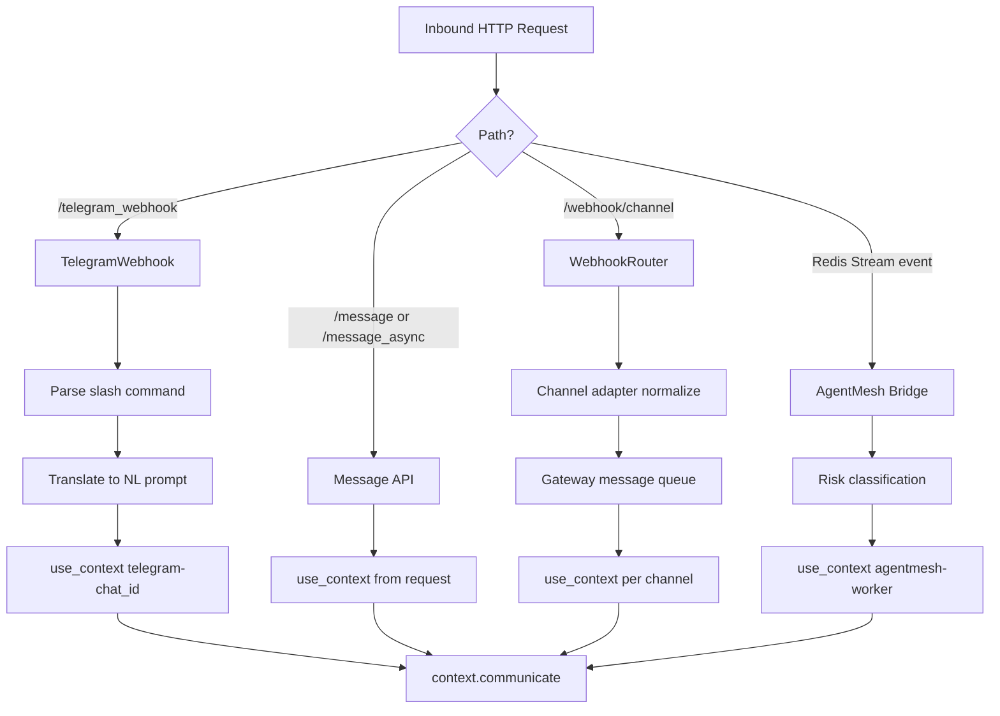
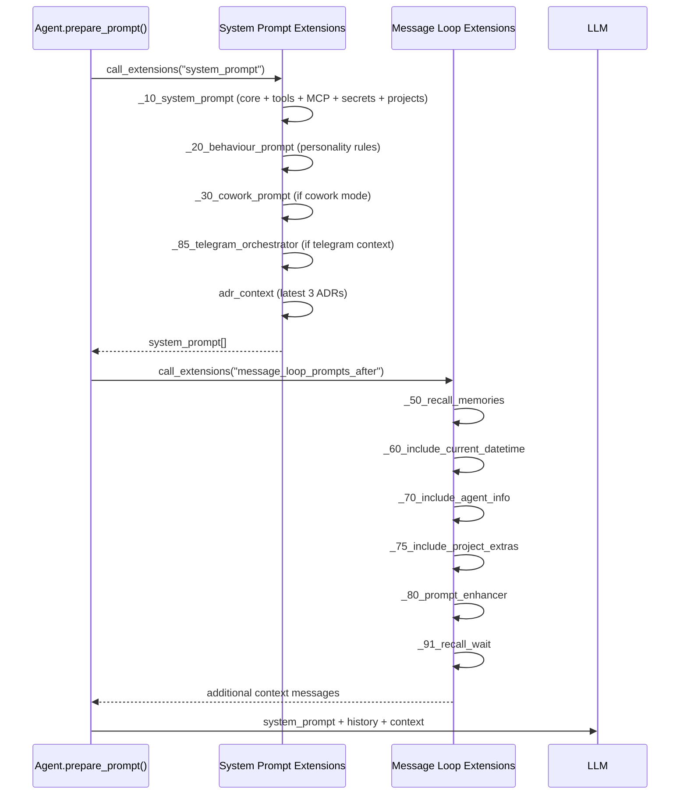
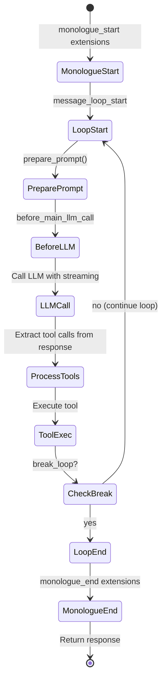
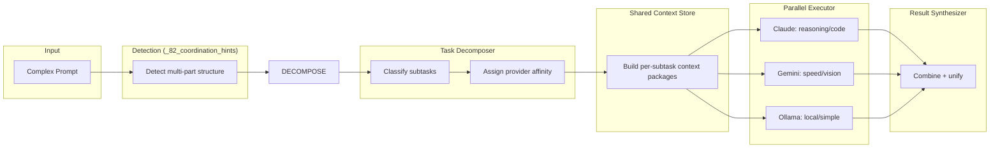
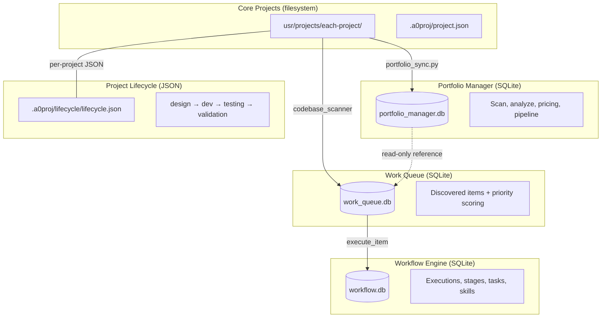
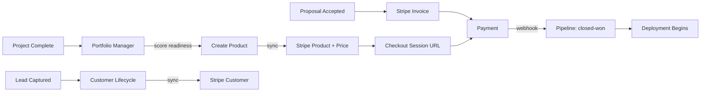

<!-- markdownlint-disable MD013 -->

# Request-to-Delivery Flow

Agent Jumbo is an agentic platform that receives requests from multiple channels (Telegram, Web UI, AgentMesh, webhooks), routes them through a context-aware agent loop with 72 tools and 33 instruments, and delivers responses back to the originating channel. This document traces that flow end-to-end.

**Audience:** Developers debugging, extending, or onboarding to Agent Jumbo.

## Master Pipeline

```mermaid
flowchart LR
    subgraph Entry["1. Entry Points"]
        TG[Telegram Webhook]
        WEB[Web UI]
        MESH[AgentMesh Bridge]
        WH[Webhook Router]
    end

    subgraph Route["2. Routing"]
        CTX[Get/Create AgentContext]
        POL[Message Queue Policy]
    end

    subgraph Prompt["3. Context Assembly"]
        SYS[System Prompt Extensions]
        LOOP[Message Loop Extensions]
    end

    subgraph Agent["4. Agent Loop"]
        MON[Monologue: LLM Call]
        TOOL[Tool Execution]
        MON -->|tool call| TOOL
        TOOL -->|result| MON
    end

    subgraph Deliver["5. Response Delivery"]
        TG_OUT[Telegram: chunk + send]
        WEB_OUT[Web UI: SSE/HTTP]
        MESH_OUT[AgentMesh: Redis event]
        WH_OUT[Webhook: adapter send]
    end

    Entry --> Route --> Prompt --> Agent --> Deliver
```



---

## Table of Contents

<!-- markdownlint-disable MD007 -->

1. [Request Entry Points](#1-request-entry-points)
2. [Context Assembly and System Prompt](#2-context-assembly-and-system-prompt)
3. [Agent Processing Loop](#3-agent-processing-loop)
4. [Tool Catalog](#4-tool-catalog)
5. [Instrument Layer](#5-instrument-layer)
6. [The Five Project Systems](#6-the-five-project-systems)
7. [Knowledge Ingest Pipeline](#7-knowledge-ingest-pipeline)
8. [Stripe Payment Pipeline](#8-stripe-payment-pipeline)
9. [Response Delivery](#9-response-delivery)
10. [Security Model](#10-security-model)
11. [Extension Hooks Reference](#11-extension-hooks-reference)
12. [Debugging Guide](#12-debugging-guide)

<!-- markdownlint-enable MD007 -->

---

## 1. Request Entry Points

Four channels can send requests to the agent. All converge on `AgentContext.communicate()`.



### Telegram Webhook

| Aspect | Detail |
|--------|--------|
| **File** | `python/api/telegram_webhook.py` |
| **Auth** | `X-Telegram-Bot-Api-Secret-Token` header vs `TELEGRAM_WEBHOOK_SECRET` env |
| **Context** | `telegram-{chat_id}` or `TELEGRAM_AGENT_CONTEXT` env override |
| **Slash commands** | Parsed by `telegram_orchestrator.parse_slash_command()` |
| **Media** | Photos, voice, video, documents extracted via `TelegramMedia` |
| **Orchestrator** | `telegram_orchestrator.py` translates `/status`, `/project`, `/tasks`, `/newtask`, `/digest`, `/sync`, `/help` to agent prompts |
| **Dispatch** | Non-blocking — returns 200 immediately, delivers response via background `asyncio.create_task` |

### Web UI

| Aspect | Detail |
|--------|--------|
| **File** | `python/api/message.py`, `python/api/message_async.py` |
| **Auth** | Session-based + CSRF token |
| **Context** | Context ID from request JSON, creates if missing |
| **Queue policy** | `queue_strict`, `interrupt`, `queue_drop` — configurable per chat |
| **Attachments** | Saved to `tmp/uploads/`, paths passed to agent |

### AgentMesh Bridge

| Aspect | Detail |
|--------|--------|
| **Files** | `python/helpers/agentmesh_bridge.py`, `python/helpers/agentmesh_task_handler.py` |
| **Transport** | Redis Streams (`agentmesh:events`, consumer group `agentmesh:cg:agent-jumbo`) |
| **Init** | Daemon thread started in `run_ui.py` when `AGENTMESH_REDIS_URL` is set |
| **Risk classification** | HIGH/CRITICAL tasks emit `task.approval_required`; LOW tasks execute directly |
| **Profile mapping** | Category maps to agent profile: `deployment` → `actor-ops`, `security_scan` → `hacker`, etc. |

### Webhook Router

| Aspect | Detail |
|--------|--------|
| **File** | `python/api/webhook_router.py` |
| **Route** | `/webhook/<channel>` dispatches to channel adapter |
| **Adapters** | 17 channels in `python/helpers/channels/`: Discord, Email, Google Chat, IRC, LINE, Mastodon, Matrix, Mattermost, Rocket.Chat, Signal, Slack, Teams, Telegram, Twilio SMS, Viber, WhatsApp |
| **Flow** | `adapter.verify_webhook()` → `adapter.normalize()` → `gateway.process_now()` |
| **Verification** | All adapters are **fail-closed** — return `False` when secrets are not configured. Meta/WhatsApp verification validates `hub.verify_token` against `META_VERIFY_TOKEN` env var. |
| **Gateway** | `python/helpers/gateway.py` — async queue with retry + dead-letter (persisted to `logs/dead_letters.jsonl`) |

---

## 2. Context Assembly and System Prompt

Before each LLM call, the agent builds a system prompt by executing extensions in filename-sort order.



### System Prompt Extensions (`python/extensions/system_prompt/`)

| File | Purpose | Conditional |
|------|---------|-------------|
| `_10_system_prompt.py` | Core prompts: main role, tools, MCP tools, secrets, project context | Always |
| `_20_behaviour_prompt.py` | Dynamic behavior rules from `behaviour.md` | Always (inserts at position 0) |
| `_30_cowork_prompt.py` | Cowork mode settings | Only when cowork enabled |
| `_85_telegram_orchestrator.py` | Telegram tool catalog + orchestration rules | Only for `telegram-*` contexts |
| `adr_context.py` | Latest 3 Architecture Decision Records | For architect/developer/solutioning profiles |

### Message Loop Extensions (`python/extensions/message_loop_prompts_after/`)

| File | Purpose |
|------|---------|
| `_50_recall_memories.py` | Recall relevant memories from vector store |
| `_60_include_current_datetime.py` | Inject current date/time |
| `_70_include_agent_info.py` | Agent hierarchy info (depth, parent) |
| `_75_include_project_extras.py` | Project file structure context |
| `_80_prompt_enhancer.py` | Dynamic prompt enhancement |
| `_91_recall_wait.py` | Wait/timer completion state |

---

## 3. Agent Processing Loop

The agent's core loop is `monologue()` in `agent.py` (line 555). It iterates: prompt → LLM call → tool execution → repeat until the `response` tool signals completion.



### Loop Guards

The monologue has two termination safeguards:

| Guard | Limit | Configurable | Behavior |
|-------|-------|-------------|----------|
| **Iteration limit** | 25 iterations (inner loop) | Hardcoded `MAX_MONOLOGUE_ITERATIONS` | Force-returns error message, logs event |
| **Wall-clock timeout** | 30 minutes (outer loop) | `AGENT_MAX_MONOLOGUE_SECONDS` env var | Force-returns error message, logs event |

Both guards prevent unbounded API cost from stuck agents.

### Security Gate

Before tool execution, `process_tools()` calls `SecurityManager.is_tool_authorized(tool_name)`. High-risk tools (`code_execution_tool`, `email`, `email_advanced`, `memory_delete`, `memory_forget`, `workflow_engine`, `run_in_terminal`, `cowork_approval`) require passkey authentication within the last 3600 seconds. Controlled by `SECURITY_ENFORCE_PASSKEY` env var (default: `true`).

### Token Budget Warning

`get_system_prompt()` estimates token count after assembly. If the system prompt exceeds ~30,000 tokens (~30% of a 100K context window), a warning is logged. Fires once per monologue.

### Key Methods

| Method | Line | Purpose |
|--------|------|---------|
| `monologue()` | 555 | Outer loop — manages extensions, error handling, wall-clock timeout |
| `prepare_prompt()` | 681 | Assembles system prompt + history + extensions |
| `get_system_prompt()` | 789 | Loads and merges system prompt extensions, token budget warning |
| `process_tools()` | 1342 | Security gate + tool execution |

### Message Queue Policy

When a new message arrives while the agent is processing:

| Policy | Behavior |
|--------|----------|
| `interrupt` | Sets `agent.intervention` — agent picks up new message |
| `queue_strict` | Enqueues in `_message_queue`, processes FIFO after current task |
| `queue_drop` | Drops the new message |

### Agent Hierarchy

Agent 0 can delegate via the `call_subordinate` tool, creating child agents. Each child:

- Has its own conversation history
- Can access all tools
- Shares the same `AgentContext`
- Reports results back to the parent agent

### Multi-LLM Orchestration Engine

Agent Jumbo can act as a **meta-agent**, decomposing complex tasks and dispatching subtasks concurrently to different LLM providers.



**Components:**

| Component | File | Purpose |
|-----------|------|---------|
| Task Classifier | `python/helpers/task_decomposer.py` | Maps prompts to optimal provider (regex patterns) |
| Task Decomposer | `python/helpers/task_decomposer.py` | Splits multi-part prompts into subtasks with dependencies |
| Shared Context Store | `python/helpers/shared_context.py` | Serializes context per-subtask within provider window limits |
| Parallel Executor | `python/helpers/parallel_executor.py` | DAG-aware concurrent execution via `asyncio.gather` |
| Result Synthesizer | `python/helpers/result_synthesizer.py` | Combines multi-provider results into coherent response |
| Coordinator Tool | `python/tools/coordinator.py` | Agent-callable interface (decompose, dispatch, classify) |
| Coordination Hints | `python/extensions/message_loop_prompts_after/_82_coordination_hints.py` | Auto-detects multi-part tasks in prompt processing |
| Coordinator Extension | `python/extensions/system_prompt/_90_coordinator.py` | Injects coordinator awareness into system prompt |

**Provider Context Budgets:**

| Provider | Context Window | Usable (75%) | Best For |
|----------|---------------|-------------|----------|
| Anthropic (Claude) | 200K tokens | 150K | Complex reasoning, code generation, creative writing |
| Google (Gemini) | 1M tokens | 750K | Speed, vision, long context, data extraction |
| OpenAI (GPT) | 128K tokens | 96K | General tasks, structured output |
| Ollama (local) | 8K tokens | 6K | Simple tasks, privacy, zero cost |

**Context Priority** (highest first): prompt → system instructions → dependency results → project context → conversation history → memory recalls. Each section is truncated at sentence boundaries when budget is exceeded.

---

## 4. Tool Catalog

75 tools in `python/tools/`. Each inherits from `python.helpers.tool.Tool` and implements `async execute() -> Response`.

Tools are resolved dynamically: first checks `agents/{profile}/tools/{name}.py`, then `python/tools/{name}.py`.

### Communication (7)

| Tool | Purpose |
|------|---------|
| `telegram_send` | Send message via Telegram Bot API |
| `email` | Send/read/archive email via SMTP |
| `email_advanced` | Bulk send, templates |
| `google_voice_sms` | Send SMS via Google Voice |
| `twilio_voice_call` | Make voice calls via Twilio |
| `notify_user` | Internal user notifications |
| `a2a_chat` | Agent-to-Agent communication |

### Project Management (9)

| Tool | Purpose |
|------|---------|
| `portfolio_manager` | Portfolio scan, list, analyze, export, pipeline |
| `portfolio_manager_tool` | Portfolio CRUD with dashboard and pricing |
| `project_lifecycle` | Phase tracking: design → dev → testing → validation |
| `project_scaffold` | Generate project scaffolds |
| `workflow_engine` | Workflow definition, execution, stages, tasks, cleanup |
| `workflow_training` | Training workflow management |
| `linear_integration` | Linear issues: create, update, search, sync pipeline |
| `motion_integration` | Motion calendar/task sync |
| `notion_integration` | Notion page/database operations |

### Orchestration and Coordination (2)

| Tool | Purpose |
|------|---------|
| `coordinator` | Multi-LLM task coordination: decompose, dispatch, classify, provider_health, cost_report |
| `solution_catalog` | AI solutions marketplace: list, get, create, publish to Stripe, dashboard |

### Payments (1)

| Tool | Purpose |
|------|---------|
| `stripe_payments` | Stripe integration: customers, products, checkout, invoices, subscriptions, MRR/churn reporting |

### Knowledge and Memory (7)

| Tool | Purpose |
|------|---------|
| `knowledge_ingest` | Register sources, ingest RSS/URL/MCP/text |
| `memory_save` | Save to agent memory |
| `memory_load` | Load from agent memory |
| `memory_delete` | Delete memory entry |
| `memory_forget` | Forget memory entry |
| `document_query` | Query document store |
| `research_organize` | Research organization |

### Sales and Business (7)

| Tool | Purpose |
|------|---------|
| `sales_generator` | Proposals, demos, ROI, case studies, business cases |
| `demo_request_create` | Create demo request |
| `demo_request_list` | List demo requests |
| `customer_lifecycle` | CRM lifecycle: lead → prospect → customer |
| `brand_voice` | Brand voice content generation |
| `business_xray_tool` | Business analysis and metrics |
| `analytics_roi_calculator` | ROI calculations |

### Development (12)

| Tool | Purpose |
|------|---------|
| `code_execution_tool` | Execute Python/Node.js/Shell code |
| `code_review` | Code review operations |
| `security_audit` | Security scanning (code/infra/full) |
| `api_design` | API design assistance |
| `auth_test` | Authentication testing |
| `deployment_orchestrator` | Generate CI/CD, Docker, K8s configs |
| `deployment_config` | Deployment configuration |
| `deployment_execute` | Execute deployment |
| `deployment_run_checks` | Run deployment checks |
| `deployment_validate_env` | Validate deployment environment |
| `deployment_record_result` | Record deployment result |
| `devops_deploy` | Cloud deployment operations |
| `devops_monitor` | Monitoring and observability |

### Automation (6)

| Tool | Purpose |
|------|---------|
| `scheduler` | Task scheduling (cron) |
| `ralph_loop` | Reinforcement learning loop |
| `swarm_batch` | Batch agent operations |
| `wait` | Delay execution |
| `behaviour_adjustment` | Modify agent behavior at runtime |
| `visual_validation` | Visual regression testing |

### Content and Diagrams (3)

| Tool | Purpose |
|------|---------|
| `diagram_tool` | Mermaid/SVG diagram generation |
| `diagram_architect` | Architecture diagram generation |
| `digest_builder` | Build content digests |

### Agents and Integration (7)

| Tool | Purpose |
|------|---------|
| `call_subordinate` | Delegate to subordinate agents |
| `virtual_team` | Multi-agent task routing and coordination |
| `claude_sdk_bridge` | Claude API bridge |
| `opencode_bridge` | OpenCode integration |
| `browser_agent` | Web automation via Playwright |
| `skill_importer` | Import/register agent skills |
| `plugin_marketplace` | Plugin discovery and installation |

### Domain-Specific (7)

| Tool | Purpose |
|------|---------|
| `property_manager_tool` | Rental property management |
| `pms_hub_tool` | Multi-PMS sync (AirBnB, Hostaway, Lodgify) |
| `calendar_hub` | Google Calendar integration |
| `finance_manager` | Plaid finance: transactions, reports, tax |
| `mahoosuc_finance_report` | Mahoosuc-specific finance reporting |
| `life_os` | Personal operating system |
| `ai_migration` | AI migration planning |

### System (6)

| Tool | Purpose |
|------|---------|
| `response` | Return response and break monologue loop |
| `input` | Get user keyboard input |
| `search_engine` | Full-text search (SearXNG) |
| `vision_load` | Load and process images |
| `observability_usage_estimator` | Usage estimation and metrics |
| `unknown` | Fallback for unrecognized tool calls |

---

## 5. Instrument Layer

33 instruments in `instruments/custom/` (plus `_TEMPLATE`). Each instrument follows the pattern:

```text
instruments/custom/{name}/
  ├── __init__.py
  ├── {name}_manager.py      # Business logic
  ├── {name}_db.py            # SQLite database operations
  └── data/
      └── {name}.db           # SQLite database file
```

Tools instantiate their instrument manager at construction time:

```python
from instruments.custom.{name}.{name}_manager import Manager
db_path = files.get_abs_path("./instruments/custom/{name}/data/{name}.db")
self.manager = Manager(db_path)
```

### Instrument Directory

| Instrument | Database | Purpose |
|------------|----------|---------|
| `ai_migration` | `ai_migration.db` | Migration planning and assessment |
| `ai_ops_agent` | own DB | AI operations automation |
| `business_xray` | `business_xray.db` | Business analysis and metrics |
| `calendar_hub` | `calendar_hub.db` | Google Calendar integration |
| `claude_sdk` | none | Claude API bridge (stateless) |
| `customer_lifecycle` | `customer_lifecycle.db` | CRM lifecycle management |
| `deployment_orchestrator` | `deployment_orchestrator.db` | CI/CD pipeline generation |
| `diagram_architect` | `diagram_architect.db` | Architecture diagrams |
| `diagram_generator` | `diagram_generator.db` | Mermaid/SVG generation |
| `digest_builder` | `digest_builder.db` | Content digest creation |
| `finance_manager` | `finance_manager.db` | Plaid integration, transactions |
| `google_voice` | `google_voice.db` | SMS via Google Voice |
| `knowledge_ingest` | `knowledge_ingest.db` | RSS/URL/MCP source ingestion |
| `learning_improvement_system` | `learning_improvement.db` | Agent learning loop |
| `life_os` | `life_os.db` | Personal operating system |
| `linear_integration` | `linear_integration.db` | Linear issues, projects, sync |
| `motion_integration` | `motion_integration.db` | Motion calendar/task sync |
| `notion_integration` | `notion_integration.db` | Notion page/database ops |
| `plugin_marketplace` | `plugin_marketplace.db` | Plugin discovery/installation |
| `pms_hub` | `pms_hub.db` | Multi-PMS sync |
| `portfolio_manager` | `portfolio_manager.db` | Code project portfolio |
| `project_scaffold` | `project_scaffold.db` | Project template generation |
| `property_manager` | `property_manager.db` | Rental properties |
| `ralph_loop` | `ralph_loop.db` | Reinforcement learning loop |
| `reasoning_planning_engine` | framework | Task planning and reasoning |
| `sales_generator` | `sales_generator.db` | Proposals, demos, case studies |
| `security_monitor` | `security_monitor.db` | Security audit and monitoring |
| `skill_importer` | `skill_db.db` | Skill registration and tracking |
| `specialist_agent_framework` | framework | Role-based agent specialization |
| `twilio_voice` | `twilio_voice.db` | Voice call management |
| `virtual_team` | `virtual_team.db` | Multi-agent coordination |
| `work_queue` | `work_queue.db` | Work item discovery, scoring, execution |
| `workflow_engine` | `workflow.db` | Workflow definition and execution |
| `stripe_payments` | `stripe_payments.db` | Stripe customers, products, prices, payments, subscriptions, invoices, webhooks |
| `solution_catalog` | none (filesystem) | AI solutions marketplace (`solutions/` directory) |

---

## 6. The Five Project Systems

Agent Jumbo has five overlapping data stores for "projects." Understanding which owns what is critical.



### Core Projects (filesystem)

- **Location:** `usr/projects/` — each project is a directory
- **Metadata:** `.a0proj/project.json` (title, description, color, memory, file_structure)
- **Helper:** `python/helpers/projects.py`
- **API:** `python/api/projects.py`
- **Role:** Source of truth for what projects exist

### Portfolio Manager (SQLite)

- **Database:** `instruments/custom/portfolio_manager/data/portfolio.db`
- **Tool:** `python/tools/portfolio_manager_tool.py`
- **Actions:** scan, list, get, add, update, analyze, export, search, pipeline, dashboard, pricing
- **Sync:** `python/helpers/portfolio_sync.py` — Core Projects → Portfolio Manager (runs on `/sync` and `/status` commands)
- **Role:** Business view — sale-readiness scores, products, pricing tiers, sales pipeline

### Work Queue (SQLite)

- **Database:** `instruments/custom/work_queue/data/work_queue.db`
- **Manager:** `instruments/custom/work_queue/work_queue_manager.py`
- **Scanner:** `instruments/custom/work_queue/codebase_scanner.py` — discovers TODOs, skipped tests, coverage gaps
- **Scorer:** `instruments/custom/work_queue/priority_scorer.py` — calculates priority from type, severity, age
- **APIs:** `python/api/work_queue_dashboard.py`, `work_queue_item_*.py`, `work_queue_scan.py`
- **Status flow:** `discovered` → `queued` → `in_progress` → `done` / `dismissed`
- **Role:** Task backlog — what needs to be worked on

### Project Lifecycle (JSON per-project)

- **Storage:** `.a0proj/lifecycle/lifecycle.json` inside each project directory
- **Tool:** `python/tools/project_lifecycle.py`
- **Helper:** `python/helpers/project_lifecycle.py`
- **Phases:** design, development, testing, validation, agent-eval
- **Role:** Phase tracking for individual projects

### Workflow Engine (SQLite)

- **Database:** `instruments/custom/workflow_engine/data/workflow.db`
- **Tool:** `python/tools/workflow_engine.py`
- **Manager:** `instruments/custom/workflow_engine/workflow_manager.py`
- **Stages:** design → poc → mvp → production → support → upgrade
- **Features:** Gates, criteria, deliverables, skill tracking, learning paths
- **Cleanup:** `cleanup_executions` action marks stale (>24h) running executions as failed
- **Role:** Structured multi-stage execution with gates and approvals

### How They Connect

1. **Core Projects → Portfolio Manager:** `portfolio_sync.py` scans `usr/projects/`, reads `.a0proj/project.json`, upserts into `portfolio.db`
2. **Core Projects → Work Queue:** `codebase_scanner.py` scans project directories for TODOs, issues → creates `work_items`
3. **Work Queue → Workflow Engine:** `execute_item()` loads a workflow template, creates an execution in `workflow.db`, updates item status to `in_progress`
4. **Linear → Work Queue:** `sync_linear_issues()` imports Linear issues into `work_queue.db` with priority scoring

---

## 7. Knowledge Ingest Pipeline

```text
Source Registration → Ingestion → Deduplication → Dual Storage
```

### Source Types

| Type | Method | Confidence |
|------|--------|------------|
| `rss` | Fetch RSS feed, extract title/link/description | 0.6 |
| `url` | Fetch web page, scrape paragraphs | 0.5 |
| `mcp` | Accept structured JSON payload | 0.4–0.5 |
| `text` | Manual inline text entry | 0.7 |

### Storage

**Database:** `instruments/custom/knowledge_ingest/data/knowledge_ingest.db`

- `sources` — registered feeds/URLs with cadence config
- `items` — individual content pieces with `content_hash` for dedup
- `ingestions` — fetch history with status and item counts
- `digests` — generated summaries with time windows

**Filesystem:** Markdown files at `knowledge/custom/ingest/{source_name}/{YYYYMMDD}-{hash}.md`

```markdown
# Title
source: uri
tags: tag1, tag2
confidence: 0.7

Content here...
```

### Deduplication

Items are deduplicated by `(source_id, content_hash)` — SHA256 of content, first 16 chars. The database has a UNIQUE constraint that silently skips duplicates on INSERT.

---

## 8. Stripe Payment Pipeline

End-to-end payment processing from AI-built code to sale.



**Key components:**

| Component | File | Purpose |
|-----------|------|---------|
| Stripe Provider | `instruments/custom/stripe_payments/providers/stripe_provider.py` | httpx-based Stripe API (form-encoded) |
| Mock Provider | `instruments/custom/stripe_payments/providers/mock_provider.py` | Deterministic test data |
| Payment Manager | `instruments/custom/stripe_payments/stripe_manager.py` | Business logic: sync, checkout, subscriptions, reporting |
| Payment Database | `instruments/custom/stripe_payments/stripe_db.py` | 7 tables: customers, products, prices, payments, subscriptions, invoices, webhook_events |
| Webhook Handler | `instruments/custom/stripe_payments/webhook_handler.py` | Idempotent processing of 8 Stripe event types |
| Webhook API | `python/api/stripe_webhook.py` | `/api/stripe/webhook` with signature verification |
| Agent Tool | `python/tools/stripe_payments.py` | 17 actions across CRUD, sync, checkout, subscriptions, reporting |

**Solutions Platform:**

5 seed AI infrastructure solutions in `solutions/`:

- AI Customer Support ($3,500 + $750/mo)
- AI Document Processing ($5,000 + $1,200/mo)
- AI Sales Automation ($4,000 + $900/mo)
- AI Property Management ($2,500 + $500/mo)
- AI Financial Reporting ($3,000 + $600/mo)

Each solution has `solution.json` (pricing, instruments, agents) and `architecture.md` (Mermaid diagrams). Managed via `solution_catalog` tool. Knowledge base at `knowledge/custom/ai-infrastructure/` (10 reference docs, 3,100+ lines).

**Telegram commands:** `/payments`, `/revenue`, `/invoices`, `/solutions`, `/solution <name>`

---

## 9. Response Delivery

### Telegram

| Aspect | Detail |
|--------|--------|
| **File** | `python/helpers/telegram_client.py` |
| **Chunking** | `chunk_message()` splits at 4096 chars, prefers newline boundaries |
| **Formatting** | `format_for_telegram()` strips HTML, converts `##` to bold, truncates tables to 10 rows |
| **Send** | POST to `https://api.telegram.org/bot{token}/sendMessage` with `parse_mode: Markdown` |
| **Fallback** | On 400 error, retries without Markdown formatting |
| **Dispatch** | Async — webhook returns 200 immediately, response delivered via background `_deliver_response` task |

### Web UI

| Aspect | Detail |
|--------|--------|
| **SSE** | `/mcp/t-{token}/sse` for streaming responses |
| **HTTP** | `/mcp/t-{token}/http/` for streamable HTTP |
| **Polling** | Frontend polls for task completion |
| **Response** | `{"message": result, "context": context_id}` |
| **Timeout** | Default 90s, returns `timed_out: true` on expiry |

### AgentMesh

| Aspect | Detail |
|--------|--------|
| **File** | `python/helpers/agentmesh_bridge.py` |
| **Transport** | Redis Streams |
| **Events** | `task.completed`, `task.failed`, `task.escalated`, `task.status_update` |
| **Payload** | Result text + execution metadata |
| **Dedup** | `OrderedDict`-based FIFO eviction (cap: 5000 entries, evicts oldest half) |

### Webhook Channels

| Aspect | Detail |
|--------|--------|
| **File** | `python/helpers/gateway.py` |
| **Mechanism** | Per-adapter `send_message()` via channel factory |
| **Queue** | Async message queue with retry and dead-letter semantics |
| **Dead letters** | Persisted to `logs/dead_letters.jsonl` (timestamp, message_id, channel, error, payload) |

---

## 10. Security Model

### Passkey Enforcement

High-risk tools require passkey authentication before execution. The gate is in `agent.py:process_tools()` via `SecurityManager.is_tool_authorized()`.

| Setting | Default | Override |
|---------|---------|----------|
| `SECURITY_ENFORCE_PASSKEY` | `true` | Set to `false` in env for development |
| `AUTH_WINDOW_SECONDS` | 3600 (1 hour) | Hardcoded in `security.py` |

**HIGH_RISK_TOOLS:** `code_execution_tool`, `email`, `email_advanced`, `memory_delete`, `memory_forget`, `workflow_engine`, `run_in_terminal`, `cowork_approval`

### Webhook Verification

All channel adapters are **fail-closed** — they return `False` when their respective webhook secrets are not configured. This prevents unauthenticated message injection.

| Adapter | Required Secret |
|---------|----------------|
| Telegram | `secret_token` |
| Signal | `signal_webhook_secret` |
| Mattermost | `mattermost_webhook_token` |
| Matrix | `matrix_hs_token` |
| Mastodon | `mastodon_webhook_secret` |
| Rocket.Chat | `rocketchat_webhook_token` |
| Teams | `teams_shared_secret` |
| Google Chat | `google_chat_verification_token` |
| Email | N/A (returns `False` — uses IMAP polling, not webhooks) |
| IRC | N/A (returns `False` — uses socket, not webhooks) |
| Meta/WhatsApp | `META_VERIFY_TOKEN` env var (validated via `hmac.compare_digest`) |

### Monologue Loop Guards

| Guard | Limit | Purpose |
|-------|-------|---------|
| Inner loop iteration cap | 25 | Prevents stuck tool-calling loops |
| Outer loop wall-clock timeout | 30 min (`AGENT_MAX_MONOLOGUE_SECONDS`) | Prevents runaway cost from restarts |

### Database Security

All instrument SQLite databases use WAL mode + `busy_timeout=5000ms` to prevent lock contention. Encryption uses AES-256-GCM via `SecurityManager.encrypt_data()` — never falls back to plaintext on failure (returns `None`).

---

## 11. Extension Hooks Reference

22 hook points across the agent lifecycle. Extensions are Python files in `python/extensions/{hook_name}/`, executed in filename-sort order.

| Hook | Timing | Files |
|------|--------|-------|
| `agent_init` | Agent creation | `_10_initial_message`, `_15_load_profile_settings` |
| `system_prompt` | Before each LLM call (system) | `_10_system_prompt`, `_20_behaviour`, `_30_cowork`, `_85_telegram`, `_90_coordinator`, `adr_context` |
| `message_loop_prompts_before` | Before history assembly | `_90_organize_history_wait` |
| `message_loop_prompts_after` | After history assembly | `_50_recall_memories`, `_60_datetime`, `_70_agent_info`, `_75_project_extras`, `_80_enhancer`, `_82_coordination_hints`, `_91_wait` |
| `monologue_start` | Monologue begins | `_10_memory_init`, `_60_rename_chat` |
| `message_loop_start` | Each loop iteration starts | `_10_iteration_no` |
| `before_main_llm_call` | Just before LLM call | `_10_log_for_stream` |
| `reasoning_stream` | During reasoning stream | `_10_log_from_stream` |
| `reasoning_stream_chunk` | Each reasoning chunk | `_10_mask_stream` |
| `reasoning_stream_end` | Reasoning stream ends | `_10_mask_end` |
| `response_stream` | During response stream | `_10_log_from_stream`, `_15_replace_include_alias`, `_20_live_response` |
| `response_stream_chunk` | Each response chunk | `_10_mask_stream` |
| `response_stream_end` | Response stream ends | `_10_mask_end` |
| `tool_execute_before` | Before tool execution | `_10_replace_last_tool_output`, `_10_unmask_secrets`, `_20_cowork_approvals`, `_30_telemetry_start` |
| `tool_execute_after` | After tool execution | `_10_mask_secrets`, `_30_telemetry_end` |
| `tool_execute_error` | Tool execution error | `_30_telemetry_error` |
| `hist_add_before` | Before adding to history | `_10_mask_content` |
| `hist_add_tool_result` | After tool result added | `_90_save_tool_call_file` |
| `message_loop_end` | Each loop iteration ends | `_10_organize_history`, `_85_ralph_loop_check`, `_90_save_chat` |
| `monologue_end` | Monologue complete | `_50_memorize_fragments`, `_51_memorize_solutions`, `_90_waiting_for_input_msg`, `adr_generator` |
| `user_message_ui` | UI message received | `_10_update_check` |
| `error_format` | Error formatting | `_10_mask_errors` |
| `util_model_call_before` | Before utility model call | `_10_mask_secrets` |

---

## 12. Debugging Guide

### Trace a Telegram Message

1. **Webhook receipt:** Check `python/api/telegram_webhook.py` — look for dedup check and secret token validation
2. **Command parsing:** `telegram_orchestrator.parse_slash_command()` — is the command recognized?
3. **Context creation:** `use_context()` in `python/helpers/api.py` — is the context ID correct?
4. **System prompt:** Check `_85_telegram_orchestrator.py` — is the tool catalog injected?
5. **Agent loop:** `agent.py:monologue()` — check `process_tools()` for tool call errors
6. **Response:** `telegram_client.send_long_message()` — check for Markdown formatting errors (400 from Telegram API)

### Trace a Web UI Message

1. **API entry:** `python/api/message.py` — check CSRF token, context ID
2. **Queue policy:** Is another task running? Check `communicate_with_policy()` behavior
3. **Agent loop:** Same as Telegram from step 5
4. **Response:** Check SSE endpoint `/mcp/t-{token}/sse` — is the frontend receiving?

### Log Locations

| Log | Location |
|-----|----------|
| Chat logs | `logs/` (HTML format) |
| Tool call files | Saved by `_90_save_tool_call_file.py` extension |
| Dead-letter queue | `logs/dead_letters.jsonl` (one JSON object per line) |
| Supervisord | `/dev/stdout` (container stdout) |

### Health Check Endpoint

`GET /health_check` returns structured JSON with per-subsystem status:

```json
{
  "status": "healthy | degraded | unhealthy",
  "checks": {
    "llm": {"status": "ok"},
    "databases": {"status": "ok", "detail": "workflow.db, work_queue.db accessible"},
    "redis": {"status": "ok | not_configured"},
    "disk": {"status": "ok | warning", "free_mb": 1234}
  }
}
```

### Request Tracing

Every request gets a `request_id` (from `X-Request-ID` header or auto-generated UUID). This ID propagates: API handler → `AgentContext.request_id` → `LoopData.request_id` → structured log calls. Use it to correlate logs across the pipeline.

### Common Failure Points

| Symptom | Check |
|---------|-------|
| Telegram bot not responding | Webhook secret mismatch, or bot token invalid |
| Tool call returns error | Check tool's `execute()` method, instrument DB permissions |
| Tool blocked by passkey | `SECURITY_ENFORCE_PASSKEY=true` — set to `false` for dev, or authenticate via passkey |
| Agent loops without responding | `response` tool not being called — check system prompt |
| Agent terminates after 25 iterations | Legitimate complex task hit `MAX_MONOLOGUE_ITERATIONS` — review prompt |
| Agent terminates after 30 min | Hit `AGENT_MAX_MONOLOGUE_SECONDS` wall-clock limit |
| Stale workflow executions | Auto-cleaned on `get_stats` call (>24h marked as failed) |
| Knowledge files owned by root | `FILE_OWNER_UID`/`FILE_OWNER_GID` env vars not set in container |
| Channel webhook returns 403 | Adapter secret not configured — check env vars per § Security Model |
| Dead letters accumulating | Check `logs/dead_letters.jsonl` for error details |
