# Agent Jumbo Diagram Generation Guide

## Overview

Agent Jumbo now supports comprehensive diagram generation using three powerful tools:

- **Mermaid** - Text-based diagrams with inline rendering
- **Excalidraw** - Hand-drawn style visual diagrams
- **Draw.io** - Professional technical diagrams

## Features

### 🎨 Mermaid Diagrams (Recommended)

- ✅ Renders automatically in the WebUI chat
- ✅ No file needed - just use code blocks
- ✅ 10+ diagram types supported
- ✅ Can export to PNG/SVG/PDF

### ✏️ Excalidraw Diagrams

- ✅ Beautiful hand-drawn aesthetic
- ✅ Perfect for architecture sketches
- ✅ Export to JSON or images
- ✅ Can open in <https://excalidraw.com>

### 📐 Draw.io Diagrams

- ✅ Professional technical diagrams
- ✅ Network topology, system architecture
- ✅ Export to multiple formats
- ✅ Can open in <https://app.diagrams.net>

## Quick Start

### Method 1: Chat with Agent (Easiest)

Simply ask the agent to create a diagram:

```
"Create a flowchart showing the login process"
```

The agent will respond with an inline Mermaid diagram that renders beautifully in chat.

### Method 2: Use the Instrument Directly

```bash
# Mermaid diagram
python /a0/instruments/custom/diagram_generator/generate_mermaid.py \
  --output /tmp/my_diagram.png \
  --code "graph TD; A[Start]-->B[End];"

# Excalidraw template
python /a0/instruments/custom/diagram_generator/generate_excalidraw.py \
  --output /tmp/sketch.excalidraw \
  --template flowchart

# Draw.io network diagram
python /a0/instruments/custom/diagram_generator/generate_drawio.py \
  --output /tmp/network.png \
  --template network
```

### Method 3: Use the Tool in Code

```python
# The agent can use the diagram_tool
{
    "tool_name": "diagram_tool",
    "tool_args": {
        "diagram_type": "mermaid",
        "code": "sequenceDiagram\n    User->>System: Login",
        "output_path": "/tmp/sequence.png"
    }
}
```

## Mermaid Diagram Types

### Flowchart

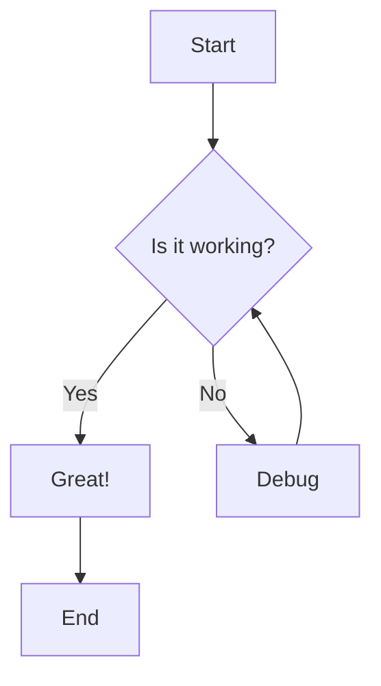

### Sequence Diagram

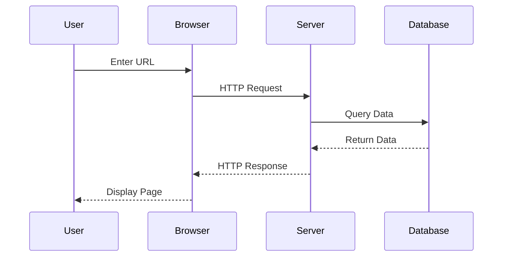

### Class Diagram

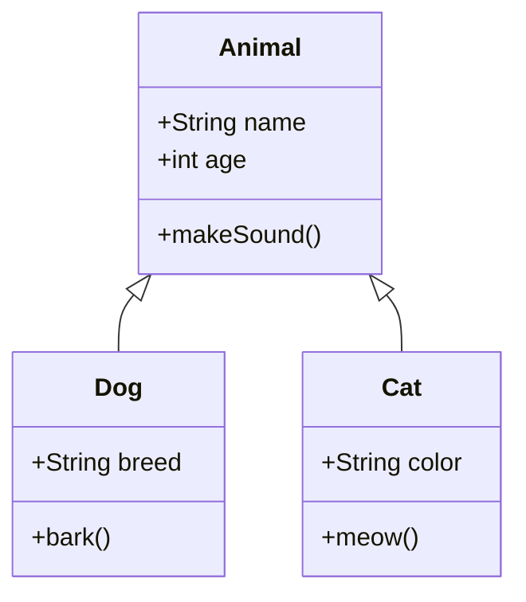

### State Diagram

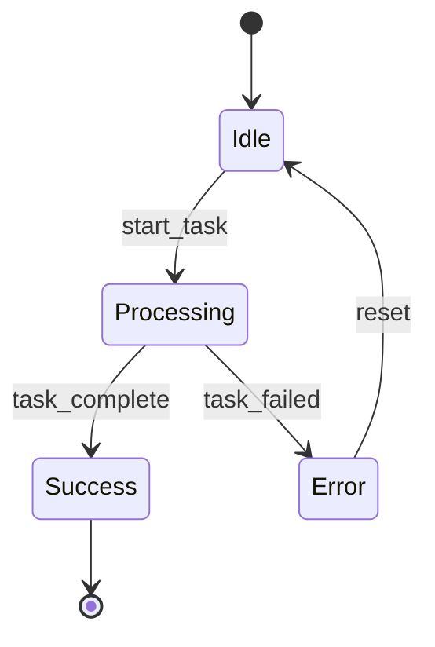

### Entity Relationship Diagram

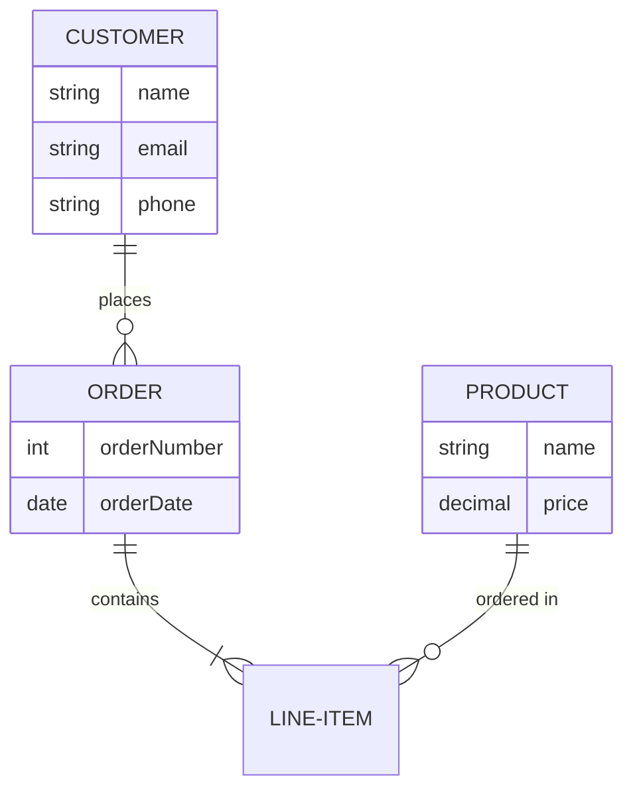

### Gantt Chart

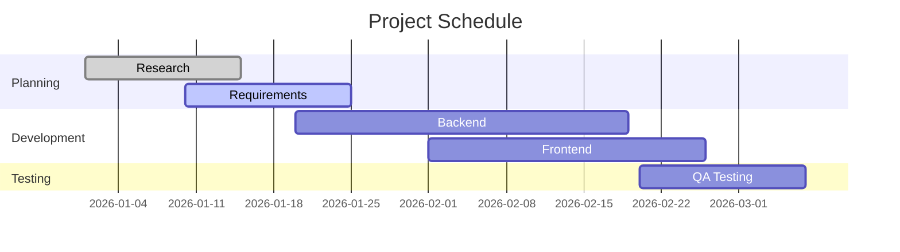

### Pie Chart

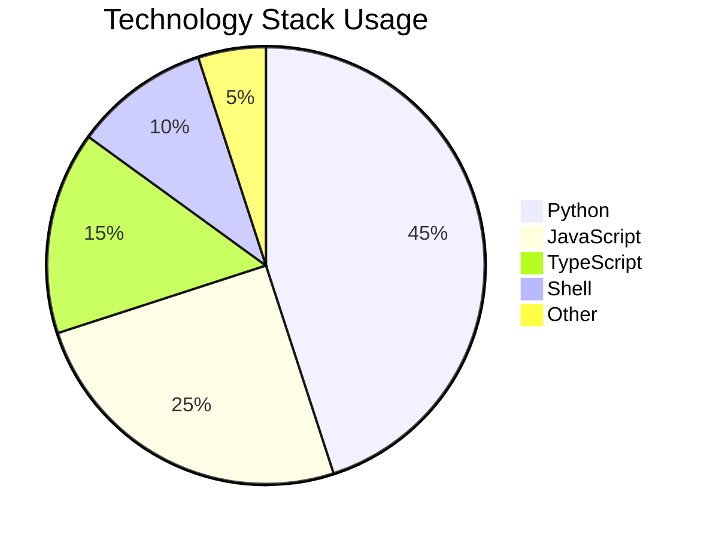

### Git Graph

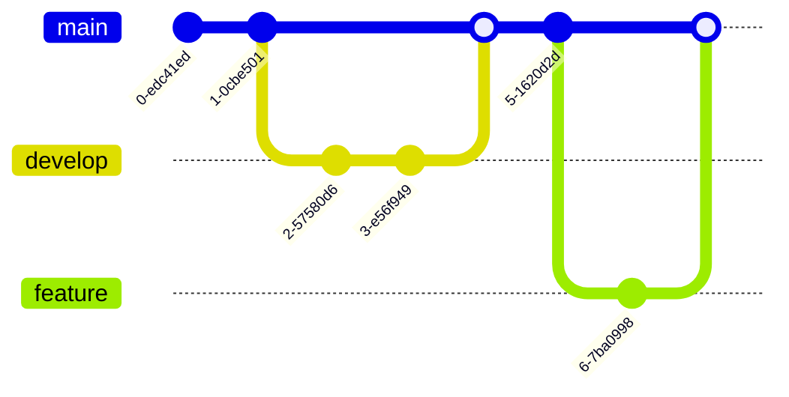

### User Journey

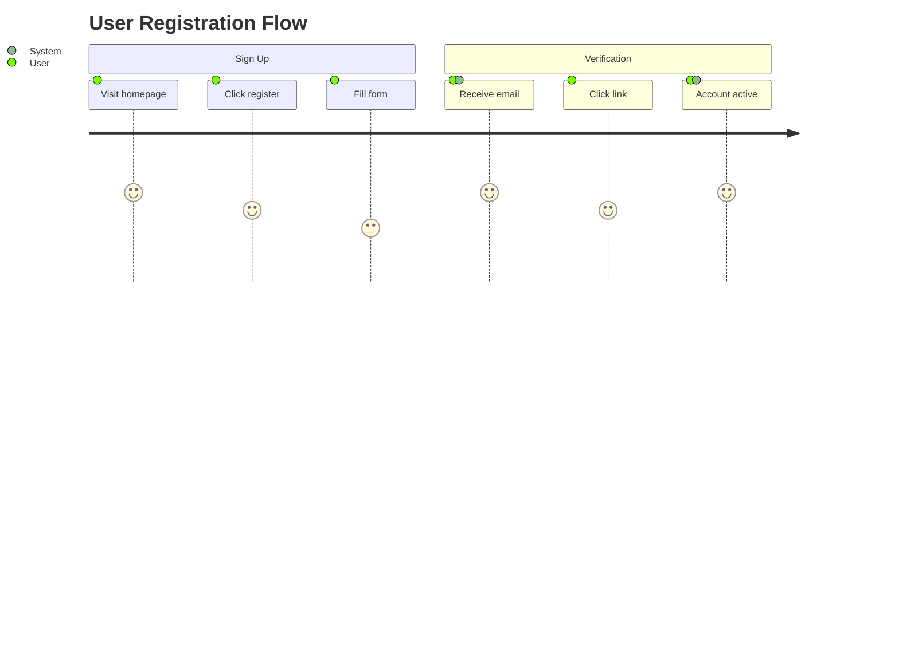

### Mindmap

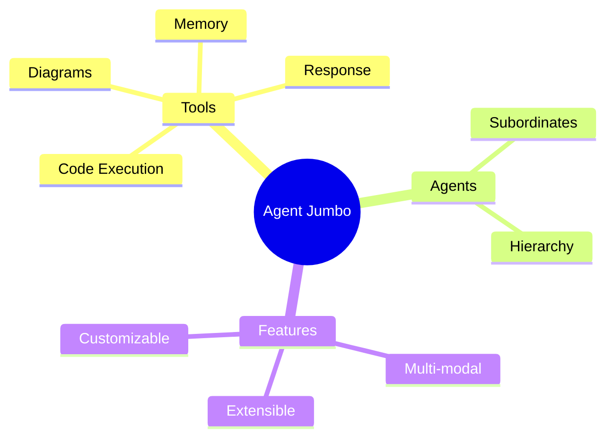

## Advanced Examples

### Architecture Diagram

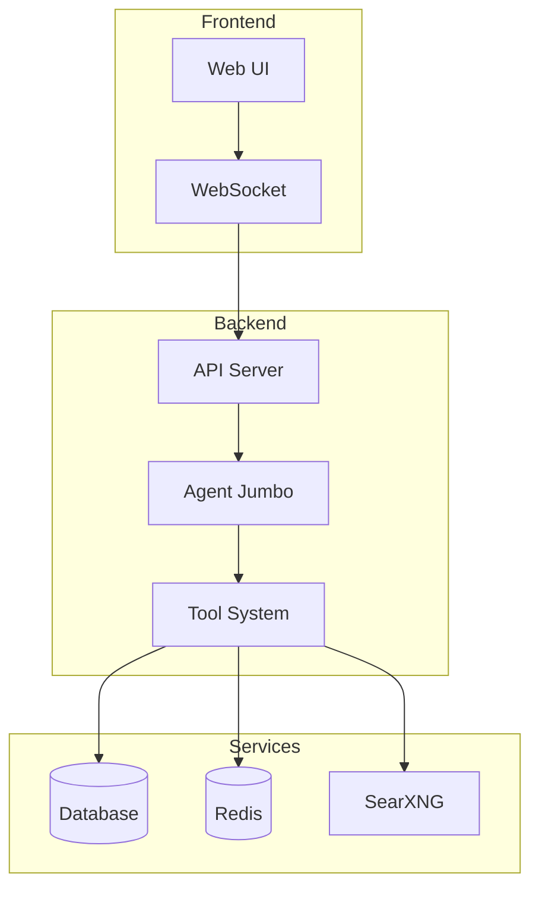

### System Flow

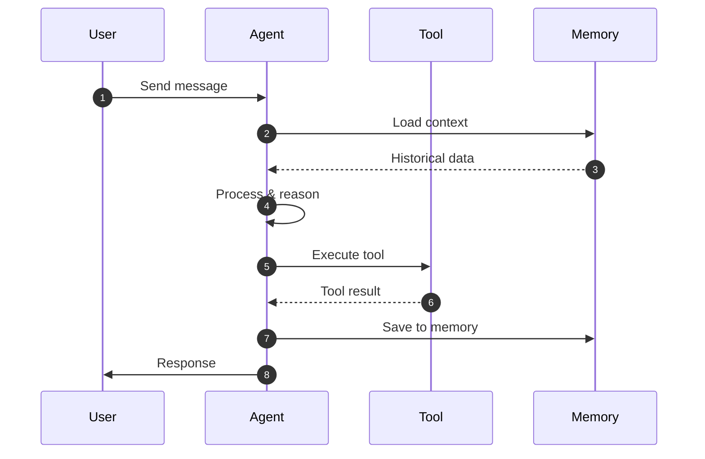

## Command Reference

### Mermaid CLI

```bash
# Basic usage
python generate_mermaid.py -o output.png -c "graph TD; A-->B;"

# With options
python generate_mermaid.py \
  --output diagram.svg \
  --format svg \
  --theme dark \
  --background transparent \
  --width 2048 \
  --height 1536 \
  --code "flowchart LR; Start-->End"

# From file
python generate_mermaid.py -o output.png -i input.mmd
```

### Excalidraw CLI

```bash
# Use template
python generate_excalidraw.py -o sketch.excalidraw -t flowchart

# Custom elements
python generate_excalidraw.py -o custom.excalidraw \
  -e '[{"type":"rectangle","x":100,"y":100,"width":200,"height":100,"text":"Box"}]'
```

### Draw.io CLI

```bash
# Use template
python generate_drawio.py -o network.png -t network -f png

# From XML
python generate_drawio.py -o diagram.drawio -x "<mxfile>...</mxfile>"
```

## Tips & Best Practices

1. **For chat interactions**: Use Mermaid inline code blocks
   - Renders immediately
   - No file management needed
   - Beautiful output

2. **For file exports**: Use the diagram_tool or CLI scripts
   - PNG for presentations
   - SVG for scalability
   - PDF for documentation

3. **Choose the right tool**:
   - **Quick diagrams**: Mermaid
   - **Hand-drawn style**: Excalidraw
   - **Professional technical**: Draw.io

4. **Mermaid themes**:
   - `default` - Classic look
   - `dark` - Dark background
   - `forest` - Green tones
   - `neutral` - Minimal colors

5. **Performance**:
   - Inline Mermaid is fastest
   - File exports take 2-5 seconds
   - Complex diagrams may take longer

## Troubleshooting

### Mermaid not rendering

- Check browser console for errors
- Ensure mermaid.min.js is loaded
- Verify code block has `language-mermaid` class

### Export failures

- Ensure mmdc (mermaid-cli) is installed
- Check file path permissions
- Verify diagram syntax is valid

### Installation

If diagram tools aren't working in Docker:

```bash
# Inside container
npm install -g @mermaid-js/mermaid-cli
```

## Examples for Agent

Ask the agent things like:

- "Create a flowchart for user authentication"
- "Show me a sequence diagram of the API request flow"
- "Generate a class diagram for the Tool hierarchy"
- "Make a Gantt chart for the project timeline"
- "Draw an architecture diagram with multiple services"
- "Create an ER diagram for the database schema"

The agent will automatically choose the best diagram type and render it inline!

## Contributing

To add new diagram types or templates:

1. Add to instrument `.md` file for documentation
2. Extend Python generator scripts
3. Update tool prompt with examples
4. Test in chat and file export modes

## Resources

- [Mermaid Documentation](https://mermaid.js.org/)
- [Excalidraw](https://excalidraw.com)
- [Draw.io](https://app.diagrams.net)
- [Agent Jumbo Docs](../docs/README.md)
