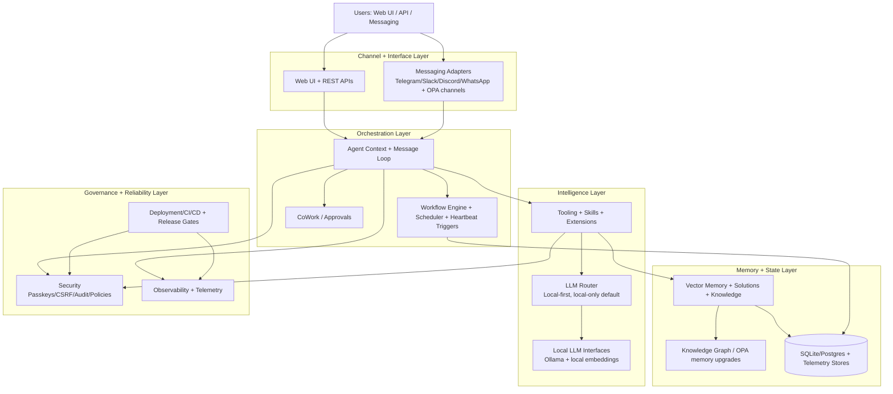
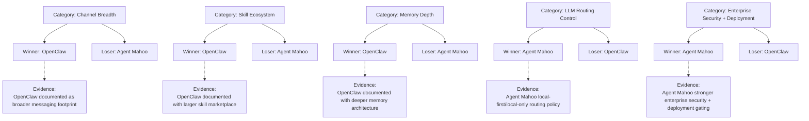

# Agent Mahoo vs OpenClaw: High-Level Architecture

This visual compares the current Agent Mahoo + Agent Mahoo implementation to the OpenClaw reference model used in this codebase planning docs.

Assumption sources in this repo:

- `AGENT-MAHOO-OPA.md`
- `COMPETITIVE-ANALYSIS.md`
- `COMPLETE_VS_COMPLETE_COMPARISON.md`

## 1) Current Implementation (Agent Mahoo + Agent Mahoo)

## 2) Winner/Loser Matrix: Agent Mahoo vs OpenClaw

## 3) Strategic Readout (From Diagram)

- Agent Mahoo strength: orchestration, security, deployment, and now local-first LLM control.
- OpenClaw strength: channel breadth + ecosystem scale + mature messaging-native memory patterns.
- OPA roadmap objective: close channel/skill/memory gaps while preserving Agent Mahoo enterprise strengths.
