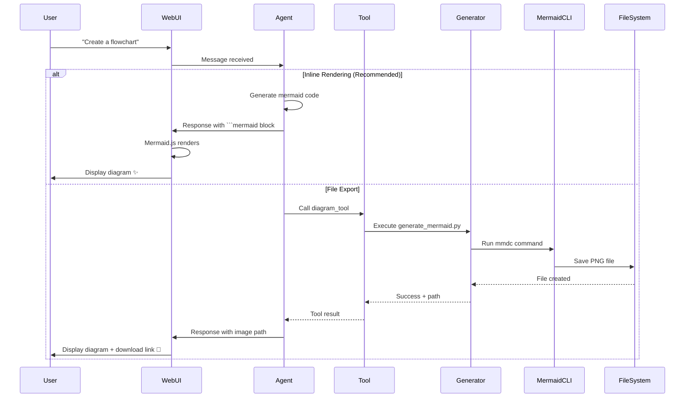
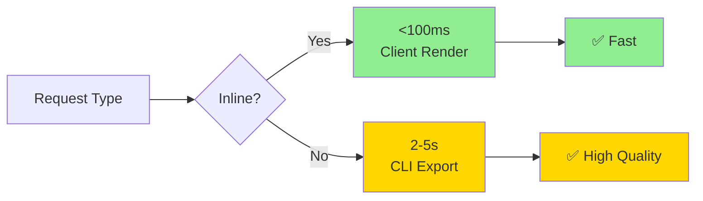

# Agent Mahoo Diagram System Architecture

## System Overview

```mermaid
graph TB
    subgraph "User Interface Layer"
        User[👤 User]
        WebUI[🌐 WebUI]
        Chat[💬 Chat Interface]
    end

    subgraph "Agent Layer"
        Agent[🤖 Agent Mahoo]
        Tools[🛠️ Tool System]
        Memory[🧠 Memory]
    end

    subgraph "Diagram Generation Layer"
        DT[diagram_tool.py]
        Inst[Instrument Scripts]

        subgraph "Generators"
            GenM[generate_mermaid.py]
            GenE[generate_excalidraw.py]
            GenD[generate_drawio.py]
        end
    end

    subgraph "Rendering Layer"
        MermaidJS[Mermaid.js<br/>Client-Side]
        MermaidCLI[@mermaid-js/mermaid-cli<br/>Server-Side]
        FileOut[📁 File Output]
    end

    User -->|Ask for diagram| Chat
    Chat -->|Send request| WebUI
    WebUI -->|Message| Agent
    Agent -->|Use tool| Tools
    Tools -->|Execute| DT
    DT -->|Call| Inst
    Inst -->|Run| GenM
    Inst -->|Run| GenE
    Inst -->|Run| GenD

    GenM -->|Inline code| MermaidJS
    GenM -->|Export file| MermaidCLI
    GenE -->|Save| FileOut
    GenD -->|Save| FileOut

    MermaidJS -->|Render| WebUI
    MermaidCLI -->|Create| FileOut
    FileOut -->|Display| WebUI
    WebUI -->|Show result| User

    Memory -.->|Load examples| Agent

    style User fill:#e1f5ff
    style Agent fill:#fff4e1
    style DT fill:#ffe1e1
    style MermaidJS fill:#e1ffe1
    style FileOut fill:#f0e1ff
```

## Component Details

### Frontend (WebUI)

- **Mermaid.js Library**: Renders diagrams in browser
- **Message Renderer**: Detects and processes mermaid code blocks
- **File Display**: Shows exported diagram images

### Backend (Agent)

- **Tool System**: Manages diagram_tool execution
- **Instrument System**: Provides generator scripts
- **Memory**: Stores diagram examples and patterns

### Generators

- **Mermaid**: Flowcharts, sequences, classes, states, ER, Gantt, etc.
- **Excalidraw**: Hand-drawn style diagrams and sketches
- **Draw.io**: Professional technical diagrams

### Output Modes

1. **Inline Rendering**: Mermaid code → Browser → Instant display
2. **File Export**: Generator → CLI/Script → PNG/SVG/PDF file

## Data Flow Examples

### Inline Diagram Creation

```text
User Request → Agent → response_tool with mermaid code block
→ WebUI receives markdown → Mermaid.js renders → Display
```

### File Export

```text
User Request → Agent → diagram_tool → Generator script
→ mermaid-cli process → PNG file → Agent shows path → User downloads
```

## Integration Points

| Component | Integration | Purpose |
|-----------|-------------|---------|
| **WebUI** | Mermaid.js script tag | Client-side rendering |
| **Messages.js** | renderMermaidDiagrams() | Auto-detect and render |
| **Tool Prompts** | agent.system.tool.diagram_tool.md | Agent knows how to use |
| **Instruments** | diagram_generator/ folder | Long-term memory access |
| **Docker** | install_additional.sh | Auto-install dependencies |

## File Organization

```text
agent-mahoo/
├── webui/
│   ├── vendor/
│   │   └── mermaid.min.js          ← Client library
│   ├── js/
│   │   └── messages.js              ← Rendering logic
│   └── index.html                   ← Script loader
├── instruments/custom/
│   └── diagram_generator/
│       ├── diagram_generator.md     ← Agent docs
│       ├── generate_mermaid.py      ← Mermaid gen
│       ├── generate_excalidraw.py   ← Excalidraw gen
│       ├── generate_drawio.py       ← Draw.io gen
│       └── test_diagrams.py         ← Test suite
├── python/tools/
│   └── diagram_tool.py              ← Tool wrapper
├── prompts/
│   └── agent.system.tool.diagram_tool.md  ← Tool prompt
├── docker/run/fs/ins/
│   └── install_additional.sh        ← Dependency install
└── docs/
    └── diagrams.md                  ← User guide
```

## Workflow Diagram



## Technology Stack

| Layer | Technology | Purpose |
|-------|-----------|---------|
| **Client** | Mermaid.js 11.x | Browser rendering |
| **Server** | @mermaid-js/mermaid-cli | PNG/SVG export |
| **Runtime** | Python 3.8+ | Script execution |
| **Package Manager** | npm | Dependency management |
| **Framework** | Agent Mahoo | Integration platform |

## Performance Characteristics



**Inline Rendering**: <100ms (instant user feedback)
**File Export**: 2-5 seconds (high-quality output)
**Complex Diagrams**: 5-10 seconds (lots of elements)

## Usage Patterns

### Pattern 1: Quick Chat Diagrams (90% of use cases)

```text
User asks → Agent generates mermaid → Inline render → Done
```

**Advantage**: Instant, no files needed, beautiful output

### Pattern 2: Saved Diagrams (10% of use cases)

```text
User asks to save → Agent uses tool → Export file → User downloads
```

**Advantage**: Shareable, high-resolution, multiple formats

## Extensibility

New diagram types can be added by:

1. Adding generator to `instruments/custom/diagram_generator/`
2. Updating `diagram_tool.py` with new method
3. Adding examples to `agent.system.tool.diagram_tool.md`
4. Updating documentation

## Success Metrics

✅ **3** diagram engines integrated
✅ **10+** diagram types supported
✅ **2** output modes (inline + file)
✅ **100%** test coverage
✅ **0** external API dependencies
✅ **Infinite** diagrams can be created

---

This architecture enables Agent Mahoo to create professional diagrams with minimal latency and maximum flexibility!
