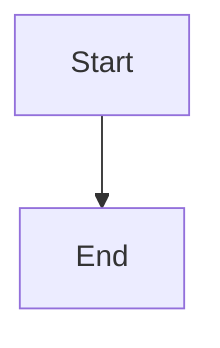
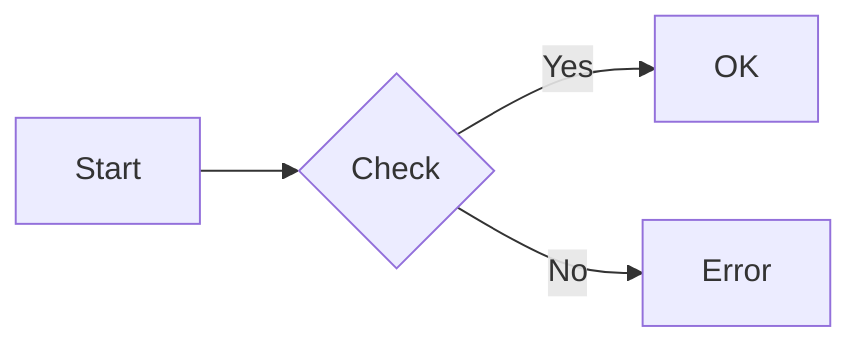
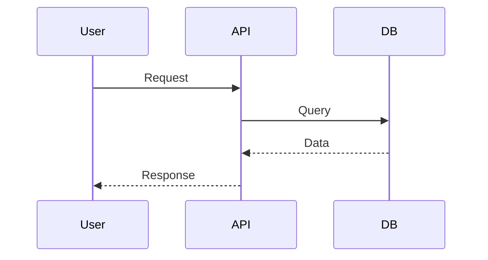
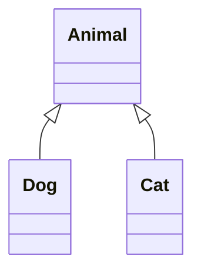

# 📋 Diagram Generation Quick Reference

## 🎨 For Agent Mahoo Users

### Ask the Agent

```text
"Create a flowchart for user authentication"
"Show me a sequence diagram of the API flow"
"Generate a class diagram for the Tool system"
"Make a Gantt chart for the project timeline"
"Draw an ER diagram for the database"
```

### Inline Mermaid (Best for Chat)

````markdown

````

## 🛠️ For Developers

### Mermaid CLI

```bash
python generate_mermaid.py -o diagram.png -c "graph TD; A-->B;"
python generate_mermaid.py -o diagram.svg -f svg -t dark -c "..."
```

### Excalidraw CLI

```bash
python generate_excalidraw.py -o sketch.excalidraw -t flowchart
python generate_excalidraw.py -o custom.excalidraw -e '[...]'
```

### Draw.io CLI

```bash
python generate_drawio.py -o network.png -t network
python generate_drawio.py -o diagram.drawio -x "<mxfile>...</mxfile>"
```

## 📊 Diagram Types

| Type | Use For | Example |
|------|---------|---------|
| **Flowchart** | Process flows, algorithms | `graph TD; A-->B` |
| **Sequence** | API calls, interactions | `sequenceDiagram` |
| **Class** | UML, object models | `classDiagram` |
| **State** | State machines | `stateDiagram-v2` |
| **ER** | Database schema | `erDiagram` |
| **Gantt** | Project timelines | `gantt` |
| **Pie** | Data distribution | `pie title...` |
| **Git** | Branch visualization | `gitGraph` |

## 🎯 Quick Examples

### Flowchart



### Sequence



### Class



## 📁 File Locations

```text
/a0/instruments/custom/diagram_generator/
├── generate_mermaid.py
├── generate_excalidraw.py
├── generate_drawio.py
└── diagram_generator.md

/docs/diagrams.md              # Full guide
/python/tools/diagram_tool.py  # Tool implementation
```

## ⚡ Tips

1. **Use inline Mermaid** for chat - fastest and easiest
2. **Export to PNG** when you need to save/share
3. **Use templates** for common patterns
4. **Check syntax** at mermaid.live for complex diagrams
5. **Dark theme** for presentations: `--theme dark`

## 🔍 Troubleshooting

**Not rendering?** → Check browser console
**Export fails?** → Run `mmdc --version`
**Syntax error?** → Validate at mermaid.live
**File not found?** → Check absolute paths

## 📖 Full Documentation

- `/docs/diagrams.md` - Complete guide with all examples
- `mermaid.js.org` - Mermaid documentation
- `excalidraw.com` - Excalidraw editor
- `app.diagrams.net` - Draw.io editor
