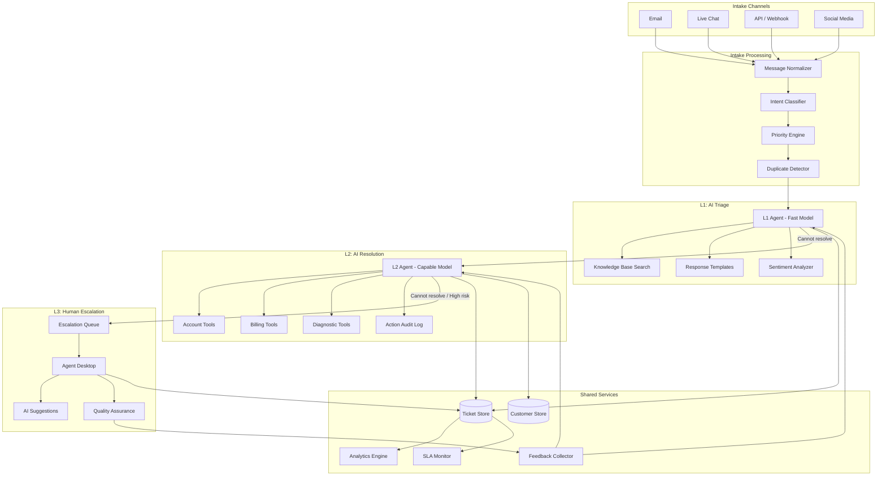

# Reference Architecture: Customer Support Automation

## Overview

A multi-tier AI-powered customer support system that handles the full spectrum from simple FAQ resolution to complex technical troubleshooting. The architecture routes tickets through three tiers: AI triage (L1), AI resolution with tools (L2), and human escalation (L3). The goal is to resolve 70-80% of tickets without human involvement while maintaining high customer satisfaction.

## Architecture Diagram



## Tier Breakdown

### L1: AI Triage (Target: 50% resolution)

L1 handles straightforward queries using a fast, cost-effective model (Claude Haiku, GPT-4o-mini) with knowledge base retrieval.

**Capabilities:**
- FAQ resolution using RAG over the knowledge base
- Password reset instructions
- Order status lookups (read-only)
- Feature explanation and documentation pointers
- Routing to L2 with classified intent and priority

**Model selection:** Use the smallest model that achieves > 90% accuracy on your L1 test set. Speed and cost matter here -- L1 processes the highest volume.

```python
class L1Agent:
    def __init__(self):
        self.llm = LLMClient(model="claude-haiku")  # Fast, cheap
        self.kb = KnowledgeBase(index="support-docs")
        self.max_turns = 3  # Short conversations only

    async def handle(self, ticket: Ticket) -> L1Result:
        # Retrieve relevant KB articles
        context = await self.kb.search(ticket.message, top_k=5)

        response = await self.llm.complete(
            system=L1_SYSTEM_PROMPT,
            messages=[
                {"role": "user", "content": ticket.message},
            ],
            context=context,
        )

        if response.can_resolve:
            return L1Result(
                status="resolved",
                response=response.answer,
                confidence=response.confidence,
                kb_articles=context.article_ids,
            )
        else:
            return L1Result(
                status="escalate_l2",
                intent=response.classified_intent,
                priority=response.priority,
                summary=response.summary_for_next_tier,
            )
```

**Escalation triggers:**
- Confidence below threshold (< 0.75)
- Customer expresses frustration or anger (sentiment score < -0.5)
- Query requires account modification
- Query involves billing disputes or refunds
- Customer explicitly requests a human

### L2: AI Resolution with Tools (Target: 25% resolution)

L2 uses a more capable model with access to account management tools. It can take actions, not just provide information.

**Capabilities:**
- Account lookup and modification
- Billing adjustments within policy limits
- Technical troubleshooting with diagnostic tools
- Multi-step problem resolution
- Generating and sending follow-up communications

```python
class L2Agent:
    POLICY_LIMITS = {
        "refund_max": 50.00,        # Auto-refund up to $50
        "credit_max": 100.00,       # Auto-credit up to $100
        "subscription_change": True, # Can change plan
        "account_delete": False,     # Cannot delete accounts
    }

    def __init__(self):
        self.llm = LLMClient(model="claude-sonnet")  # More capable
        self.tools = [
            AccountLookupTool(),
            BillingAdjustmentTool(limits=self.POLICY_LIMITS),
            DiagnosticTool(),
            EmailSendTool(),
        ]

    async def handle(self, ticket: Ticket, l1_context: L1Result) -> L2Result:
        messages = self.build_context(ticket, l1_context)

        for turn in range(self.max_turns):
            response = await self.llm.complete(
                system=L2_SYSTEM_PROMPT,
                messages=messages,
                tools=self.tools,
            )

            if response.tool_calls:
                for call in response.tool_calls:
                    # Policy check before execution
                    if not self.policy_allows(call):
                        return L2Result(
                            status="escalate_l3",
                            reason="Action exceeds policy limits",
                            proposed_action=call,
                        )
                    result = await self.execute_tool(call)
                    await self.audit_log.record(ticket.id, call, result)
                    messages.append(tool_result_message(call, result))
            else:
                return L2Result(status="resolved", response=response.content)

        return L2Result(status="escalate_l3", reason="Max turns exceeded")
```

**Escalation triggers:**
- Action exceeds policy limits (refund > $50, account deletion)
- Customer requests human explicitly after L2 introduction
- Technical issue requires backend system access L2 does not have
- Legal, compliance, or safety concerns detected
- Max conversation turns exceeded without resolution

### L3: Human Escalation (Target: 20-25% of tickets)

Human agents handle complex cases with AI assistance. The AI provides suggested responses, relevant context, and recommended actions.

**AI assistance for human agents:**

```python
class AIAssistant:
    """Provides real-time suggestions to human agents."""

    async def suggest_response(self, conversation: list[Message]) -> Suggestion:
        return await self.llm.complete(
            system="You are assisting a human support agent. Suggest a response.",
            messages=conversation,
        )

    async def summarize_history(self, ticket: Ticket) -> str:
        """Summarize L1/L2 interactions so the human does not re-read everything."""
        return await self.llm.complete(
            system="Summarize the support interaction so far. Include: "
                   "customer issue, what was tried, what failed, and recommended next steps.",
            messages=ticket.full_history,
        )

    async def check_compliance(self, draft_response: str) -> ComplianceCheck:
        """Check the human agent's response for policy compliance before sending."""
        return await self.llm.complete(
            system="Review this support response for policy compliance.",
            messages=[{"role": "user", "content": draft_response}],
        )
```

## Routing Logic

```python
class TicketRouter:
    ROUTING_RULES = {
        # Intent -> (tier, priority)
        "password_reset":     ("L1", "low"),
        "order_status":       ("L1", "normal"),
        "billing_question":   ("L1", "normal"),
        "refund_request":     ("L2", "normal"),
        "account_issue":      ("L2", "normal"),
        "technical_bug":      ("L2", "high"),
        "legal_complaint":    ("L3", "urgent"),
        "security_incident":  ("L3", "critical"),
        "executive_escalation": ("L3", "critical"),
    }

    async def route(self, ticket: Ticket) -> RoutingDecision:
        # Classify intent
        intent = await self.classifier.classify(ticket.message)

        # Check for VIP customers
        customer = await self.customer_db.get(ticket.customer_id)
        if customer.tier == "enterprise":
            return RoutingDecision(tier="L2", priority="high")

        # Check for repeat contacts (same issue within 24h)
        recent = await self.ticket_db.find_recent(ticket.customer_id, hours=24)
        if len(recent) > 2:
            return RoutingDecision(tier="L2", priority="high")

        # Apply routing rules
        tier, priority = self.ROUTING_RULES.get(intent, ("L1", "normal"))
        return RoutingDecision(tier=tier, priority=priority, intent=intent)
```

## SLA Patterns

```python
SLA_TARGETS = {
    "critical": {
        "first_response": timedelta(minutes=5),
        "resolution": timedelta(hours=1),
        "escalation_timeout": timedelta(minutes=15),
    },
    "high": {
        "first_response": timedelta(minutes=15),
        "resolution": timedelta(hours=4),
        "escalation_timeout": timedelta(minutes=30),
    },
    "normal": {
        "first_response": timedelta(hours=1),
        "resolution": timedelta(hours=24),
        "escalation_timeout": timedelta(hours=2),
    },
    "low": {
        "first_response": timedelta(hours=4),
        "resolution": timedelta(hours=48),
        "escalation_timeout": timedelta(hours=8),
    },
}

class SLAMonitor:
    async def check_breaches(self):
        open_tickets = await self.ticket_db.get_open()
        for ticket in open_tickets:
            sla = SLA_TARGETS[ticket.priority]
            age = datetime.utcnow() - ticket.created_at

            if not ticket.first_response_at and age > sla["first_response"]:
                await self.alert("first_response_breach", ticket)

            if age > sla["resolution"]:
                await self.alert("resolution_breach", ticket)
                # Auto-escalate
                await self.escalate(ticket, reason="SLA breach")
```

## Quality Assurance

```python
class QualityChecker:
    async def evaluate_resolution(self, ticket: Ticket) -> QAScore:
        """Post-resolution quality check on a sample of AI-resolved tickets."""
        score = await self.llm.complete(
            system=QA_EVALUATION_PROMPT,
            messages=[
                {"role": "user", "content": json.dumps({
                    "customer_message": ticket.original_message,
                    "ai_response": ticket.resolution_message,
                    "actions_taken": ticket.action_log,
                    "customer_satisfaction": ticket.csat_score,
                })}
            ],
        )
        return QAScore(
            accuracy=score.accuracy,       # Was the answer correct?
            completeness=score.completeness, # Did it address all concerns?
            tone=score.tone,               # Was the tone appropriate?
            policy_compliance=score.policy, # Did it follow policy?
        )
```

Sample 10-20% of AI-resolved tickets for QA review. Flag any ticket that scores below threshold for human review and retraining.

## Metrics Dashboard

| Metric | Target | Alert Threshold |
|--------|--------|-----------------|
| L1 resolution rate | > 50% | < 40% |
| L2 resolution rate | > 80% (of L2 tickets) | < 65% |
| Overall AI resolution | > 70% | < 60% |
| CSAT for AI-resolved | > 4.0/5.0 | < 3.5/5.0 |
| First response time (P95) | < 30s for L1/L2 | > 60s |
| SLA breach rate | < 2% | > 5% |
| Escalation accuracy | > 90% | < 80% |
| Cost per resolution (AI) | < $0.50 | > $1.00 |
| Cost per resolution (human) | < $15.00 | > $25.00 |

## Key Design Decisions

1. **L1 and L2 use different models.** L1 uses a fast, cheap model for high-volume simple queries. L2 uses a more capable model for complex reasoning. This optimizes cost without sacrificing quality where it matters.

2. **Policy limits are enforced in code, not in prompts.** The L2 agent cannot refund more than $50 even if it wants to -- the tool itself enforces the limit. Never rely on prompt instructions alone for security-critical constraints.

3. **Every L2 action is logged to an audit trail.** This supports compliance, dispute resolution, and continuous improvement of the AI system.

4. **Human agents get AI assistance, not replacement.** L3 provides suggested responses and context summaries to make human agents faster, not to eliminate them.

5. **Feedback loops are built in from day one.** QA scores, CSAT data, and human corrections feed back into model fine-tuning and prompt improvement.
