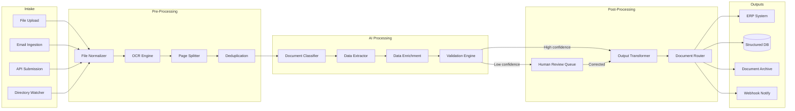

# Reference Architecture: Document Processing Pipeline

## Overview

This architecture processes unstructured documents (PDFs, images, emails, scanned forms) through an AI-powered pipeline that classifies, extracts structured data, validates results, and routes outputs to downstream systems. The pipeline handles high volume (thousands of documents per day) with configurable confidence thresholds and a human review queue for uncertain extractions.

## Pipeline Diagram



## Stage 1: Intake

Multiple ingestion channels feed into a unified processing queue. Each document gets a unique processing ID and metadata envelope.

```python
@dataclass
class DocumentEnvelope:
    doc_id: str
    source: str           # "upload", "email", "api", "directory"
    original_filename: str
    mime_type: str
    file_size: int
    raw_content: bytes
    metadata: dict        # Source-specific metadata (email headers, upload user, etc.)
    received_at: datetime
    priority: str         # "normal", "high", "urgent"

class IntakeService:
    async def ingest(self, source: str, file: bytes, metadata: dict) -> str:
        doc_id = str(uuid.uuid4())
        envelope = DocumentEnvelope(
            doc_id=doc_id,
            source=source,
            mime_type=magic.from_buffer(file, mime=True),
            file_size=len(file),
            raw_content=file,
            metadata=metadata,
            received_at=datetime.utcnow(),
            priority=self.determine_priority(metadata),
        )
        await self.storage.save_raw(doc_id, file)
        await self.queue.enqueue("pre-processing", envelope)
        return doc_id
```

## Stage 2: Pre-Processing

### File Normalization

Convert all inputs to a standard format for downstream processing.

```python
class FileNormalizer:
    SUPPORTED_TYPES = {"application/pdf", "image/png", "image/jpeg", "image/tiff"}

    async def normalize(self, envelope: DocumentEnvelope) -> NormalizedDocument:
        if envelope.mime_type == "application/pdf":
            pages = await self.pdf_to_images(envelope.raw_content)
        elif envelope.mime_type.startswith("image/"):
            pages = [await self.preprocess_image(envelope.raw_content)]
        elif envelope.mime_type == "message/rfc822":
            pages = await self.extract_email_attachments(envelope.raw_content)
        else:
            raise UnsupportedDocumentType(envelope.mime_type)

        return NormalizedDocument(
            doc_id=envelope.doc_id,
            pages=pages,  # List of PIL Images
            page_count=len(pages),
        )
```

### OCR

Extract text from images. Use a tiered approach: fast OCR first, LLM vision for difficult pages.

```python
class OCRService:
    async def extract_text(self, page: Image) -> OCRResult:
        # Tier 1: Fast OCR (Tesseract / cloud OCR)
        result = await self.tesseract.process(page)

        if result.confidence > 0.85:
            return result

        # Tier 2: LLM vision for low-confidence pages
        vision_result = await self.llm_vision.extract_text(
            image=page,
            prompt="Extract all text from this document image. "
                   "Preserve layout and formatting. Include all numbers, "
                   "dates, and special characters exactly as they appear.",
        )
        return OCRResult(
            text=vision_result.text,
            confidence=vision_result.confidence,
            method="llm_vision",
        )
```

### Deduplication

Detect and flag duplicate submissions to prevent double-processing.

```python
class Deduplicator:
    async def check(self, doc: NormalizedDocument) -> DedupResult:
        # Content hash for exact duplicates
        content_hash = hashlib.sha256(doc.full_text.encode()).hexdigest()
        exact_match = await self.hash_store.find(content_hash)
        if exact_match:
            return DedupResult(is_duplicate=True, match_id=exact_match, match_type="exact")

        # Embedding similarity for near-duplicates
        embedding = await self.embedder.embed(doc.full_text[:2000])
        similar = await self.vector_store.search(embedding, threshold=0.95)
        if similar:
            return DedupResult(is_duplicate=True, match_id=similar[0].id, match_type="near")

        await self.hash_store.save(content_hash, doc.doc_id)
        return DedupResult(is_duplicate=False)
```

## Stage 3: AI Processing

### Document Classification

Classify documents by type to determine the appropriate extraction schema.

```python
DOCUMENT_TYPES = {
    "invoice": {
        "schema": InvoiceSchema,
        "extraction_prompt": INVOICE_EXTRACTION_PROMPT,
        "routing_rules": {"target": "accounts_payable"},
    },
    "receipt": {
        "schema": ReceiptSchema,
        "extraction_prompt": RECEIPT_EXTRACTION_PROMPT,
        "routing_rules": {"target": "expense_system"},
    },
    "contract": {
        "schema": ContractSchema,
        "extraction_prompt": CONTRACT_EXTRACTION_PROMPT,
        "routing_rules": {"target": "legal_review"},
    },
    "identity_document": {
        "schema": IdentitySchema,
        "extraction_prompt": IDENTITY_EXTRACTION_PROMPT,
        "routing_rules": {"target": "kyc_system"},
    },
}

class DocumentClassifier:
    async def classify(self, doc: NormalizedDocument) -> Classification:
        result = await self.llm.complete(
            system="Classify this document into one of the following types: "
                   + ", ".join(DOCUMENT_TYPES.keys()),
            messages=[{"role": "user", "content": doc.full_text[:3000]}],
            response_format=ClassificationResponse,  # Structured output
        )
        return Classification(
            doc_type=result.document_type,
            confidence=result.confidence,
            reasoning=result.reasoning,
        )
```

### Structured Data Extraction

Extract typed fields from the document using the schema for its document type.

```python
class DataExtractor:
    async def extract(self, doc: NormalizedDocument, doc_type: str) -> ExtractionResult:
        config = DOCUMENT_TYPES[doc_type]
        schema = config["schema"]

        result = await self.llm.complete(
            system=config["extraction_prompt"],
            messages=[
                {"role": "user", "content": f"Extract data from this document:\n\n{doc.full_text}"}
            ],
            response_format=schema,  # Pydantic model -> structured output
        )

        # Per-field confidence scoring
        field_confidences = {}
        for field_name, value in result.dict().items():
            confidence = self.score_field_confidence(field_name, value, doc.full_text)
            field_confidences[field_name] = confidence

        return ExtractionResult(
            data=result,
            field_confidences=field_confidences,
            overall_confidence=min(field_confidences.values()),
        )
```

**Example schema (Invoice):**

```python
class InvoiceSchema(BaseModel):
    vendor_name: str
    vendor_address: str | None
    invoice_number: str
    invoice_date: date
    due_date: date | None
    line_items: list[LineItem]
    subtotal: Decimal
    tax_amount: Decimal | None
    total_amount: Decimal
    currency: str
    payment_terms: str | None
    po_number: str | None

class LineItem(BaseModel):
    description: str
    quantity: Decimal
    unit_price: Decimal
    total: Decimal
```

### Validation Engine

Cross-validate extracted data using business rules and arithmetic checks.

```python
class ValidationEngine:
    def validate_invoice(self, data: InvoiceSchema) -> list[ValidationIssue]:
        issues = []

        # Arithmetic validation
        computed_subtotal = sum(item.total for item in data.line_items)
        if abs(computed_subtotal - data.subtotal) > Decimal("0.01"):
            issues.append(ValidationIssue(
                field="subtotal",
                severity="error",
                message=f"Subtotal mismatch: computed {computed_subtotal}, extracted {data.subtotal}",
            ))

        # Line item math
        for i, item in enumerate(data.line_items):
            expected = item.quantity * item.unit_price
            if abs(expected - item.total) > Decimal("0.01"):
                issues.append(ValidationIssue(
                    field=f"line_items[{i}].total",
                    severity="error",
                    message=f"Line item total mismatch",
                ))

        # Date validation
        if data.due_date and data.due_date < data.invoice_date:
            issues.append(ValidationIssue(
                field="due_date",
                severity="warning",
                message="Due date is before invoice date",
            ))

        # Vendor validation against known vendors
        if not self.vendor_db.exists(data.vendor_name):
            issues.append(ValidationIssue(
                field="vendor_name",
                severity="info",
                message="Vendor not found in vendor database",
            ))

        return issues
```

## Stage 4: Human Review Queue

Documents with low confidence or validation errors are routed to a human review interface.

```python
class ReviewQueueManager:
    REVIEW_THRESHOLDS = {
        "auto_approve": 0.95,   # High confidence, no validation errors
        "quick_review": 0.80,   # Medium confidence, minor issues
        "full_review": 0.0,     # Low confidence or major issues
    }

    async def route(self, extraction: ExtractionResult, issues: list[ValidationIssue]) -> str:
        has_errors = any(i.severity == "error" for i in issues)

        if has_errors:
            return "full_review"
        elif extraction.overall_confidence >= self.REVIEW_THRESHOLDS["auto_approve"]:
            return "auto_approve"
        elif extraction.overall_confidence >= self.REVIEW_THRESHOLDS["quick_review"]:
            return "quick_review"
        else:
            return "full_review"
```

The review interface shows:
- Original document image alongside extracted data
- Highlighted fields with low confidence (yellow) or validation errors (red)
- Pre-filled fields that the reviewer can correct
- One-click approval for high-confidence extractions

## Stage 5: Output and Routing

```python
class DocumentRouter:
    async def route(self, doc_id: str, doc_type: str, data: dict):
        config = DOCUMENT_TYPES[doc_type]["routing_rules"]
        target = config["target"]

        # Transform to target system format
        transformed = self.transformers[target].transform(data)

        # Send to target
        await self.targets[target].submit(transformed)

        # Archive original + extracted data
        await self.archive.store(doc_id, data, transformed)

        # Notify via webhook
        await self.webhook.notify(doc_id, doc_type, status="processed")
```

## Performance Characteristics

| Stage | Avg Latency | Cost per Document |
|-------|-------------|-------------------|
| Pre-processing + OCR | 2-5s | $0.01-0.05 |
| Classification | 1-2s | $0.005-0.02 |
| Extraction (LLM) | 3-8s | $0.02-0.10 |
| Validation | < 100ms | Negligible |
| Total (auto-approved) | 8-15s | $0.04-0.17 |

## Scaling Considerations

- **Intake** scales horizontally with queue consumers
- **OCR** is CPU-bound -- scale with dedicated OCR workers
- **LLM extraction** is the bottleneck -- batch documents and use rate limit management
- **Human review** is the true bottleneck -- invest in UI that makes review fast

## Key Design Decisions

1. **Tiered OCR**: Fast OCR for clean documents, LLM vision for degraded scans. This keeps costs low while maintaining extraction quality on difficult inputs.

2. **Structured output for extraction**: Using JSON schema / Pydantic models as the LLM response format ensures type safety and enables programmatic validation.

3. **Validation is separate from extraction**: The LLM extracts, deterministic code validates. This catches arithmetic errors and logical inconsistencies that LLMs commonly produce.

4. **Review queue has SLAs**: Unreviewed documents do not sit forever. Escalate or auto-approve with flagging after the SLA window.

5. **Every correction feeds back**: Human corrections during review are stored as training examples. Periodic prompt refinement and potential fine-tuning use this data.
