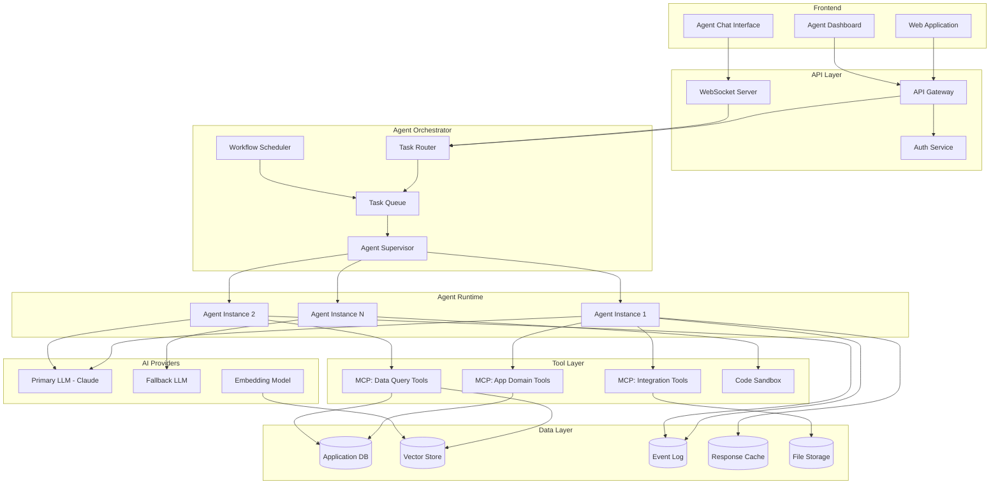

# Reference Architecture: SaaS with Embedded AI Agents

## Overview

This reference architecture describes how to embed AI agents into a SaaS product. The agents operate on behalf of users, performing tasks within the application's domain using the same APIs and data that human users access. The architecture prioritizes multi-tenancy, security isolation, observability, and cost control.

## Architecture Diagram



## Component Breakdown

### Frontend

**Web Application**: The existing SaaS UI. Agents are invoked from within the product -- a user clicks "analyze this report" or "draft a response" and the agent handles it.

**Agent Chat Interface**: A conversational interface for interactive agent sessions. Communicates over WebSockets for real-time streaming.

**Agent Dashboard**: Shows active agent tasks, history, token spend, and allows intervention (pause, cancel, modify).

### API Layer

**API Gateway**: Standard API gateway handling authentication, rate limiting, and routing. Agent requests go through the same gateway as human API requests.

**Auth Service**: Issues agent-scoped tokens. An agent acting on behalf of user X gets a token with user X's permissions -- never broader. Implements:
- Per-user agent quotas (max concurrent agents, max tokens/day)
- Scope restrictions (agent can read customer data but not delete it)
- Session-scoped tokens that expire when the agent task completes

**WebSocket Server**: Handles real-time communication for streaming agent responses and progress updates to the frontend.

### Agent Orchestrator

**Task Router**: Receives agent requests and routes them based on:
- Task type (simple query vs. multi-step workflow)
- Required capabilities (which tools are needed)
- Priority (paid tier gets faster execution)
- Current load (queue depth, active agents)

**Agent Supervisor**: Manages agent lifecycle:
- Spawns agent instances from the pool
- Monitors heartbeats and kills stuck agents
- Enforces token budgets (hard stop at limit)
- Handles graceful degradation when LLM providers are down

**Task Queue**: Persistent queue (Redis Streams, SQS, or similar) for agent tasks. Provides:
- Priority queuing (enterprise customers first)
- Dead letter queue for failed tasks
- Deduplication to prevent re-processing

**Workflow Scheduler**: Triggers scheduled agent tasks (daily reports, weekly analysis, monitoring checks).

### Agent Runtime

Each agent instance is an isolated execution context with:
- Its own LLM session and conversation history
- Scoped tool access based on the user's permissions
- Token budget enforcement
- Structured logging to the event log

```python
class AgentInstance:
    def __init__(self, config: AgentConfig):
        self.tenant_id = config.tenant_id
        self.user_id = config.user_id
        self.tools = config.allowed_tools
        self.token_budget = config.max_tokens
        self.tokens_used = 0

    async def execute(self, task: Task) -> AgentResult:
        while not task.is_complete():
            if self.tokens_used >= self.token_budget:
                return AgentResult(
                    status="budget_exhausted",
                    partial_results=self.results,
                )
            response = await self.llm.complete(
                messages=self.history,
                tools=self.tools,
                max_tokens=min(4096, self.token_budget - self.tokens_used),
            )
            self.tokens_used += response.usage.total_tokens
            await self.process_response(response)
        return self.finalize()
```

### Tool Layer

**MCP: App Domain Tools**: Tools specific to the SaaS product (create invoice, update customer record, generate report). These wrap the application's internal APIs.

**MCP: Integration Tools**: Tools for third-party services (send email, query Salesforce, post to Slack). Each integration has its own MCP server with isolated credentials.

**MCP: Data Query Tools**: Read-only tools for querying application data and vector stores. Separated from mutation tools for security.

**Code Sandbox**: Isolated execution environment for running agent-generated code (data analysis scripts, custom transformations). Uses Vercel Sandbox or similar.

### Data Layer

**Application DB**: The existing SaaS database. Agents access it through the same ORM/API layer as the application -- never direct database access.

**Vector Store**: Stores embeddings for semantic search. Used by agents to find relevant documents, past conversations, knowledge base articles.

**Event Log**: Append-only log of all agent actions. Critical for audit, debugging, and billing.

**Response Cache**: Caches LLM responses keyed by (prompt_hash, model, temperature). Reduces cost and latency for repeated queries.

## Multi-Tenancy

Every agent request is scoped to a tenant. This is enforced at multiple layers:

```python
class TenantIsolation:
    @middleware
    async def enforce(self, request, handler):
        tenant_id = request.auth.tenant_id

        # Database queries are automatically scoped
        request.db = ScopedDatabase(tenant_id)

        # Tools are filtered by tenant permissions
        request.tools = self.tool_registry.for_tenant(tenant_id)

        # Token budgets are tenant-specific
        request.budget = await self.billing.get_budget(tenant_id)

        return await handler(request)
```

**Isolation rules:**
- Agent A (tenant 1) can never see data from tenant 2. Period.
- Tool access is scoped per-tenant (tenant 1 may have Salesforce integration, tenant 2 may not)
- Token budgets and rate limits are per-tenant
- Agent logs are partitioned by tenant

## Cost Control

```python
class CostController:
    TIER_LIMITS = {
        "free":       {"daily_tokens": 10_000,    "concurrent_agents": 1},
        "pro":        {"daily_tokens": 500_000,   "concurrent_agents": 5},
        "enterprise": {"daily_tokens": 5_000_000, "concurrent_agents": 20},
    }

    async def check_budget(self, tenant_id: str) -> BudgetStatus:
        tier = await self.billing.get_tier(tenant_id)
        limits = self.TIER_LIMITS[tier]
        usage = await self.usage.get_daily(tenant_id)

        return BudgetStatus(
            remaining_tokens=limits["daily_tokens"] - usage.tokens,
            can_start_agent=usage.active_agents < limits["concurrent_agents"],
        )
```

## Deployment Topology

```
Load Balancer
  |
  +-- API Servers (stateless, autoscaled)
  |
  +-- WebSocket Servers (sticky sessions)
  |
  +-- Agent Workers (autoscaled by queue depth)
  |     |-- Agent Runtime Container 1
  |     |-- Agent Runtime Container 2
  |     |-- Agent Runtime Container N
  |
  +-- MCP Servers (sidecar or standalone)
  |     |-- Domain Tools (co-located with API)
  |     |-- Integration Tools (isolated, rate-limited)
  |
  +-- Scheduled Workers (cron-triggered)
```

**Scaling strategy:**
- API servers scale on request rate
- Agent workers scale on queue depth (target: < 30s queue wait time)
- MCP servers scale with agent workers (1:1 sidecar or shared pool)

## Error Handling

| Failure | Response |
|---------|----------|
| LLM provider down | Failover to secondary provider |
| LLM rate limited | Queue with exponential backoff |
| Tool execution fails | Retry with backoff, then report to agent |
| Agent exceeds token budget | Graceful stop with partial results |
| Agent stuck in loop | Supervisor kills after N identical tool calls |
| Tenant over quota | Queue with "quota exceeded" notification |

## Key Design Decisions

1. **Agents use the application API, not direct DB access.** This ensures business logic, validation, and authorization are applied consistently.

2. **Token budgets are hard limits, not soft.** When the budget is exhausted, the agent stops. Users see partial results rather than surprise bills.

3. **All agent actions are logged to an append-only event log.** This supports audit requirements, billing reconciliation, and debugging.

4. **Tools are isolated in MCP servers.** A buggy integration tool cannot crash the agent runtime. Each MCP server can be restarted independently.

5. **Agent workers are stateless.** All state is in the task queue and event log. Any worker can pick up any task. This enables simple horizontal scaling.
