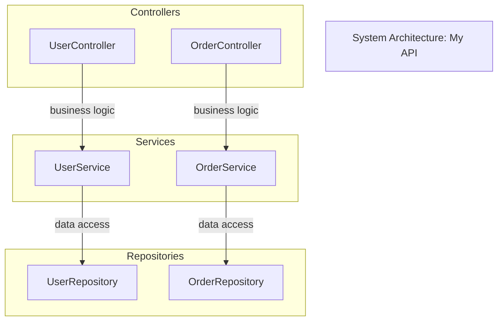

# Diagram Architect Tool

The **diagram_architect** tool auto-generates architecture diagrams from codebase analysis. It detects components, relationships, data flows, and external integrations to create comprehensive architecture documentation.

## Purpose

- Analyze codebases to detect software components
- Map relationships and dependencies between components
- Identify external service integrations
- Trace data flows through the system
- Generate Mermaid diagrams for visualization
- Export architecture documentation

## Diagram Types

| Type | Description |
|------|-------------|
| **System** | Component architecture showing services, controllers, models |
| **Data Flow** | How data moves through the system |
| **Integration** | External services and API connections |
| **Deployment** | Infrastructure and container layout |

---

## Available Actions

### 1. analyze_architecture

**Perform full architecture analysis of a project**

```
{{diagram_architect(
  action="analyze_architecture",
  project_path="/path/to/project",
  analysis_type="full"
)}}
```

**Parameters:**

- `project_path` (required): Path to the project to analyze
- `analysis_type` (optional): Type of analysis (full, quick) - default: full

**Returns:** analysis_id, detected counts for components, relationships, integrations, data flows

**What it detects:**

- Services, Controllers, Repositories, Models
- API endpoints and routes
- Database connections
- Message queues and caches
- External HTTP APIs, WebSockets, gRPC
- Cloud storage integrations
- Authentication providers
- Docker and Kubernetes configurations
- CI/CD pipelines

---

### 2. get_analysis

**Get analysis details**

```
{{diagram_architect(
  action="get_analysis",
  analysis_id=1
)}}
```

**Parameters:**

- `analysis_id` (required): Analysis ID

**Returns:** Analysis details with component counts

---

### 3. list_analyses

**List all analyses**

```
{{diagram_architect(
  action="list_analyses",
  project_path="/path/to/project"
)}}
```

**Parameters:**

- `project_path` (optional): Filter by project path

**Returns:** List of analyses with status

---

### 4. get_analysis_summary

**Get comprehensive analysis summary**

```
{{diagram_architect(
  action="get_analysis_summary",
  analysis_id=1
)}}
```

**Parameters:**

- `analysis_id` (required): Analysis ID

**Returns:** Summary with component breakdown, integration types, diagram list

---

### 5. generate_system_diagram

**Generate system/component architecture diagram**

```
{{diagram_architect(
  action="generate_system_diagram",
  analysis_id=1,
  title="My System Architecture"
)}}
```

**Parameters:**

- `analysis_id` (required): Analysis ID
- `title` (optional): Custom diagram title

**Returns:** diagram_id, Mermaid code

**Shows:**

- Components grouped by type (Controllers, Services, Models, etc.)
- Relationships between components
- Infrastructure components

---

### 6. generate_data_flow

**Generate data flow diagram**

```
{{diagram_architect(
  action="generate_data_flow",
  analysis_id=1,
  title="Data Flow Diagram"
)}}
```

**Parameters:**

- `analysis_id` (required): Analysis ID
- `title` (optional): Custom diagram title

**Returns:** diagram_id, Mermaid code

**Shows:**

- Data entry points (API endpoints)
- Data transformations
- Storage destinations
- Flow directions

---

### 7. generate_integration_map

**Generate external integrations diagram**

```
{{diagram_architect(
  action="generate_integration_map",
  analysis_id=1,
  title="External Integrations"
)}}
```

**Parameters:**

- `analysis_id` (required): Analysis ID
- `title` (optional): Custom diagram title

**Returns:** diagram_id, Mermaid code

**Shows:**

- Central application
- External services grouped by type
- Connection protocols
- Integration points

---

### 8. generate_deployment

**Generate deployment/infrastructure diagram**

```
{{diagram_architect(
  action="generate_deployment",
  analysis_id=1,
  title="Deployment Architecture"
)}}
```

**Parameters:**

- `analysis_id` (required): Analysis ID
- `title` (optional): Custom diagram title

**Returns:** diagram_id, Mermaid code

**Shows:**

- Containers and orchestration
- Database instances
- Cache layers
- CI/CD pipelines

---

### 9. generate_from_app_spec

**Generate diagram from app_spec.json**

```
{{diagram_architect(
  action="generate_from_app_spec",
  app_spec_path="/path/to/app_spec.json",
  diagram_type="system"
)}}
```

**Parameters:**

- `app_spec_path` (required): Path to app_spec.json
- `diagram_type` (optional): Type of diagram (system, data_flow) - default: system

**Returns:** diagram_id, Mermaid code

---

### 10. export_all

**Generate and export all diagram types**

```
{{diagram_architect(
  action="export_all",
  analysis_id=1,
  output_dir="/path/to/output"
)}}
```

**Parameters:**

- `analysis_id` (required): Analysis ID
- `output_dir` (optional): Output directory for diagram files

**Returns:** List of generated diagram files (.mmd format)

---

### 11. get_diagram

**Get a specific diagram**

```
{{diagram_architect(
  action="get_diagram",
  diagram_id=1
)}}
```

**Parameters:**

- `diagram_id` (required): Diagram ID

**Returns:** Diagram details with Mermaid code

---

### 12. list_diagrams

**List generated diagrams**

```
{{diagram_architect(
  action="list_diagrams",
  analysis_id=1,
  diagram_type="system"
)}}
```

**Parameters:**

- `analysis_id` (optional): Filter by analysis
- `diagram_type` (optional): Filter by type

**Returns:** List of diagrams with metadata

---

## Typical Workflow

### Analyze and Document a Project

```
# 1. Analyze the codebase
{{diagram_architect(
  action="analyze_architecture",
  project_path="/projects/my-api"
)}}

# 2. Review what was detected
{{diagram_architect(
  action="get_analysis_summary",
  analysis_id=1
)}}

# 3. Generate diagrams
{{diagram_architect(action="generate_system_diagram", analysis_id=1)}}
{{diagram_architect(action="generate_data_flow", analysis_id=1)}}
{{diagram_architect(action="generate_integration_map", analysis_id=1)}}

# 4. Or export all at once
{{diagram_architect(
  action="export_all",
  analysis_id=1,
  output_dir="/projects/my-api/docs/architecture"
)}}
```

---

## Component Detection Patterns

### What Gets Detected

**Services**

```python
class UserService:       # Detected as 'service'
class OrderService:      # Detected as 'service'
```

**Controllers**

```python
class UserController:    # Detected as 'controller'
@Controller('/users')    # Detected as 'controller'
router = APIRouter()     # Detected as 'controller'
```

**Models**

```python
class User(Base):        # Detected as 'model'
class OrderSchema:       # Detected as 'model'
```

**API Endpoints**

```python
@app.get('/users')       # Detected as 'api_endpoint'
@router.post('/orders')  # Detected as 'api_endpoint'
```

**Databases**

```python
create_engine('postgresql://...')  # Detected as 'database'
sqlite3.connect('app.db')          # Detected as 'database'
MongoClient()                      # Detected as 'database'
```

**External Integrations**

```python
requests.get('https://api.stripe.com')  # Detected as 'http_api'
boto3.client('s3')                       # Detected as 'cloud_storage'
smtplib.SMTP()                           # Detected as 'smtp'
```

---

## Integration with Other Tools

### With Project Scaffold

Generate architecture docs for new projects:

```
{{project_scaffold(action="scaffold_project", template="api/fastapi", ...)}}
{{diagram_architect(action="analyze_architecture", project_path="...")}}
```

### With Portfolio Manager

Document existing portfolio projects:

```
{{portfolio_manager_tool(action="list")}}
# For each project:
{{diagram_architect(action="analyze_architecture", project_path="...")}}
```

### With Sales Generator

Include architecture visuals in proposals:

```
{{diagram_architect(action="generate_system_diagram", analysis_id=1)}}
{{sales_generator(action="generate_proposal", include_diagrams=true)}}
```

### With Diagram Tool

The diagram_architect complements the existing diagram_tool:

- **diagram_tool**: Manual diagram creation with precise control
- **diagram_architect**: Auto-generate diagrams from code analysis

---

## Output Format

All diagrams are generated as Mermaid code:



---

## Notes

- Analysis results are stored in SQLite for reuse
- Skip directories: node_modules, venv, **pycache**, .git, dist, build
- Supports Python, JavaScript/TypeScript, Go, Java projects
- Mermaid files can be rendered in GitHub, VS Code, or converted to images
- Use `export_all` to generate complete architecture documentation
