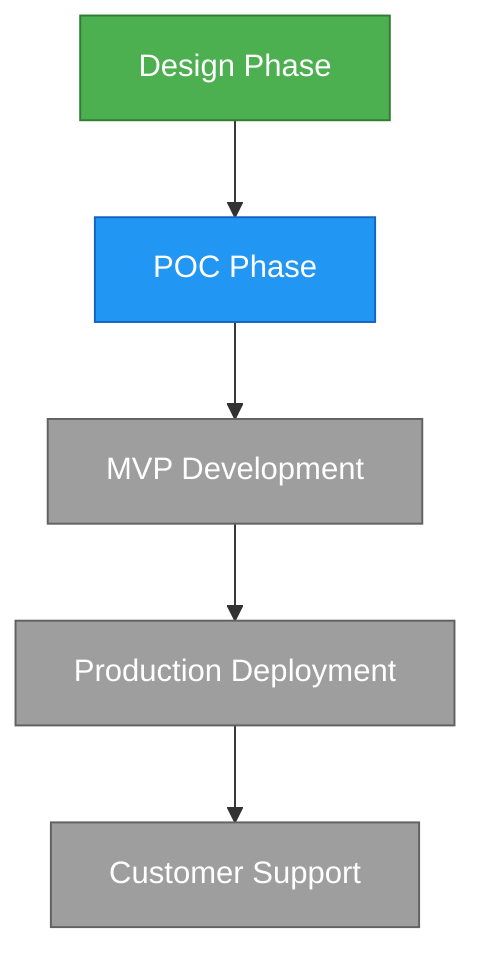

# Workflow Engine Tool

Orchestrate structured workflows with defined stages, gates, and training paths. Manage complete product lifecycles from design through production and support, with skill tracking and learning progressions.

## User Stories

### Story 1: New Product Development

*"As a project manager, I want to guide a product from concept to production with clear milestones and deliverables."*

```
# Create the workflow
{{workflow_engine(
  action="create_from_template",
  template_path="templates/product_development.json",
  name="Mobile App v1.0"
)}}

# Start execution with project context
{{workflow_engine(
  action="start_workflow",
  workflow_name="Mobile App v1.0",
  context={"customer": "Acme Corp", "priority": "high", "platform": "iOS/Android"}
)}}

# Monitor progress with dashboard
{{workflow_engine(action="dashboard")}}

# Visualize the workflow
{{workflow_engine(action="visualize_workflow", name="Mobile App v1.0", execution_id=1)}}
```

### Story 2: Stage Gate Reviews

*"As a technical lead, I want to ensure each phase meets quality criteria before advancing."*

```
# Check current status
{{workflow_engine(action="get_status", execution_id=1)}}

# Complete exit criteria
{{workflow_engine(
  action="complete_criterion",
  execution_id=1,
  stage_id="design",
  criterion_id="architecture_reviewed"
)}}

# Mark deliverable as complete
{{workflow_engine(
  action="complete_deliverable",
  execution_id=1,
  stage_id="design",
  deliverable_id="arch_diagram",
  artifact_path="/docs/architecture.md"
)}}

# Approve stage for advancement
{{workflow_engine(
  action="approve_stage",
  execution_id=1,
  stage_id="design",
  approved_by="tech_lead",
  notes="Architecture is solid, proceed to POC"
)}}

# Advance to next stage
{{workflow_engine(action="advance_stage", execution_id=1)}}
```

### Story 3: Task Assignment & Tracking

*"As a developer, I want to know what tasks are assigned to me and track my progress."*

```
# Get next available task
{{workflow_engine(action="get_next_task", execution_id=1)}}

# Start working on a task
{{workflow_engine(
  action="start_task",
  execution_id=1,
  stage_id="poc",
  task_id="implement_core",
  assigned_to="developer_1"
)}}

# Complete the task
{{workflow_engine(
  action="complete_task",
  execution_id=1,
  stage_id="poc",
  task_id="implement_core",
  output_data={"files_created": 12, "tests_added": 8}
)}}

# Visualize task dependencies
{{workflow_engine(
  action="visualize_tasks",
  name="Mobile App v1.0",
  stage_id="poc",
  execution_id=1
)}}
```

### Story 4: Failed Task Recovery

*"As a QA engineer, I want to handle test failures and retry mechanisms."*

```
# Mark task as failed with retry
{{workflow_engine(
  action="fail_task",
  execution_id=1,
  stage_id="mvp",
  task_id="integration_tests",
  error="3 tests failed in auth module",
  retry=true
)}}

# Check execution timeline to see what happened
{{workflow_engine(action="visualize_timeline", execution_id=1)}}

# After fixing, complete the task
{{workflow_engine(
  action="complete_task",
  execution_id=1,
  stage_id="mvp",
  task_id="integration_tests",
  output_data={"tests_passed": 47, "coverage": "89%"}
)}}
```

### Story 5: Service Delivery Workflow

*"As a solutions architect, I want to deliver custom solutions to clients with proper handoffs."*

```
# Use service delivery template
{{workflow_engine(
  action="create_from_template",
  template_path="templates/service_delivery.json",
  name="Enterprise Integration Project",
  customizations={
    "global_context": {
      "client": "BigCorp Inc",
      "contract_value": 250000,
      "sla": "99.9%"
    }
  }
)}}

# Start with discovery phase
{{workflow_engine(
  action="start_workflow",
  workflow_name="Enterprise Integration Project"
)}}

# Generate Gantt chart for client presentation
{{workflow_engine(
  action="visualize_gantt",
  name="Enterprise Integration Project",
  start_date="2024-02-01"
)}}
```

### Story 6: Continuous Improvement Cycle

*"As a product owner, I want to track the support → upgrade cycle for ongoing improvements."*

```
# Check workflow with all stages including support/upgrade
{{workflow_engine(action="visualize_workflow", name="Mobile App v1.0")}}

# View execution history
{{workflow_engine(action="get_history", workflow_id=1, limit=10)}}

# Clone workflow for next version
{{workflow_engine(
  action="clone_workflow",
  workflow_id=1,
  new_name="Mobile App v2.0"
)}}
```

---

## Stage Types

The workflow engine supports these lifecycle stages:

- **design** - Requirements, architecture, planning
- **poc** - Proof of concept, feasibility validation
- **mvp** - Minimum viable product development
- **production** - Full production deployment
- **support** - Customer support and maintenance
- **upgrade** - Feature additions, improvements
- **custom** - Custom workflow stages

## Core Concepts

### Workflow Definition

A workflow consists of ordered stages, each containing:

- **Entry Criteria** - Conditions that must be met to enter the stage
- **Tasks** - Work items to complete (can run sequentially or in parallel)
- **Deliverables** - Artifacts that must be produced
- **Exit Criteria** - Conditions to complete the stage
- **Approval** - Optional approval gate before advancing

### Task Dependencies

Tasks can specify dependencies and run in parallel groups:

```json
{
  "id": "testing",
  "name": "Run Tests",
  "dependencies": ["implement_feature"],
  "parallel_group": 1
}
```

Tasks in the same `parallel_group` run concurrently after their dependencies complete.

### Role-Based Assignment

Tasks can target specific roles:

- `architect`, `developer`, `dba`, `qa`, `devops`, `security`, `pm`, `designer`, `analyst`

---

## Available Actions

### Workflow Management

| Action | Description |
|--------|-------------|
| `create_workflow` | Create a new workflow definition |
| `get_workflow` | Get workflow details by ID or name |
| `list_workflows` | List all workflows (optionally by type) |
| `delete_workflow` | Delete a workflow |
| `clone_workflow` | Clone an existing workflow |

### Templates

| Action | Description |
|--------|-------------|
| `list_templates` | List available workflow templates |
| `load_template` | Load a template file |
| `create_from_template` | Create workflow from template with customizations |

**Available Templates:**

- `product_development.json` - Full lifecycle: design → poc → mvp → production → support → upgrade
- `service_delivery.json` - Client projects: discovery → design → implementation → deployment → training → support

### Workflow Execution

| Action | Description |
|--------|-------------|
| `start_workflow` | Start executing a workflow |
| `get_status` | Get current execution status with progress |
| `advance_stage` | Move to next stage (checks exit criteria) |
| `approve_stage` | Approve a stage gate |
| `complete_criterion` | Mark entry/exit criterion as met |
| `complete_deliverable` | Mark deliverable as completed |

### Task Execution

| Action | Description |
|--------|-------------|
| `start_task` | Begin working on a task |
| `complete_task` | Mark task as successfully completed |
| `fail_task` | Mark task as failed (with optional retry) |
| `get_next_task` | Get next available task based on dependencies |

### Skills & Training

| Action | Description |
|--------|-------------|
| `register_skill` | Register a new skill for tracking |
| `get_skill` | Get skill details |
| `list_skills` | List all skills (optionally by category) |
| `track_skill` | Record skill usage/assessment |
| `get_agent_skills` | Get agent's skill proficiency levels |

### Learning Paths

| Action | Description |
|--------|-------------|
| `create_learning_path` | Create a structured learning path |
| `get_learning_path` | Get learning path details |
| `list_learning_paths` | List paths (optionally by target role) |

### History & Statistics

| Action | Description |
|--------|-------------|
| `get_history` | Get execution history |
| `get_events` | Get detailed event log for an execution |
| `get_stats` | Get workflow engine statistics |

### Visualization

| Action | Description |
|--------|-------------|
| `visualize_workflow` | Generate Mermaid flowchart |
| `visualize_progress` | Show ASCII progress visualization |
| `visualize_tasks` | Show task dependencies diagram |
| `visualize_timeline` | Show execution event timeline |
| `visualize_gantt` | Generate Mermaid Gantt chart |
| `dashboard` | Comprehensive dashboard view |

---

## Detailed Action Reference

### create_workflow

Create a new workflow with defined stages.

```
{{workflow_engine(
  action="create_workflow",
  name="Product Development",
  description="Standard product lifecycle workflow",
  version="1.0.0",
  stages=[
    {
      "id": "design",
      "name": "Design Phase",
      "type": "design",
      "duration_days": 7,
      "entry_criteria": [
        {"id": "requirements", "description": "Requirements documented", "required": true}
      ],
      "tasks": [
        {"id": "arch", "name": "Architecture Design", "action": "diagram_architect.analyze_architecture", "role": "architect"},
        {"id": "scaffold", "name": "Project Setup", "action": "project_scaffold.scaffold_project", "role": "developer", "dependencies": ["arch"]}
      ],
      "exit_criteria": [
        {"id": "design_approved", "description": "Design approved by stakeholders"}
      ],
      "deliverables": [
        {"id": "arch_doc", "name": "Architecture Document", "format": "markdown", "required": true}
      ],
      "approval_required": true,
      "approvers": ["tech_lead", "product_owner"]
    }
  ],
  settings={
    "parallel_execution": true,
    "require_approvals": true,
    "auto_retry": true,
    "max_retries": 3
  }
)}}
```

### start_workflow

Start executing a workflow with optional context.

```
{{workflow_engine(
  action="start_workflow",
  workflow_name="Product Development",
  execution_name="Project Alpha Sprint 1",
  context={
    "customer": "Acme Corp",
    "priority": "high",
    "deadline": "2024-06-30",
    "team_size": 5
  }
)}}
```

### get_status

Get comprehensive execution status.

```
{{workflow_engine(action="get_status", execution_id=1)}}
```

**Output Example:**

```
## Execution Status

**Workflow:** Product Development
**Status:** running
**Current Stage:** poc
**Current Task:** implement_core

**Progress:** [████████░░░░░░░░░░░░] 40%
Stages: 2/5

**Started:** 2024-01-15T09:00:00

### Stage Progress
✓ design: completed
▶ poc: in_progress
○ mvp: pending
○ production: pending
○ support: pending
```

### visualize_workflow

Generate a Mermaid flowchart.

```
{{workflow_engine(
  action="visualize_workflow",
  name="Product Development",
  execution_id=1
)}}
```

**Output:**



### visualize_gantt

Generate a planning Gantt chart.

```
{{workflow_engine(
  action="visualize_gantt",
  name="Product Development",
  start_date="2024-02-01"
)}}
```

**Output:**

```mermaid
gantt
    title Product Development Timeline
    dateFormat YYYY-MM-DD

    section Design Phase
    Architecture Design :aarch, 7d
    Project Setup :ascaffold, 7d

    section POC Phase
    Implement Core Features :acore, 14d
    Integration Testing :atest, 14d
```

### dashboard

Get comprehensive dashboard.

```
{{workflow_engine(action="dashboard")}}
```

**Output:**

```
╔══════════════════════════════════════════════════════════════╗
║            WORKFLOW ENGINE DASHBOARD                         ║
╠══════════════════════════════════════════════════════════════╣
║  Workflows: 5        Templates: 2        Executions: 12      ║
║  Skills: 8           Learning Paths: 3                       ║
╠══════════════════════════════════════════════════════════════╣
║  Execution Status                                            ║
║  running: 3  completed: 8  failed: 1                         ║
╠══════════════════════════════════════════════════════════════╣
║  Recent Executions                                           ║
║  ✓ Mobile App v1.0                                           ║
║  ▶ Enterprise Integration                                    ║
║  ▶ API Gateway v2                                            ║
╠══════════════════════════════════════════════════════════════╣
║  Top Skills                                                  ║
║  Python Basics          ★★★★☆                               ║
║  API Design             ★★★☆☆                               ║
║  Docker                 ★★☆☆☆                               ║
╚══════════════════════════════════════════════════════════════╝
```

---

## Workflow Template Structure

```json
{
  "id": "product_development",
  "name": "Product Development Workflow",
  "version": "1.0.0",
  "description": "Standard product lifecycle from design to production",
  "stages": [
    {
      "id": "design",
      "name": "Design Phase",
      "type": "design",
      "duration_days": 7,
      "entry_criteria": [
        {"id": "requirements_doc", "description": "Requirements documented", "required": true}
      ],
      "tasks": [
        {
          "id": "architecture",
          "name": "Design Architecture",
          "action": "diagram_architect.analyze_architecture",
          "role": "architect",
          "priority": 1
        },
        {
          "id": "scaffold",
          "name": "Create Project Structure",
          "action": "project_scaffold.scaffold_project",
          "role": "developer",
          "dependencies": ["architecture"],
          "priority": 2
        }
      ],
      "deliverables": [
        {"id": "arch_diagram", "name": "Architecture Diagram", "format": "mermaid", "required": true}
      ],
      "exit_criteria": [
        {"id": "arch_approved", "description": "Architecture approved"}
      ],
      "approval_required": true
    }
  ],
  "transitions": [
    {"from": "design", "to": "poc", "condition": "arch_approved"}
  ],
  "global_context": {
    "default_roles": ["architect", "developer", "qa", "devops"]
  },
  "settings": {
    "parallel_execution": true,
    "require_approvals": true,
    "auto_retry": true,
    "max_retries": 3
  }
}
```

---

## Integration with Other Tools

The workflow engine integrates with Agent Jumbo's tool ecosystem:

| Tool | Integration |
|------|-------------|
| `project_scaffold` | Generate project structures in design phase |
| `diagram_architect` | Create architecture diagrams automatically |
| `deployment_orchestrator` | CI/CD and deployment in production phase |
| `virtual_team` | Assign tasks to team roles |
| `customer_lifecycle` | Track customer-related workflows |
| `business_xray` | ROI and business analysis |
| `sales_generator` | Create proposals and demos |

**Example Integration:**

```
# In a workflow task definition
{
  "id": "generate_architecture",
  "name": "Generate Architecture Diagrams",
  "action": "diagram_architect.analyze_architecture",
  "role": "architect"
}
```

When the task executes, it can automatically invoke the `diagram_architect` tool with the project context.

---

## Best Practices

### 1. Start with Templates

Use built-in templates and customize rather than building from scratch:

```
{{workflow_engine(
  action="create_from_template",
  template_path="templates/product_development.json",
  name="My Project",
  customizations={"stages": [{"id": "poc", "duration_days": 21}]}
)}}
```

### 2. Use Meaningful Context

Include project-specific context when starting workflows:

```
{{workflow_engine(
  action="start_workflow",
  workflow_name="My Project",
  context={"customer": "...", "budget": 50000, "priority": "high"}
)}}
```

### 3. Track Deliverables

Always mark deliverables with artifact paths for traceability:

```
{{workflow_engine(
  action="complete_deliverable",
  execution_id=1,
  stage_id="design",
  deliverable_id="arch_doc",
  artifact_path="/docs/architecture/system-design.md"
)}}
```

### 4. Use Visualization for Stakeholders

Generate visual artifacts for status meetings:

```
{{workflow_engine(action="visualize_progress", execution_id=1)}}
{{workflow_engine(action="visualize_gantt", name="My Project")}}
```

### 5. Handle Failures Gracefully

Use retry for recoverable failures:

```
{{workflow_engine(
  action="fail_task",
  execution_id=1,
  stage_id="mvp",
  task_id="tests",
  error="Network timeout",
  retry=true
)}}
```
