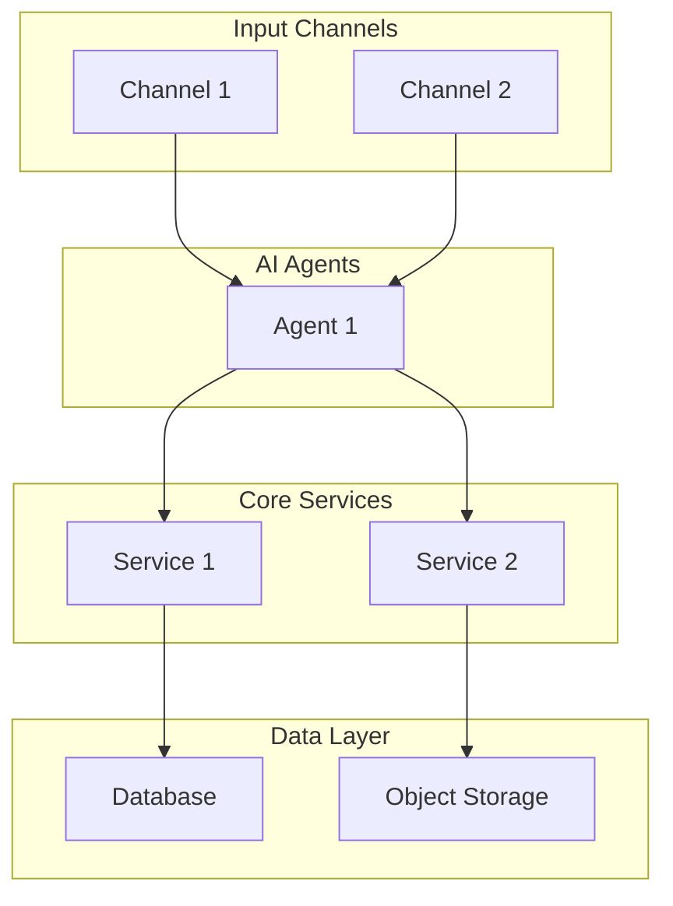

# Architecture: {{SOLUTION_NAME}}

## Overview

{{Brief description of the solution architecture and its primary objectives.}}

## Architecture Diagram

## Components

| Component | Role | Technology |
|-----------|------|------------|
| {{Component}} | {{Role}} | {{Tech}} |

## Data Flow

1. **Ingestion** -- {{Describe how data enters the system.}}
2. **Processing** -- {{Describe how AI agents process the data.}}
3. **Output** -- {{Describe how results are delivered.}}
4. **Feedback Loop** -- {{Describe how the system learns and improves.}}

## Integration Points

| Integration | Direction | Protocol | Purpose |
|-------------|-----------|----------|---------|
| {{Integration}} | Inbound/Outbound | REST/Webhook/gRPC | {{Purpose}} |

## Security Considerations

- {{Authentication and authorization model}}
- {{Data encryption at rest and in transit}}
- {{PII handling and retention policies}}

## Scaling Strategy

- {{Horizontal scaling approach}}
- {{Rate limiting and backpressure}}
- {{Resource allocation per tenant}}
