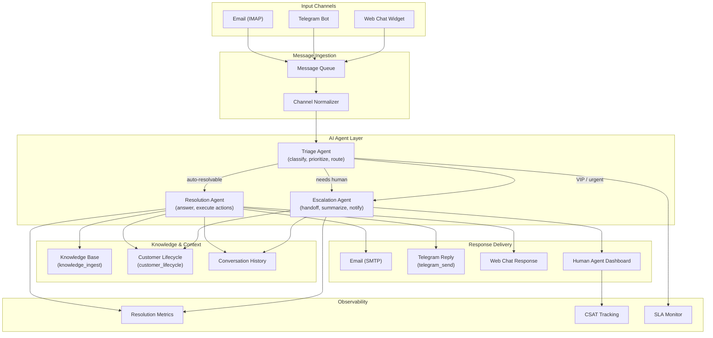

# Architecture: AI Customer Support

## Overview

A multi-channel AI customer support system that receives inquiries via email, Telegram, and web chat, routes them through a triage agent for classification and priority assignment, then delegates to a resolution agent for automated responses or an escalation agent for human handoff. The system maintains a shared knowledge base and customer context across all channels.

## Architecture Diagram

## Components

| Component | Role | Technology |
|-----------|------|------------|
| Message Queue | Buffer and dedup incoming messages across channels | Internal work queue |
| Channel Normalizer | Convert channel-specific formats to unified message schema | Python transformer |
| Triage Agent | Classify intent, assign priority (P1-P4), route to resolution or escalation | LLM agent with classification prompt |
| Resolution Agent | Generate responses using knowledge base, execute actions (refunds, status lookups) | LLM agent with tool access |
| Escalation Agent | Prepare handoff summary, notify human agents, track SLA timers | LLM agent with notification tools |
| Knowledge Base | Indexed FAQ, documentation, and policy content | knowledge_ingest instrument |
| Customer Lifecycle | Customer profile, history, and segment data | customer_lifecycle instrument |
| Conversation History | Full thread context per customer per channel | SQLite / Postgres store |

## Data Flow

1. **Ingestion** -- Messages arrive from email (IMAP polling), Telegram (webhook), or web chat (WebSocket). Each is normalized into a unified `SupportMessage` schema with sender identity, channel, content, and attachments.
2. **Triage** -- The triage agent classifies the message by intent (billing, technical, general, complaint) and urgency. It checks customer lifecycle data for VIP status or open issues. Messages are routed to resolution (80% target) or escalation (20%).
3. **Resolution** -- The resolution agent searches the knowledge base for relevant answers, checks customer context for personalization, and generates a response. It can execute actions like order lookups, refund processing, or account updates via tool calls.
4. **Escalation** -- When the resolution agent lacks confidence or the issue requires human judgment, the escalation agent generates a summary of the conversation, attaches relevant customer context, and creates a ticket in the human agent dashboard.
5. **Feedback Loop** -- CSAT scores and resolution outcomes are tracked. Low-scoring interactions are flagged for knowledge base updates. The triage model's routing accuracy is evaluated weekly.

## Integration Points

| Integration | Direction | Protocol | Purpose |
|-------------|-----------|----------|---------|
| Email (IMAP/SMTP) | Bidirectional | IMAP/SMTP | Receive and send customer emails |
| Telegram Bot API | Bidirectional | HTTPS/Webhook | Receive and send Telegram messages |
| Web Chat Widget | Bidirectional | WebSocket | Real-time browser-based chat |
| Knowledge Base | Internal | API | Query FAQ and documentation content |
| CRM / Customer DB | Inbound | REST API | Fetch customer profiles and history |
| Human Agent Dashboard | Outbound | Webhook | Escalation tickets and notifications |

## Security Considerations

- All customer PII is encrypted at rest (AES-256) and in transit (TLS 1.3)
- Agent responses are filtered through a safety layer to prevent disclosure of internal policies or other customers' data
- Conversation logs are retained for 90 days by default, configurable per compliance requirements
- API keys for channel integrations are stored in encrypted vault, never in agent prompts

## Scaling Strategy

- Message queue provides backpressure during traffic spikes; agents process at configurable concurrency limits
- Knowledge base is pre-indexed; queries are sub-100ms regardless of corpus size
- Each channel adapter scales independently; Telegram webhook can handle burst traffic via queue buffering
- Per-tenant rate limiting prevents any single customer from monopolizing agent capacity
