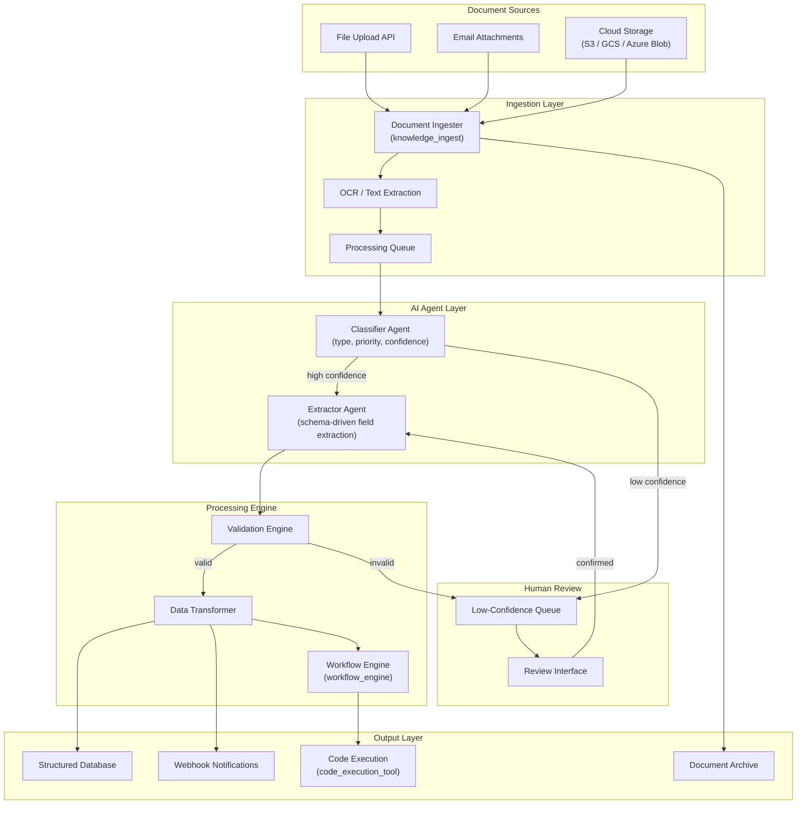

# Architecture: AI Document Processing

## Overview

An end-to-end document processing pipeline that ingests documents from file uploads, email attachments, and cloud storage, classifies them by type and priority, extracts structured data using configurable schemas, and triggers downstream workflows. Two AI agents -- a classifier and an extractor -- work in sequence to transform unstructured documents into actionable, structured records.

## Architecture Diagram

## Components

| Component | Role | Technology |
|-----------|------|------------|
| Document Ingester | Accept documents from all sources, normalize to internal format | knowledge_ingest instrument |
| OCR / Text Extraction | Convert images and scanned PDFs to machine-readable text | Tesseract / vision model |
| Classifier Agent | Determine document type (invoice, contract, form, etc.) and assign processing priority | LLM agent with few-shot classification |
| Extractor Agent | Pull structured fields from documents using type-specific extraction schemas | LLM agent with schema-guided extraction |
| Validation Engine | Verify extracted fields against type constraints (date formats, currency values, required fields) | Rule engine + code_execution_tool |
| Workflow Engine | Trigger downstream actions based on document type and extracted data | workflow_engine instrument |
| Human Review Queue | Route low-confidence classifications and failed validations to human reviewers | Internal queue with web UI |

## Data Flow

1. **Ingestion** -- Documents arrive via file upload API, email attachment scanning, or cloud storage sync. The ingester normalizes file formats, runs OCR on image-based documents, and stores the original in the document archive. A processing record is created in the queue.
2. **Classification** -- The classifier agent analyzes document content and metadata to determine the document type (invoice, contract, purchase order, W-2, etc.) and assigns a confidence score. Documents above the confidence threshold (default 0.85) proceed to extraction; others are routed to human review.
3. **Extraction** -- The extractor agent applies a type-specific extraction schema to pull structured fields. For an invoice, this includes vendor name, invoice number, line items, totals, and due date. The agent uses code_execution_tool for complex calculations (tax verification, line item totals).
4. **Validation and Output** -- Extracted data passes through validation rules. Valid records are written to the structured database and trigger configured webhooks. The workflow engine can initiate downstream processes like approval routing, payment scheduling, or data sync to external systems.
5. **Feedback Loop** -- Human corrections from the review queue are fed back to improve classifier confidence thresholds and extractor schema mappings. Extraction accuracy is tracked per document type and reported weekly.

## Integration Points

| Integration | Direction | Protocol | Purpose |
|-------------|-----------|----------|---------|
| File Upload API | Inbound | REST (multipart) | Accept document uploads from client applications |
| Email (IMAP) | Inbound | IMAP | Scan incoming email for document attachments |
| Cloud Storage | Inbound | S3 API / GCS API | Sync documents from cloud storage buckets |
| Webhook Output | Outbound | HTTPS POST | Notify external systems of processed documents |
| Database Export | Outbound | SQL / REST | Write structured data to client databases |
| document_query tool | Internal | API | Query processed documents by extracted fields |

## Security Considerations

- Documents are encrypted at rest in the archive (AES-256) and in transit (TLS 1.3)
- PII detection runs on all extracted fields; sensitive data is flagged and can be redacted or masked
- Access to the review queue requires authentication; audit logs track all human review actions
- Document retention policies are configurable per document type and compliance framework

## Scaling Strategy

- Processing queue enables horizontal scaling of classifier and extractor agents independently
- OCR is the primary bottleneck; GPU-accelerated instances are provisioned for high-volume deployments
- Batch processing mode available for bulk document imports (cloud storage sync)
- Per-tenant document volume limits with configurable quotas
