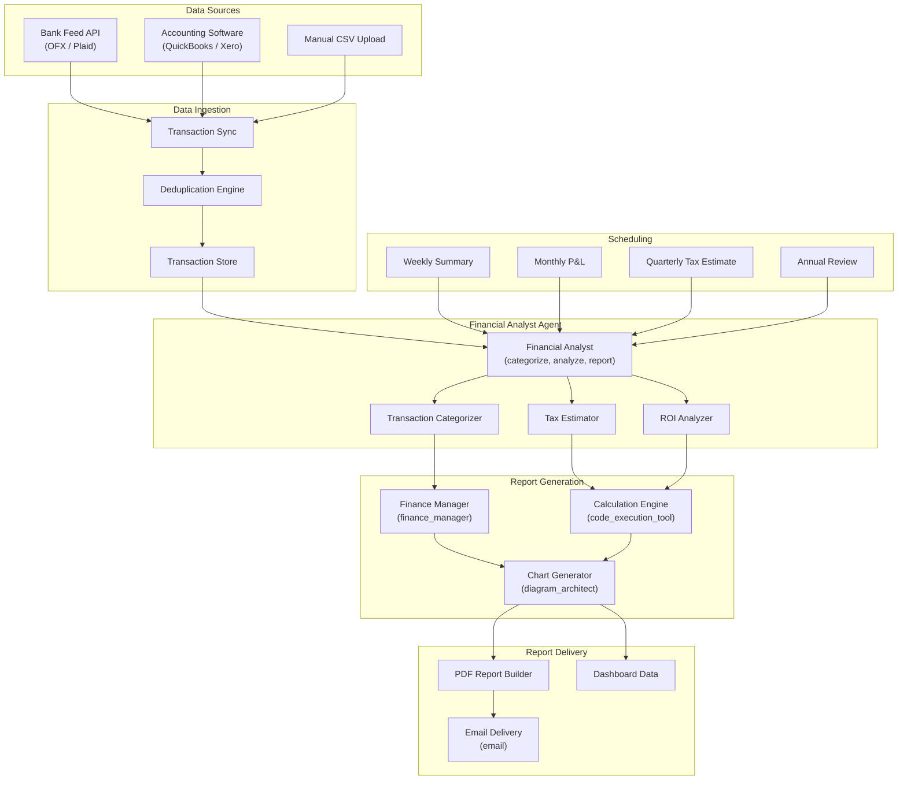

# Architecture: AI Financial Reporting

## Overview

An automated financial reporting solution powered by a single specialized financial analyst AI agent. The system ingests raw transaction data from bank feeds and accounting software, categorizes transactions using learned rules and AI classification, generates periodic financial reports with charts and visualizations, estimates tax liabilities, and performs ROI analysis across business units. Reports are delivered via email on a configurable schedule.

## Architecture Diagram

## Components

| Component | Role | Technology |
|-----------|------|------------|
| Transaction Sync | Pull transactions from bank APIs and accounting software on schedule | Plaid / OFX integration |
| Deduplication Engine | Prevent double-counting of transactions synced from multiple sources | Hash-based matching on amount, date, description |
| Financial Analyst Agent | Orchestrate all analysis: categorization, tax estimation, ROI analysis, and report narrative generation | LLM agent + finance_manager |
| Transaction Categorizer | Classify transactions into chart-of-accounts categories using rules and AI | Hybrid rule engine + LLM classification |
| Tax Estimator | Calculate estimated quarterly tax liability based on categorized income and expenses | code_execution_tool with tax tables |
| ROI Analyzer | Compute ROI metrics per business unit, project, or marketing channel | code_execution_tool with financial models |
| Chart Generator | Produce bar charts, line graphs, pie charts, and trend visualizations for reports | diagram_architect tool |
| PDF Report Builder | Compile analysis, charts, and narrative into formatted PDF reports | Template engine + chart embedding |

## Data Flow

1. **Transaction Ingestion** -- Bank transactions are synced daily via Plaid or OFX feeds. Accounting software data is synced via API. Manual uploads are accepted as CSV. All transactions pass through deduplication before entering the transaction store.
2. **Categorization** -- The financial analyst agent categorizes each transaction against the configured chart of accounts. Known vendors and recurring transactions are matched by rules. Novel transactions are classified by the LLM using description analysis and merchant category codes. Uncertain classifications (confidence < 0.8) are flagged for review.
3. **Analysis** -- On schedule, the agent runs analysis pipelines:
   - **Weekly**: Cash flow summary, top expenses, income vs. budget
   - **Monthly**: Full P&L statement, balance sheet changes, category trends
   - **Quarterly**: Estimated tax liability, quarterly comparison, cash runway projection
   - **Annual**: Year-end summary, tax preparation data, year-over-year growth analysis
4. **Report Generation** -- The agent composes narrative summaries explaining key findings, generates visualizations via diagram_architect, runs calculations via code_execution_tool, and assembles everything into a formatted PDF report.
5. **Delivery** -- Reports are emailed to the configured distribution list. Dashboard data is updated for real-time access. Historical reports are archived for audit and comparison.

## Integration Points

| Integration | Direction | Protocol | Purpose |
|-------------|-----------|----------|---------|
| Plaid / Bank API | Inbound | REST API | Automated transaction feed |
| Accounting Software | Bidirectional | REST API | Sync transactions and categories |
| Email | Outbound | SMTP | Deliver reports to stakeholders |
| Dashboard | Outbound | REST API | Push report data for real-time display |
| CSV Upload | Inbound | File upload | Manual transaction import |
| Tax Tables | Internal | Static data | Federal and state tax rate schedules |

## Security Considerations

- Financial data is encrypted at rest (AES-256) and in transit (TLS 1.3)
- Bank credentials are managed via Plaid Link; the system never stores bank passwords
- Reports containing financial data are delivered via encrypted email or authenticated dashboard
- Role-based access: only authorized users can view reports and modify categorization rules
- Audit trail logs all categorization changes, report generations, and data access events

## Scaling Strategy

- Transaction volume scales linearly; categorization is batched for efficiency
- Report generation is scheduled during off-peak hours to avoid compute contention
- Chart generation is parallelized: multiple visualizations render concurrently
- Multi-entity support allows a single deployment to serve multiple businesses with isolated data
