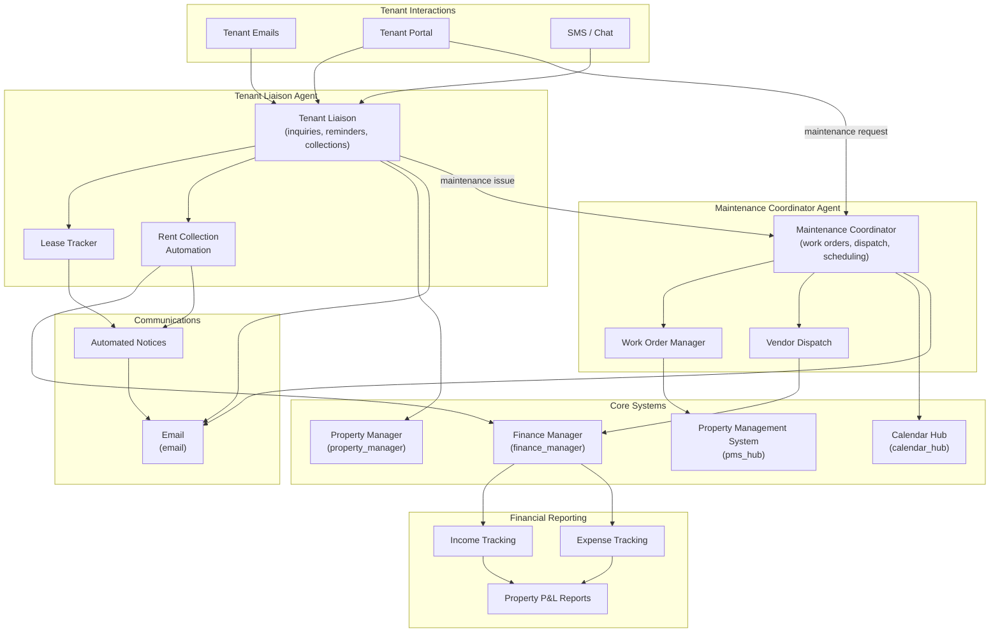

# Architecture: AI Property Management

## Overview

A rental property operations platform with two AI agents automating tenant communications and maintenance coordination. The tenant liaison agent handles inquiries, lease reminders, and rent collection communications. The maintenance coordinator agent manages work orders, vendor dispatch, and scheduling. Both agents integrate with property management systems, calendars, and financial tools for a unified operations view.

## Architecture Diagram

## Components

| Component | Role | Technology |
|-----------|------|------------|
| Tenant Liaison Agent | Handle tenant inquiries, send lease renewal reminders, automate rent collection communications, manage move-in/move-out workflows | LLM agent + property_manager + email |
| Maintenance Coordinator Agent | Create work orders from tenant requests, match and dispatch vendors, schedule inspections and repairs | LLM agent + pms_hub + calendar_hub |
| Property Management System Hub | Central property data: units, leases, tenants, rent rolls | pms_hub instrument |
| Property Manager | Portfolio-level operations: occupancy tracking, listing management, performance analysis | property_manager instrument |
| Calendar Hub | Maintenance scheduling, inspection calendars, lease milestone dates | calendar_hub tool |
| Finance Manager | Rent income tracking, maintenance expenses, property-level P&L | finance_manager instrument |
| Automated Notices | Template-driven notice generation: late rent, lease expiry, maintenance updates | Email templates + email tool |

## Data Flow

1. **Tenant Communication** -- Tenant messages arrive via email, portal, or SMS. The tenant liaison agent identifies the tenant, retrieves their lease and account status from pms_hub, and responds contextually. Common actions (lease questions, payment status, parking requests) are resolved automatically.
2. **Rent Collection** -- The finance manager tracks rent due dates. The tenant liaison sends payment reminders at configurable intervals (5 days before, day of, 3 days late, 7 days late). Late payment notices escalate in tone and include late fee calculations.
3. **Maintenance Requests** -- When a tenant reports an issue, the maintenance coordinator creates a work order, categorizes the issue (plumbing, electrical, HVAC, general), assesses urgency, selects an appropriate vendor from the approved list, and schedules the repair via calendar_hub.
4. **Vendor Coordination** -- The maintenance coordinator sends work order details to vendors via email, confirms appointment times, and follows up on completion. Vendor invoices are logged in the finance manager as property expenses.
5. **Financial Reporting** -- The finance manager aggregates rent income and maintenance expenses per property. Monthly P&L reports are generated and emailed to property owners. Annual summaries support tax preparation.

## Integration Points

| Integration | Direction | Protocol | Purpose |
|-------------|-----------|----------|---------|
| Property Management System | Bidirectional | REST API | Sync property, unit, tenant, and lease data |
| Email | Bidirectional | IMAP/SMTP | Tenant communications and vendor coordination |
| Calendar | Bidirectional | CalDAV / API | Maintenance scheduling and lease milestone tracking |
| Tenant Portal | Inbound | Webhook | Receive tenant requests and maintenance submissions |
| Accounting Software | Outbound | API | Export financial data for bookkeeping |
| Vendor Systems | Outbound | Email / API | Dispatch work orders and receive completion confirmations |

## Security Considerations

- Tenant PII (SSN for applications, bank details for ACH) is encrypted and access-restricted
- Agents never expose one tenant's information to another; strict tenant isolation in all queries
- Financial data access is role-based: property owners see their properties only
- Maintenance photos and documents are stored with access controls tied to the work order

## Scaling Strategy

- Solution scales by property count; each property adds minimal overhead to agent workload
- Maintenance request volume is handled via queue with priority-based ordering (emergency > urgent > routine)
- Financial reporting runs on schedule (nightly aggregation) to avoid peak-time compute
- Multi-portfolio support allows property management companies to manage multiple owners' portfolios in isolation
