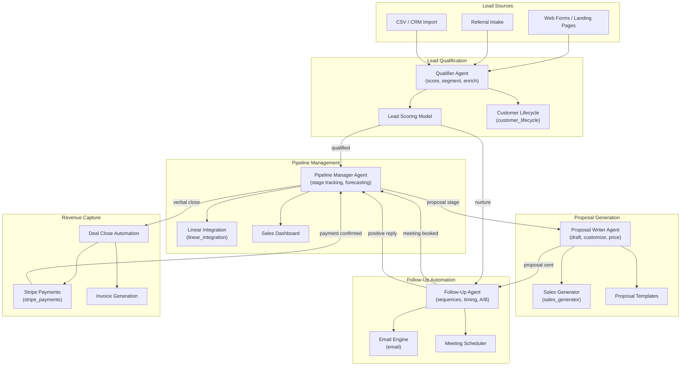

# Architecture: AI Sales Automation

## Overview

A full-cycle sales automation platform with four specialized AI agents managing the complete pipeline from lead intake to closed deal. The qualifier agent scores and segments inbound leads, the proposal writer generates tailored proposals, the pipeline manager tracks deal stages in Linear, and the follow-up agent orchestrates multi-touch email sequences. All agents share a unified customer lifecycle context and coordinate through the workflow engine.

## Architecture Diagram

## Components

| Component | Role | Technology |
|-----------|------|------------|
| Qualifier Agent | Score inbound leads using firmographic, behavioral, and engagement signals; segment into tiers | LLM agent + scoring model via customer_lifecycle |
| Pipeline Manager Agent | Track deal stages in Linear, update forecasts, identify stalled deals, trigger stage-appropriate actions | LLM agent + linear_integration |
| Proposal Writer Agent | Generate customized proposals with dynamic pricing, case studies, and scope sections | LLM agent + sales_generator instrument |
| Follow-Up Agent | Orchestrate multi-step email sequences with dynamic timing, A/B subject lines, and response detection | LLM agent + email tool |
| Lead Scoring Model | Weighted scoring across engagement, fit, and intent signals | Configurable rules + ML model |
| Linear Integration | CRM-like pipeline board with custom stages, fields, and automations | linear_integration tool |
| Stripe Payments | Payment link generation, invoice creation, subscription setup | stripe_payments tool |

## Data Flow

1. **Lead Intake** -- Leads enter from web forms, referrals, or CRM imports. Each lead is enriched with available firmographic data and assigned a unique ID in the customer lifecycle system.
2. **Qualification** -- The qualifier agent evaluates each lead against the ideal customer profile. Leads scoring above threshold (default 70/100) are marked as Sales Qualified and pushed to the pipeline. Below-threshold leads enter nurture sequences via the follow-up agent.
3. **Pipeline Tracking** -- The pipeline manager creates a Linear issue for each qualified deal, tracks it through stages (Discovery, Proposal, Negotiation, Close), updates probability forecasts, and alerts on stalled deals (no activity > 5 days).
4. **Proposal Generation** -- When a deal reaches the Proposal stage, the proposal writer generates a customized proposal using the sales_generator instrument. It pulls from templates, customizes scope and pricing, and includes relevant case studies. The proposal is sent via email with tracking.
5. **Follow-Up Sequences** -- The follow-up agent manages multi-touch sequences: post-proposal follow-ups, meeting booking nudges, and re-engagement campaigns for stalled deals. It detects positive replies and updates the pipeline manager.
6. **Revenue Capture** -- On verbal close, the pipeline manager triggers Stripe payment link or invoice generation. Payment confirmation automatically moves the deal to Closed-Won and updates revenue forecasts.

## Integration Points

| Integration | Direction | Protocol | Purpose |
|-------------|-----------|----------|---------|
| Web Forms | Inbound | Webhook / REST | Capture lead submissions |
| Linear | Bidirectional | GraphQL API | Pipeline tracking and deal management |
| Email (SMTP) | Outbound | SMTP | Send proposals, follow-ups, and sequences |
| Email (IMAP) | Inbound | IMAP | Detect replies and engagement |
| Stripe | Bidirectional | REST API | Payment processing and subscription management |
| Calendar | Outbound | CalDAV / API | Schedule discovery and demo calls |
| CRM | Bidirectional | REST API | Sync contact and deal data |

## Security Considerations

- Lead and customer data is encrypted at rest; PII fields are access-controlled by role
- Email sending complies with CAN-SPAM: unsubscribe links, sender identification, opt-out handling
- Stripe integration uses restricted API keys scoped to invoice and payment link creation only
- Proposal documents are generated with watermarks and expiration dates for sensitive pricing

## Scaling Strategy

- Lead scoring runs asynchronously; burst intake (e.g., after a campaign) is queue-buffered
- Email sending is rate-limited per domain to maintain deliverability reputation
- Pipeline manager operates on event-driven triggers, not polling, for efficient resource use
- Multi-tenant deployment supports isolated pipelines per sales team or business unit
